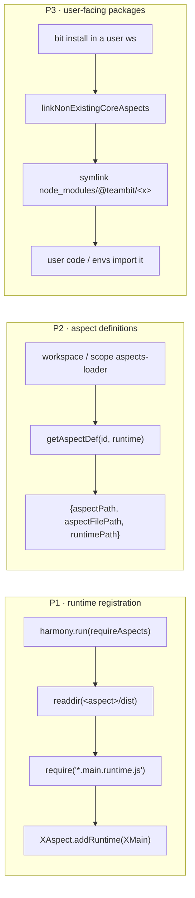
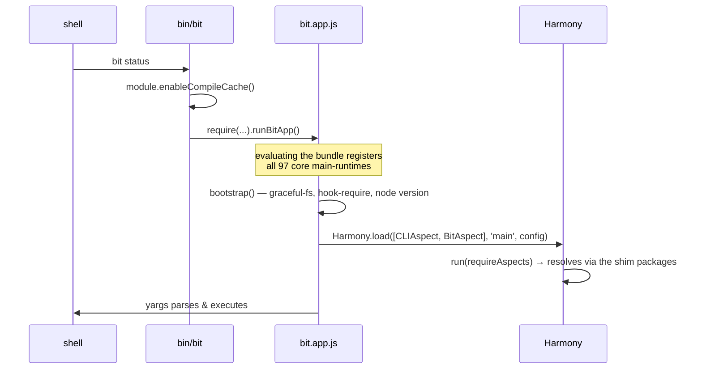

# Bundling the Bit CLI with esbuild — Plan, Architecture & Status Report

> Branch: `bit-bundle3` (based on `remove-core-envs-from-manifest`)
> Status: **working end-to-end** — and now also **as a real `bit build` task**, with types.
> §7 verification · §8 what's installed and why · §9 bundle vs SEA · §9b the published package shape
> · §9c running e2e against the bundle · §9d first CI run results · §9e the build task · §10 gaps
> · §15 webpack/mocha externals research · §16 babel/ws/mcp-config-writer externals research (§16e:
> babel aspect usage & pre-bundle interaction) · §17 making `bit start` work from the pre-bundles
> · §18 mcp-config-writer inlined into the bundle instead of copied · §19 `BabelAspect` removed from
> core, `@babel/core` verified still load-bearing via aspect-loader + scope's version.ts.
> Last updated: 2026-08-13 (hash-gate fix + `buffer/` external implemented and both proved working -
> `buffer/` on a live e2e run, the hash-gate fix via a hacky planted-artifact test; still need a real
> shipped artifact in the normal build flow for CI to benefit — §14)

---

## 1. Goal & result so far

Ship the Bit CLI as a **single bundled JavaScript file** plus a thin ring of packages that genuinely
cannot be inlined, instead of a 1.2 GB `node_modules` tree.

|                     | released bit (bvm 2.0.72) | bundled bit (this branch)                                                                  |
| ------------------- | ------------------------- | ------------------------------------------------------------------------------------------ |
| install size        | **1.2 GB**                | **322 MB** (61 MB bundle + 133 MB externals + shims + 91 MB pre-bundled UI/preview — §17g) |
| files on disk       | **141,008**               | **~7,300**                                                                                 |
| `bit --help` (warm) | 0.662 s                   | **0.642 s** (SEA: 1.324 s — §9)                                                            |
| `bit list` (warm)   | 0.914 s                   | **0.848 s** (SEA: 1.574 s)                                                                 |
| single executable   | —                         | **179 MB `bit-app`** (+ the `bundle/` support dir)                                         |
| build time          | n/a                       | ~11 s esbuild + ~5 s codegen (+ ~40 s for the SEA variant)                                 |

Every command on the target list — and a good deal more — runs from `/tmp/bit-bundle` against
workspaces in `/tmp/bundle-tests/*`, with **zero** reads from this repo or from `~/.bvm` (§7.3).

---

## 2. How to build and run it

```bash
bit compile                     # the bundle is built FROM dist/, so this must be current
npm run bundle                  # → /tmp/bit-bundle
cd /tmp/bit-bundle/bundle && npm install     # the externals, ~230 packages

node /tmp/bit-bundle/node_modules/@teambit/bit/bin/bit --help
```

| flag                                      | meaning                                                                                 |
| ----------------------------------------- | --------------------------------------------------------------------------------------- |
| `--out-dir <path>`                        | where to write the distribution (or `BIT_BUNDLE_OUT_DIR`)                               |
| `--sea`                                   | also build the single executable → `<out>/bit-app`                                      |
| `--ui-bundling`                           | add the UI/preview bundling externals — makes `bit start` work, **costs 1.1 GB** (§8.3) |
| `--minify` / `--sourcemap` / `--no-clean` | as expected                                                                             |

A clean run keeps `bundle/node_modules`, so the `npm install` is only needed when `externals.ts`
changes. `npm run bundle:ensure` does build-only-if-stale (§9c) and also runs the `npm install` for
you, which is usually what you want:

```bash
npm run bundle:ensure            # build iff stale, then install externals
npm run bundle:ensure -- --sea   # same, plus the executable
```

---

## 3. Output layout

```
/tmp/bit-bundle/                       ← the distribution
├── bit-app                            ← the SEA executable (only with --sea)
├── node_modules/@teambit/             ← 108 generated SHIM packages (2.5 MB)
│   ├── bit/
│   │   ├── package.json               ← real version → `bit --version`; `bin` field
│   │   ├── bin/bit                    ← launcher: enableCompileCache() + runBitApp()
│   │   └── dist/{index.js, esm.mjs, bit.aspect.js, bit.main.runtime.js}
│   ├── workspace/  … one per core aspect …
│   └── harmony/ , legacy/             ← non-aspect packages users import
└── bundle/
    ├── bit.app.js                     ← THE bundle, 67 MB, one CJS file
    ├── bit.app.sea.js + .blob         ← SEA variant + its blob (only with --sea)
    ├── package.json + .npmrc          ← the externals; `npm install` runs HERE
    ├── node_modules/                  ← installed externals (161 MB)
    ├── workers/jest.worker.js         ← self-contained child-process entry
    ├── metafile.json, sea-config.json
    ├── workspace-template.jsonc, agents-template*.md, bit-*-template.md
    └── lib.*.d.ts                     ← typescript lib files (102 of them)
```

### Why there are two `node_modules`

They hold two different kinds of thing, and mixing them is unsafe:

- **`<out>/node_modules/@teambit/*` — generated, 2.5 MB.** Not dependencies at all: 108 two-line
  shim packages that re-export slices of `bit.app.js`. They are the _public API surface_ — what a
  user's `bit install` symlinks into their workspace, and what `getAspectDir` / `getAspectDef`
  discover.
- **`<out>/bundle/node_modules` — installed, 161 MB.** Real npm packages, the output of
  `npm install` against `bundle/package.json`.

They are kept apart because a package manager run in a directory prunes whatever its `package.json`
doesn't reference — a single root tree would mean `npm install` deleting the generated shims. Node
resolves both from `bit.app.js` anyway: `bundle/node_modules` first, then one level up.

**This split is a property of the prototype, not of the design.** A published package's own files are
never pruned, so the shipping layout has one `node_modules` — the consumer's — with the externals as
ordinary `dependencies` of `@teambit/bit`. See §9b.

---

## 4. Architecture

### 4.1 The three structural problems, and how each is solved



|        | problem                                                                        | solution                                                                                                                                                                                                                                                       |
| ------ | ------------------------------------------------------------------------------ | -------------------------------------------------------------------------------------------------------------------------------------------------------------------------------------------------------------------------------------------------------------- |
| **P1** | a bundle has no `dist/*.main.runtime.js` to `readdir` and `require`            | the generated entry does `import '@teambit/x/x.main.runtime'` for **every** core aspect, so the side effect happens at bundle-evaluation time. `requireAspects` still runs and still finds files — because of P2 — so **no runtime source change was needed**. |
| **P2** | `getAspectDef` globs `<pkg>/dist` for `*.aspect.js` / `*.<runtime>.runtime.js` | each shim emits those exact file names, re-exporting the bundle. `getAspectDef('teambit.workspace/workspace','main')` returns real paths (§7.3). **Zero changes to `core-aspects.ts`.**                                                                        |
| **P3** | users must `import '@teambit/<aspect>'`, and the linker symlinks _directories_ | the shims **are** real directories with real `package.json`s, so `DependencyLinker.linkCoreAspect` works untouched.                                                                                                                                            |

### 4.2 The shim trick

The bundle entry is generated into `node_modules/.bit-bundle/entry.ts`:

```ts
import './core-aspects-runtimes'; // 97 side-effect imports of *.main.runtime
export * from './core-aspects-exports'; // export * as workspace from '@teambit/workspace'; …
export { runBit as runBitApp } from '@teambit/bit/run-bit';
```

so `bit.app.js` exposes every core aspect's API as a named export, and each shim is two lines:

```js
// /tmp/bit-bundle/node_modules/@teambit/workspace/dist/index.js
module.exports = require('../../../../bundle/bit.app.js').workspace;
```

Node's module cache guarantees the 67 MB bundle is evaluated **once**, however many shims point at
it.

The entry deliberately **exports** `runBitApp` rather than calling it: the bundle is `require`d by
every shim, and a bundle that started the CLI on import would boot bit whenever a user's component
imported a core aspect.

### 4.3 Load flow



---

## 5. The bundler

`scopes/harmony/bit/bundle/` — run with `npm run bundle`.

| file                                                                      | role                                                                                                                                                                                 |
| ------------------------------------------------------------------------- | ------------------------------------------------------------------------------------------------------------------------------------------------------------------------------------ |
| `bundle.ts`                                                               | orchestrator, flags, summary; selective clean that preserves installed externals                                                                                                     |
| `config.ts`                                                               | every path in one place                                                                                                                                                              |
| `core-aspects-info.ts`                                                    | per aspect: package name, dir, and the **actual** `*.aspect` / `*.main.runtime` file names (not derivable from the id — `teambit.envs/envs` lives in `environments.main.runtime.ts`) |
| `generate-entry.ts`                                                       | writes the entry, the SEA entry and the two barrels into `node_modules/.bit-bundle`                                                                                                  |
| `run-esbuild.ts`                                                          | the single `build()` call, with an optional SEA wrapper                                                                                                                              |
| `externals.ts`                                                            | the lean list + the opt-in UI group, each entry with a stated reason                                                                                                                 |
| `plugins/teambit-dist-resolver-plugin.ts`                                 | the most important plugin — §6.1                                                                                                                                                     |
| `plugins/worker-entry-plugin.ts`, `worker-entries.ts`, `build-workers.ts` | child-process entry points, built as their own bundles                                                                                                                               |
| `plugins/ignore-assets-plugin.ts`                                         | `.css/.scss/.mdx/.md` → empty module                                                                                                                                                 |
| `generate-shim-packages.ts`                                               | the 108 `@teambit/*` shim packages                                                                                                                                                   |
| `generate-esm-bridges.ts`                                                 | derives each shim's `esm.mjs` **from the built bundle** — §6.3                                                                                                                       |
| `copy-assets.ts`                                                          | files read via `path.join(__dirname, …)`, with collision detection                                                                                                                   |
| `build-sea.ts`                                                            | Node single-executable build (§9)                                                                                                                                                    |
| `ensure-bundle.ts`                                                        | build-iff-stale + stamp, used by the e2e runners (§9c)                                                                                                                               |
| `create-package-json.ts`, `generate-npmrc.ts`, `generate-bin.ts`          | the distribution's metadata & launcher                                                                                                                                               |

Nothing generated is written into the source tree: the entry and barrels go to
`node_modules/.bit-bundle`, so git, `tsc` and oxlint never see them.

---

## 6. The four problems that actually mattered

### 6.1 Mixed resolution of `@teambit/*` → duplicate aspect instances

A workspace component's `package.json` says:

```jsonc
"." :   { "node": { "require": "./dist/index.js", "import": "./dist/esm.mjs" } }
"./*":  "./*.ts"
```

so the **same module** resolves three different ways depending on how it was imported:
`@teambit/cli` from a TS file (an `import`) → `dist/esm.mjs`; from a `require` → `dist/index.js`;
and `@teambit/cli/cli.main.runtime` → the raw **TypeScript source**. A bundler follows all three and
ends up with _two copies of every aspect_ — Harmony would register a runtime on one `CLIAspect`
object and look it up on another.

It also fails outright: `esm.mjs` is a hand-written bridge, and components that never needed one
(`@teambit/validator`, `@teambit/objects`, `@teambit/config-store`, `@teambit/cli-mcp-server`,
`@teambit/empty-env`) simply don't have it. `bit-bundle2`'s answer was to hand-write ~50 `esm.mjs`
files (there is a commit literally titled _"update all esm.mjs files"_).

**Solution** — `teambit-dist-resolver-plugin`: every `@teambit/*` package with `_bit_local: true`
(326 in this repo) resolves to its compiled `dist`, uniformly, bypassing the exports map. Bare
specifier → the package's `main` (**not** hard-coded `dist/index.js` — `@teambit/legacy.constants`
has `main: dist/constants.js`). Deep specifier `@teambit/x/foo` → `dist/foo.js`. Non-workspace
`@teambit/*` packages fall through to esbuild, retried with `require` semantics if the ESM branch
points at a missing file.

### 6.2 `hook-require` was polluting `Object.prototype` — a real bug, not a bundling artefact

`scopes/harmony/bit/hook-require.ts` did:

```ts
module.constructor.prototype.require = function (id) { … }
```

Under a bundler the free `module` variable is the _bundler's_ synthetic module record — a plain
object — so `module.constructor` is **`Object`**, and this installed an enumerable `require` on
`Object.prototype`. Every object in the process then inherited it, and anything doing `for…in`
picked it up. It surfaced as an opaque `hookRequire - id must be a string` from deep inside pino:
lodash's `omit` copies inherited enumerable keys, so a 4-key options object reached the logger with
a fifth key `require` whose value was the hook itself, which pino then called as a serializer.

**Fix**: import the `module` builtin explicitly and patch `Module.prototype.require` / call
`Module._load`. Correct in both bundled and non-bundled builds; `bd --version`, `bd list`,
`bd status` and `npm run lint` all re-verified. **This is worth landing on `master` independently of
bundling.**

### 6.3 ESM consumers need named exports

Envs are ESM: `import { ComponentMap } from '@teambit/component'`. Node can synthesise named exports
from CJS, but only for shapes `cjs-module-lexer` reads statically — and
`module.exports = require(bundle).component` is not one. `bit create` failed with _"Named export
'ComponentMap' not found"_.

**Fix** — `generate-esm-bridges.ts` loads the freshly built bundle **in a child process**, asks it
for the real export names of each aspect namespace, and writes `dist/esm.mjs` accordingly (108
bridges, 0 skipped). Because they are _derived from the artefact_, they cannot drift the way the
hand-written ones in the repo do.

### 6.4 Native code and child processes

- **`@pnpm/napi`** (the pnpm v12 Rust engine) picks a per-platform `.node` package at require time.
- **`jest.worker`** is handed to `jest-worker` as an absolute path and `require`d in a _child_
  process. It is built as its own self-contained bundle at `bundle/workers/jest.worker.js`, and
  `worker-entry-plugin` rewrites the `require.resolve` to point at it. (`require.resolve` in the
  emitted CJS resolves relative to the bundle file, so it travels with the distribution.)
- **`batch`** (via express/serve-index) requires a package called `emitter` that hasn't existed in a
  decade → aliased to node's `events`.
- **`__dirname`-relative data files** (`workspace-template.jsonc`, the AGENTS.md / MCP rules
  templates, typescript's `lib.*.d.ts`) are copied flat into the bundle dir, because inside the
  bundle `__dirname` _is_ the bundle dir. `copy-assets` warns on a name collision rather than
  silently overwriting.

---

## 7. Verification

### 7.1 Command matrix — 40 commands run from the bundle

All against `/tmp/bundle-tests/ws2` (a real workspace with a created, snapped, tagged component).

| ✅ working    |                                                                                                                                 |
| ------------- | ------------------------------------------------------------------------------------------------------------------------------- |
| lifecycle     | `init`, `create aspect`, `compile`, `status`, `status --json`, `list`, `show`, `log`, `diff`, `snap`, `tag`, `export`, `import` |
| build         | `build --unmodified` — **all 9 tasks**, incl. Vitest, schema extraction, Rspack preview bundling, PreBundlePreview              |
| analysis      | `schema`, `deps get`, `graph --json`, `insights`, `why`\*, `dependents`\*                                                       |
| lanes         | `lane list`, `lane create`, `lane show`, `lane switch`, `lane remove`                                                           |
| quality       | `test`, `lint`, `format`                                                                                                        |
| workspace     | `install`, `link`, `envs`, `aspect list`, `templates`, `clear-cache`, `doctor`                                                  |
| config/system | `config list`, `globals`, `system log`, `cat-component`, `cat-scope`                                                            |
| long-running  | `watch` (compiles + watches), `server` (HTTP API responds)                                                                      |

\* `why`, `dependents`, `format --check` and `eject --help` exit non-zero — **identically to the
released `bit`** on the same workspace, so they are pre-existing behaviour, not bundle regressions
(verified side by side).

| ✅ working since 2026-08-11 |                                                                                                                                                                                                                |
| --------------------------- | -------------------------------------------------------------------------------------------------------------------------------------------------------------------------------------------------------------- |
| `bit start`                 | serves the shipped UI and preview pre-bundles from the shims — no bundler runs, and none of the UI-bundling externals are needed. Was `Cannot find module '@teambit/mdx.modules.mdx-v3-options'` before (§17). |

### 7.2 Single executable

`npm run bundle -- --sea` produces `/tmp/bit-bundle/bit-app` (179 MB). Verified: `--version`,
`--help`, `init`, `create aspect` (incl. pnpm install), `status`, `list`, `show`,
`build --unmodified` (all 9 tasks). Details and caveats in §9.

### 7.3 Isolation

- `BIT_LOG=* bit status` from the bundle → **0** log lines mentioning `dev/bit/bit`, **0** mentioning
  `.bvm`.
- A probe script resolved core aspects through the bundle's own resolution path:
  `teambit.workspace/workspace → /private/tmp/bit-bundle/node_modules/@teambit/workspace`, and
  `getAspectDef(…, 'main')` returned existing `dist/workspace.aspect.js` /
  `dist/workspace.main.runtime.js`.

### 7.4 No regression to the normal build

`npm run lint` (tsc --noEmit + oxlint) → 0 errors. `bd --version`, `bd list`, `bd status`,
`bd compile` all fine after the `hook-require` change.

---

## 8. What is installed next to the bundle, and why

This is the section to optimise against. The bundle itself is 67 MB; **161 MB is installed
dependencies**, so this is where the remaining weight lives.

### 8.1 The externals (started at 11, now 10 — `mocha` removed 2026-08-10, see §15e)

Every entry was verified against the emitted bundle — the "sites" column is the number of distinct
files in `bit.app.js` that actually `require()` it.

| package                         | installed  | sites  | why it cannot be inlined                                                                                          | who needs it                                                                                             | droppable?                                                                             |
| ------------------------------- | ---------- | ------ | ----------------------------------------------------------------------------------------------------------------- | -------------------------------------------------------------------------------------------------------- | -------------------------------------------------------------------------------------- |
| `@rspack/core`                  | **42 MB**  | 7      | native Rust binary                                                                                                | `@teambit/preview` (rspack.config, pre-bundle), `@teambit/ui` (dev/browser/ssr configs, ui-server)       | **only for `bit start` / preview + UI bundling.** Biggest single win if made optional. |
| `@pnpm/napi`                    | **40 MB**  | 3      | Rust engine, per-platform optional dep                                                                            | `@teambit/pnpm` (read-config, lynx), `@teambit/pkg` (packer)                                             | no — `bit install` / `bit create` need it                                              |
| `typescript`                    | **23 MB**  | 92     | `ts-server-client` spawns `typescript/lib/tsserver.js` by path; the compiler is handed `lib.*.d.ts` paths         | `@teambit/typescript`, `@teambit/envs` fallback compiler, `tsutils`                                      | partly — see §8.2                                                                      |
| `@babel/core`                   | **17 MB**  | 73     | `aspect-loader` (always-loaded) pulls it via `babel-compiler`; `scope`'s `version.ts` pulls it via `react-docgen` | `aspect-loader.main.runtime.ts`, `scope/objects/models/version.ts`, dozens of bundled babel plugins      | not via `BabelAspect` removal (done) — see §19b for the two remaining levers           |
| `webpack`                       | **14 MB**  | 8      | plugin/loader graph resolved by name                                                                              | `@teambit/webpack` dev config, `@rspack/dev-server`, `workbox-webpack-plugin`, `webpack-assets-manifest` | **only for user envs that use webpack**                                                |
| ~~`mocha`~~                     | ~~2.2 MB~~ | ~~2~~  | —                                                                                                                 | —                                                                                                        | **done — removed 2026-08-10, see §15e**                                                |
| `@parcel/watcher`               | 588 KB     | 1      | native `.node`                                                                                                    | `@teambit/watcher`                                                                                       | no                                                                                     |
| `@lydell/node-pty`              | ~1 MB      | 1      | native `.node`                                                                                                    | `@teambit/bit` server-forever (the PTY daemon)                                                           | only if `bit server-forever` is dropped                                                |
| `bufferutil` / `utf-8-validate` | small      | 2 each | native `.node`                                                                                                    | optional accelerators for `ws`                                                                           | product-level yes, bundler-level no — see §16b                                         |
| `source-map-support`            | small      | 1      | installs a process-wide `Error.prepareStackTrace` hook                                                            | `@babel/register`                                                                                        | no                                                                                     |
| `pnpapi` / `fsevents`           | —          | 0      | declared external, never installed                                                                                | guarded/optional requires                                                                                | n/a                                                                                    |

Plus ~4 MB of `caniuse-lite`, 3.3 MB `terser-webpack-plugin`, 2.3 MB `terser`, and the transitive
tail — all pulled in by webpack/rspack, not requested directly.

### 8.2 Optimisation levers, roughly in order of value

1. **Make `@rspack/core` + `webpack` optional (≈ 60 MB).** Nothing in the CLI's core path touches
   them; they exist for `bit start`, the preview build and webpack-based user envs. A lazy install
   ("run `bit ui install` to enable the UI") or resolving them from the user's workspace would cut a
   quarter of the distribution.
2. **Decide who owns `typescript` (23 MB).** A user's env already brings its own TypeScript; bit ships
   a second copy mostly so `ts-server` and the fallback compiler have one. Resolving from the
   workspace with a lazy fallback is the same trade-off as (1).
3. **`@babel/core` (17 MB).** Same question. Note the 77 require sites are overwhelmingly _bundled
   babel plugins_ asking for their peer, not bit code — so inlining babel is also plausible.
4. **Drop `bufferutil` / `utf-8-validate`.** Pure optional accelerators for `ws`.
5. **Audit the bundle's own 67 MB** via `bundle/metafile.json`. The `aspectsWithoutMainRuntime` list
   (9 UI-only aspects) is a hint that a lot of React UI code is being pulled into a CLI bundle
   through index barrels and never executed. Marking the UI-bundling packages external already cut
   the bundle from 66.5 MB → 61.4 MB, which suggests more is reachable the same way.
6. **`--minify`** — not yet measured against the compile-cache startup win.

### 8.3 The `--ui-bundling` group — measured, and deliberately off

`bit start` builds an rspack config full of `require.resolve('<pkg>')` — loader paths and
`resolve.alias` entries — and rspack then loads those files itself, so a copy inlined in
`bit.app.js` is invisible to it. Supplying them means installing:

`react`, `react-dom`, `@mdx-js/loader`, `@teambit/mdx.modules.mdx-v3-options`, `@teambit/react`,
`@teambit/base-react.navigation.link`, `@teambit/base-ui.graph.tree.recursive-tree`,
`@teambit/component.ui.component-compare.context`, `@teambit/semantics.entities.semantic-schema`,
`@teambit/code.ui.code-editor`, `@teambit/api-reference.hooks.*`, `@teambit/lanes.*`,
`postcss-loader`, `postcss-flexbugs-fixes`, `postcss-normalize`, `resolve-url-loader`, `sass-loader`,
`sass`, `@rspack/dev-server`.

**Measured: 231 MB → 1.3 GB.** `@teambit/*` UI packages alone are 365 MB, `monaco-editor` 77 MB (via
`@teambit/code.ui.code-editor`), `date-fns` 36 MB, `@bitdev/*` 29 MB, `relative-time-format` 20 MB.
That is the entire saving, gone — so the group is behind a flag, not in the default build. Making
`bit start` viable needs a different approach (lazy install, or resolving the UI graph from the
pre-bundled UI artefact rather than re-resolving each package), not a bigger externals list.

Note it also required `legacy-peer-deps=true` in the generated `.npmrc`: the externals are a curated
slice of a tree pnpm already resolved, and npm's strict peer algorithm re-litigates it (e.g.
`@teambit/api-reference.hooks.use-api` still declares react `^16 || ^17` against a react-19
workspace).

---

## 9. Script bundle vs. single executable (SEA)

`npm run bundle -- --sea` runs the full Node SEA pipeline: esbuild a self-starting variant →
`node --experimental-sea-config` → copy the node binary → `codesign --remove-signature` →
`npx postject` → `codesign --sign -`. Result: `/tmp/bit-bundle/bit-app`, **179 MB**, verified working
for the whole `init → create → status → build` flow and for e2e specs.

### 9.1 Timings

Averaged over 5 runs each, same machine (macOS arm64, node 22.22.0), warm caches, in a real
workspace. "script" = `bundle/bit.app.js` loaded by the `bin/bit` launcher; "SEA" = the executable
with the bundle embedded.

|                            | `bit --version` | `bit --help` | `bit list`  |
| -------------------------- | --------------- | ------------ | ----------- |
| bvm bit 2.0.72 (unbundled) | **0.254 s**     | 0.662 s      | 0.914 s     |
| bundle, script launcher    | 0.400 s         | **0.642 s**  | **0.848 s** |
| bundle, SEA (embedded)     | 0.414 s         | 1.324 s      | 1.574 s     |

Per-command cost in the e2e suite (same 8-test spec): **script 0.78 s/command, SEA 2.0 s/command**
(27 s vs 47 s wall clock).

`--version` short-circuits before the aspect graph is evaluated, which is why all three are close
there and why bvm wins — it never parses 67 MB. Once real work starts, the bundle is slightly ahead
of bvm and the SEA is ~2× behind both.

### 9.2 Why the SEA is slower — measured, not guessed

Not the bundle size, and not (as first suspected) the wrapper I had to add. The cause is that
**Node's compile cache does not apply to the main entry script.**

| experiment                                                                  | `bit --help` |
| --------------------------------------------------------------------------- | ------------ |
| evaluate `bit.app.js` **as the main script**, cache on                      | 0.813 s      |
| evaluate the _same file_ **via `require()`** from a 1-line main, cache on   | **0.390 s**  |
| SEA with the 67 MB bundle embedded                                          | 1.312 s      |
| SEA whose embedded script is a **stub that `require`s `bundle/bit.app.js`** | **0.642 s**  |
| script launcher (`bin/bit` → `require`)                                     | 0.618 s      |

A SEA's embedded script is _always_ the main script, so it can never benefit from the module compile
cache; `useCodeCache: true` helps (2.10 s → 1.31 s) but cannot close the gap. The moment the same
binary loads the bundle through `require()` from disk, it matches the script launcher exactly.

(An earlier hypothesis — that wrapping the bundle in an IIFE to rebind `require`/`__dirname` was the
cost — was tested and rejected: removing the IIFE in favour of `var` re-binding changed nothing. The
`var` form is kept anyway, it is simpler.)

### 9.3 Pros and cons

**SEA — pros**

- One file to distribute and to put on `PATH`; no `node` on the user's machine, no version skew
  between bit and the runtime.
- The node version is pinned into the artefact, so "works on my node" problems disappear.
- The JavaScript is embedded, so it cannot be casually edited or partially deleted.
- Natural fit for a future `bvm`-less install (curl one binary).

**SEA — cons**

- **~2× slower on every command** (§9.1–9.2), and there is no configuration that fixes it — the
  limitation is structural.
- **It is not actually self-contained.** It still needs `bundle/` next to it: the externals are
  native/per-platform packages that no bundler can inline, and bit reads data files
  (`workspace-template.jsonc`, `lib.*.d.ts`, the jest worker) off disk via `__dirname`.
  So you ship a 179 MB binary _and_ a 230 MB directory.
- Build is per-platform and needs `postject` + `codesign`; every OS/arch is a separate artefact.
- 179 MB vs the 67 MB script — the binary carries a full node copy.
- Debugging is worse: no source paths, no `NODE_OPTIONS` niceties, harder stack traces.

**Script bundle — pros**

- Fastest of the three on real commands, and faster than today's bit.
- Platform-independent artefact; the same `bundle/` works anywhere the externals install.
- Ordinary node debugging, `--inspect`, source maps if enabled.

**Script bundle — cons**

- Requires a node runtime of a compatible version on the user's machine (as bit does today).
- The launcher must call `module.enableCompileCache()` (node ≥ 22.1) to get the good number.

**Recommendation.** The script bundle is the one to ship. A SEA only becomes attractive if the goal
is specifically "no node on the machine", and even then the _stub_ form (binary = node + a 1 KB
launcher that requires `bundle/bit.app.js`) gives the same startup as the script while still being a
single executable on `PATH` — it just doesn't embed the JS. That is the shape to pick if a binary is
wanted; embedding the 67 MB buys tamper-resistance and costs 2× startup.

## 9b. What the published `@teambit/bit` package should look like

The `/tmp/bit-bundle` layout is a **prototype layout**, not the shipping one, and the difference
matters because of exactly the thing you spotted: `npm install` of a published package puts that
package's dependencies in the _consumer's_ `node_modules`, never inside `<pkg>/bundle/node_modules`.

The prototype puts the externals' `package.json` inside `bundle/` for one reason only: in a hand-made
directory, an `npm install` at the root would prune the generated `@teambit/*` shims as extraneous.
**That problem does not exist for a published package** — a package's own files are never pruned.

So the shipping shape should mirror today's, with two changes:

```
@teambit/bit@<version>            ← published, ~70 MB
├── package.json
│     "bin":          { "bit": "./bin/bit" }
│     "dependencies": { "@pnpm/napi": "…", "typescript": "…", "@rspack/core": "…", … }   ← the 11 externals
├── bin/bit                       ← enableCompileCache() + require('../bundle/bit.app.js').runBitApp()
└── bundle/
      bit.app.js                  ← the 67 MB bundle
      workers/jest.worker.js
      workspace-template.jsonc, agents-template*.md, lib.*.d.ts, …

@teambit/<aspect>@<version>       ← 108 published SHIM packages, ~20 KB each
├── package.json  { "main": "dist/index.js", "dependencies": { "@teambit/bit": "<version>" } }
└── dist/{index.js, esm.mjs, <name>.aspect.js, <name>.main.runtime.js}
        → module.exports = require('@teambit/bit/bundle/bit.app.js').<aspect>
```

Why this shape:

- **The externals become ordinary `dependencies` of `@teambit/bit`.** A package manager installs them
  into the install root's `node_modules`, and node resolution from `@teambit/bit/bundle/bit.app.js`
  walks up and finds them. No `npm install` inside the package, ever. The two-`node_modules` split in
  the prototype disappears.
- **The 108 aspect packages keep their existing names and versions** — bit already publishes them, so
  the release pipeline's shape is unchanged. They just stop containing code and become ~20 KB
  re-exports of the bundle. This is what keeps `require.resolve('@teambit/workspace')`,
  `getAspectDir`, `getAspectDef` and `DependencyLinker.linkCoreAspect` working with no runtime change,
  in a user's workspace as well as in bvm's install dir.
- **bvm needs no change at all**: it still creates a dir with `{"dependencies":{"@teambit/bit":"…"}}`
  and installs. The result is ~230 MB instead of 1.2 GB because the 108 packages are now tiny and the
  dependency tree is 11 packages instead of ~5000.

> **Implemented (option 1b).** Shims now live at `dist/core-aspects/node_modules/@teambit/<name>/`
> and the bundle at `dist/core-aspects/bundle/bit.app.js`. Node's upward `node_modules` walk from the
> bundle file reaches them, so `require.resolve('@teambit/<name>')` works with **no runtime change**;
> `npm pack --dry-run` confirms npm strips only the _root_ `node_modules`, so a nested one publishes.
> The per-aspect locators (`dist/<name>/index.js`) are emitted by the bundler, replacing
> `CoreExporterTask` for a bundled build. Verified end to end: `bit install` in a workspace symlinked
> `node_modules/@teambit/workspace -> .../dist/core-aspects/node_modules/@teambit/workspace`, and
> `--version`, `status`, `list`, `show`, `compile` all pass. Full rationale in the bundler's
> `config.ts`.

### Why `dist/<aspect>/` cannot simply replace the node_modules shims

A released `@teambit/bit` already contains `dist/<aspect-name>/index.js`, generated by
`CoreExporterTask` (`@teambit/aspect`). It looked like the natural home for the bundle's shims - it
publishes cleanly, and `DependencyLinker.linkCoreAspect` checks `<mainAspect>/dist/<name>` _before_
falling back to `getAspectDir`. But its whole content is:

```js
module.exports.path = require.resolve('@teambit/workspace');
```

It is a **locator, not a package**. `linkCoreAspect` requires it, reads `module.path`, and symlinks
`resolve(module.path, '..', '..')` - it uses the file to _find_ the real `@teambit/<aspect>` package
and links that. So the directory it points at still has to exist and still has to look like a package.

The two roles cannot be merged. Node resolves a directory `require` through `package.json.main` when
a package.json is present, and only falls back to `index.js` when it is absent (verified):

| `dist/<name>/` contains                           | `require('<dist>/<name>')` returns                                      |
| ------------------------------------------------- | ----------------------------------------------------------------------- |
| `index.js` + `package.json {main: dist/index.js}` | the **package main** - `module.path` undefined, `linkCoreAspect` throws |
| `index.js` only                                   | the **locator** - what `linkCoreAspect` needs                           |

So `dist/<name>/` stays a locator, and the bundle still needs a real, resolvable package directory per
core aspect inside the published `@teambit/bit`. Three ways out:

1. **`dist/core-aspects/@teambit/<name>/` as the package dir**, with `dist/<name>/index.js` pointing at
   it (`require.resolve('../core-aspects/@teambit/<name>/dist/index.js')`, so `'..','..'` lands on the
   package root). Publishes cleanly, no `node_modules` in the tarball, no extra published packages.
   **But** `getAspectDir` - used on many other paths - resolves via `require.resolve('@teambit/<name>')`
   with a `resolve(__dirname, '../..', name, 'dist')` fallback; neither finds that directory, so it
   needs a bundle-aware branch.
2. **`node_modules/@teambit/<name>` inside the package** + `bundleDependencies` listing all 107 - the
   only way npm keeps `node_modules` in a tarball. No runtime change, more fragile packaging.
3. **Publish 107 thin packages** - rejected, too much registry churn.

(1) is the cleanest artefact and costs one small change to `getAspectDir`; (2) needs no source change.
This is the open decision.

The one open question is whether the shim packages should instead be _bundled_ inside `@teambit/bit`
(`bundleDependencies` + a pre-baked `node_modules`). That would mean publishing one package instead of
109, but npm strips `node_modules` from tarballs unless every entry is listed in `bundleDependencies`,
and it would break anyone who depends on a specific `@teambit/<aspect>` version directly. Publishing
109 packages is the boring, compatible answer.

**Not yet implemented** — `generate-shim-packages.ts` currently emits the prototype layout. Converting
it is mechanical (emit a `dependencies` entry instead of `{}`, drop `bundle/package.json`, move the
externals into the bit package's `package.json`), and is the first item of §11C.

## 9c. Running the e2e suite against the bundle

```bash
npm run e2e-test:bundle                          # whole suite against bundle/bit.app.js
npm run e2e-test:sea                             # whole suite against the SEA binary
npm run e2e-test:bundle -- ./e2e/commands/cat.e2e.ts     # a single spec
npm run e2e-test:bundle -- --force                       # rebuild even if it looks current
npm run e2e-test:bundle -- --no-build                    # fail instead of building (assert CI prepared it)
npm run e2e-test:bundle-circle                           # CircleCI reporter flags
npm run e2e-test:sea-circle
npm run bundle:ensure                            # just the build-if-stale step, no tests
```

`scripts/e2e-with-bundle.js` prepares the artefact, then runs the normal mocha command with
`npm_config_bit_bin` pointed at it — which `CommandHelper.getBitBin()` already honours, and which
accepts a full command (`node /tmp/bit-bundle/node_modules/@teambit/bit/bin/bit`), not just a bin
name. Unrecognised arguments are forwarded to mocha, so `.only` workflows and explicit spec paths
work unchanged.

### Build-once-per-machine, without ever testing a stale bundle

CI splits the suite across many fresh machines and invokes mocha repeatedly on each; a rebuild per
invocation would dominate the run. Locally the opposite risk applies: a `/tmp/bit-bundle` from
yesterday silently tests the wrong code.

Both are served by one rule — **build if and only if the stamp doesn't match**
(`scopes/harmony/bit/bundle/ensure-bundle.ts`). The stamp, written to `<out-dir>/bundle-stamp.json`,
records:

| input                                                                              | catches                                                        |
| ---------------------------------------------------------------------------------- | -------------------------------------------------------------- |
| `distFingerprint` — count + newest mtime across every workspace component's `dist` | any `bit compile`, i.e. any source change                      |
| `bundlerFingerprint` — mtimes of the compiled bundler                              | changes to the bundler itself                                  |
| `externalsHash`                                                                    | a changed externals list (→ the externals must be reinstalled) |
| `bitVersion`, `node`, `platform`, `arch`                                           | wrong machine / wrong runtime                                  |
| `sea`, `uiBundling`                                                                | a different artefact was requested                             |

Consequences, all verified:

- **CI:** first invocation on a machine builds (`no previous build`); every later invocation on the
  same machine reuses it, because nothing in the stamp moved. No cross-machine cache needed.
- **Local:** recompiling anything moves `distFingerprint` and triggers exactly one rebuild.
- A `--sea` request against a script-only build rebuilds (`artifact missing`); a plain request against
  a `--sea` build **reuses** it, since the SEA build produces the script bundle too.
- `--force` always rebuilds; `--no-build` turns staleness into a hard error, which is what a CI job
  should use if a separate step is supposed to have prepared the bundle.

The externals `npm install` runs as part of the ensure step and is a no-op on a warm machine, because
a clean rebuild deliberately preserves `bundle/node_modules`.

## 9d. First full CI run — results

Pipeline `735761af` on `bb86f8828`. `setup_esbuild_bundle` **passed** (210 s: build + externals
install + smoke tests) with the same numbers as local: 66.58 MB bundle, 106 core aspects, 11
externals, 0 unresolved, 107 ESM bridges, 0 errors.

`e2e_test_esbuild_bundle` ran the full suite across 40 nodes. Compared against the **baseline
`e2e_test` job from the same pipeline**, which is the only fair reading — the baseline is not green
on this branch either:

|                                   | tests | failures |
| --------------------------------- | ----- | -------- |
| baseline `e2e_test`               | 2876  | 23       |
| bundled `e2e_test_esbuild_bundle` | 2837  | 41       |

**All 23 baseline failures also fail in the bundle, and 0 failures are unique to the baseline** — the
bundle's failures are a strict superset, so the delta is exactly **18 bundle regressions**:

| #   | cause                                                                                                | tests                                                                                                 | already known?                                                                                                                                        |
| --- | ---------------------------------------------------------------------------------------------------- | ----------------------------------------------------------------------------------------------------- | ----------------------------------------------------------------------------------------------------------------------------------------------------- |
| 9   | `failed to start the UI server` — the http/lane/ci e2e specs serve a remote scope via `bit start`    | `http.e2e.ts` ×4, `ci-commands.e2e.ts` ×3, `lane-export-skip-main-history-http.e2e.ts` ×1, +1 cascade | **yes** — §10.1. This measures its real blast radius: the UI server is not just `bit start`, it backs the HTTP remote protocol.                       |
| 2   | `Cannot find module '@teambit/mdx.modules.mdx-v3-options'` in `bit build` with a preview/bundler env | `custom-env-operations-2.e2e.ts` ×2                                                                   | **yes** — §8.3                                                                                                                                        |
| 1   | `Cannot find module 'process/browser'` on `bit tag --build`                                          | `custom-env-operations.e2e.ts`                                                                        | **yes** — §10.2                                                                                                                                       |
| 2   | `Cannot find module './get-uid-gid.js'` on `bit export` to a shared-flag remote                      | `export.e2e.ts` ×2                                                                                    | **yes** — §10.2                                                                                                                                       |
| 2   | `Cannot find module '@yarnpkg/plugin-npm'` on `bit install` with the yarn package manager            | `root-components-yarn.e2e.ts` ×2                                                                      | **no** — the yarn aspect was not on the externals radar                                                                                               |
| 1   | `node-gyp rebuild exited with status 127`                                                            | `node-gyp.e2e.ts`                                                                                     | **no** — `node-gyp/bin/node-gyp.js` was in the warning list but its absence from PATH is a separate problem                                           |
| 1   | **`zlib.inflate … incorrect header check`** on a scope object written by the bundled binary          | `repository-hooks-aspects.e2e.ts`                                                                     | **no — investigate first**                                                                                                                            |
| 1   | `bit --help` took 1849 ms against a 1500 ms budget                                                   | `filesystem-read.e2e.ts`                                                                              | **no** — locally the bundle beats bvm (0.64 s vs 0.66 s); the CI number suggests the compile cache is not being reused between spawned commands there |

### Reading

Two thirds of the delta (12 of 18) is the **already-documented** UI-bundling / `require.resolve`
surface. The CI run's value is that it turned "silent landmines" (§10.2) into a ranked list with
exact call sites, and showed that the UI server matters more than assumed — it backs the HTTP remote
protocol, not only `bit start`.

Priority order for the next pass:

1. **`repository-hooks-aspects` zlib corruption.** A data-integrity failure outranks every missing
   module here. Objects written by the bundled binary failed to inflate; nothing else in the run
   points at a cause yet, and it must be understood before the bundle is trusted with real scopes.
2. **The UI server** (9 tests). Same root cause as `bit start`; §11A.1 still applies — fix by
   resolving the UI graph from the pre-bundled artefact, not by growing the externals list.
3. **Cheap externals** — `process/browser` and `uid-number`/`get-uid-gid`: **done 2026-08-12**, see
   §14. `@yarnpkg/plugin-npm` (the yarn plugin family): not pursued — yarn support is being dropped
   entirely, the e2e coverage for it is now `describe.skip`'d instead (§14, 2026-08-12). `node-gyp`:
   root-caused 2026-08-12 (§14) — it IS the same RUNTIME_PATH gap, just not yet applied; still open
   pending confirmation.
4. **The startup budget** — check whether `module.enableCompileCache()` actually has a writable
   cache dir under the CI user, since the local measurement says the bundle should pass this test.

## 9e. The build task — status as of 2026-08-10

`BundleCliAppTask` is wired to `@teambit/bit` via `teambit.harmony/envs/bit-cli-app-env` and **runs
green**: `bd build teambit.harmony/bit --reuse-capsules --tasks BundleCliApp` exits 0 in ~5 s and
produces a 69 MB bundle, 107 shims, 107 locators, 105 runtime assets and 1722 `.d.ts` files.

### What the first runs exposed

The bundler located every package by path-joining onto `packagesRoot`. That holds for this repo and
is wrong everywhere else: **capsules hoist most dependencies to a shared capsule root**, and pnpm
puts a package's own dependencies inside its store slot. The first real run therefore found 71 of 106
core aspects, 70 of them "without a main runtime", copied 0 of 4 asset patterns and resolved 3 of 11
external versions — **all silently**, because a missing main runtime is legitimate for a UI-only
aspect and a missing asset only surfaces at runtime.

Fixed by `resolve-package-dir.ts`, which walks the `node_modules` chain the way node does and returns
the **realpath** (returning the symlink instead broke pnpm resolution for transitive deps). Alongside
it: `findRuntimeAndAspectFiles` now looks in `dist/` and prefers it (a bare `@teambit/x` resolves to
`dist/index.js`, so a deep import to the top-level `.ts` would put the same aspect in the bundle
twice — §6.2 again); specifiers keep the extension under `dist/` and drop it at the top level, since
the two take different branches of the `exports` map and neither extension-probes; and the dist
resolver keys off `componentId` rather than `_bit_local`, which a capsule's copies do not carry.

### Freshness — checked, and correct

Most aspects resolve to _published_ packages in the capsule-root store rather than to the workspace's
just-compiled components, which looked alarming. The rule is right: **new or modified components are
built into sibling capsules and linked fresh; unmodified ones install from the registry**, where the
published package _is_ the current code. Confirmed by counting — the capsule root held 53 capsules
against a `bit status` of 2 new + 51 modified — and it only gets more correct at tag time.

### Types

Shims now carry the aspect's `.d.ts` tree, copied verbatim rather than regenerated so that type
identity is preserved across packages: declarations re-export their siblings and other `@teambit/*`
packages, and those resolve through the sibling shims. Verified in an external workspace under
`noImplicitAny`, with a negative control proving the types are enforced rather than silently `any` —
`ws.path` resolves as `string`, `cm.toArray()` as `[Component, string][]` with `Component` coming
from a sibling shim. Capsules always carry declarations; this repo needs
`bit compile --generate-types` (~11 min).

### Still open on the task

- **4 externals are undeclared dependencies of `@teambit/bit`** — `webpack`, `@babel/core`,
  `bufferutil`, `utf-8-validate` — so their versions cannot be resolved and they are dropped from the
  generated package.json. They are marked external, i.e. _not in the bundle_, so this is a runtime
  `Cannot find module` waiting to happen. The bundler now warns loudly. Fix is `bit deps set`, and it
  belongs with §9b. ~~`@teambit/mcp.mcp-config-writer` is likewise undeclared, so its runtime template
  asset is not copied.~~ No longer applicable (2026-08-11): its templates are now inlined into the
  bundle at build time instead of copied as a runtime asset — see §18.
- **`CoreExporterTask` still writes the same locators** for a non-bundled build; superseding it for
  `@teambit/bit` is not done.
- **`main` still points at `dist/index.js`**, the compiled component source, so `require('@teambit/bit')`
  loads bit's own code _outside_ the bundle while the same code is also inside it. The CLI path is
  unaffected (`bin/bit` requires the bundle directly) and `linkCoreAspect` goes through the locator to
  the shim, so nothing observed is broken — but pointing `main` at the `bit` shim would remove a
  duplicate module instance. Deliberate decision, not yet taken.

### The published shape is now built in place (§9b) — done

`outDir` is the capsule itself rather than `<capsule>/app-bundle`, so the build emits the §9b layout
directly instead of a prototype dir something would later have to lift out:

```
<capsule>/                              ← @teambit/bit, exactly as published
├── package.json                        ← 7 externals only, + bin
├── bin/bit
└── dist/
    ├── <aspect-name>/index.js          ← 107 locators
    └── core-aspects/
        ├── bundle/bit.app.js
        └── node_modules/@teambit/…     ← 107 shims, with their .d.ts
```

`inPlace` also stops `cleanOutDir` running (it would delete the capsule's own sources and dist) and
skips the `.npmrc`, which exists only for the prototype's local `npm install`.

**The dependency surface is pruned to the externals alone — 168 declarations replaced by 7.** This is
not tidiness: those ~160 packages are _inside_ `bit.app.js`, so leaving them declared would make a
consumer's install re-download the very 1.2 GB tree the bundle replaces, and would put a second copy
of every core aspect next to the shims — where `@teambit/workspace` could resolve to a published
package instead of the bundle slice. `devDependencies`, `peerDependencies`, `optionalDependencies`
and `peerDependenciesMeta` are dropped too; identity fields are untouched.

Verified: the capsule's sources and `dist` survive the run, and the built package runs `--version`,
`init`, `status` and `list` from a fresh workspace.

One trap this surfaced: in place, `@teambit/bit`'s source dir _is_ the capsule, whose `dist/` now
contains the generated shims — so the `.d.ts` copy globbed its own output and put all 106 shims'
declarations inside the `bit` shim (1158 files instead of 18). `dist/core-aspects` is now excluded.

- **The task's output is not yet consumed by the e2e runners**, which still test the hand-built
  `/tmp/bit-bundle`. Pointing them at the task's artefact is what proves the two paths cannot drift.

## 10. Known gaps & limitations

1. ~~**`bit start` / the UI dev server does not work** in the default build.~~ **Closed 2026-08-11
   (§17)** — the default build now ships the pre-built UI and preview bundles inside the shims and
   serves them without running a bundler. Remaining limitation: a workspace whose env contributes its
   own preview-runtime aspects misses the `.hash` and falls into the rebuild path, which a default
   bundle cannot perform (§17d, §17h).
2. **41 `require.resolve` calls remain unresolved in the output.** esbuild warns
   _"X should be marked as external for use with require.resolve"_ for `@svgr/webpack`,
   `babel-loader`, `expose-loader`, the `*-browserify` polyfills, `@rspack/dev-server/client/*`, etc.
   All sit inside webpack/rspack config builders — code that produces a config for bundling _someone
   else's_ browser code. They throw only if that path executes. Silent landmines; see §11.
3. **`bit install` inside a bundled workspace requires the externals installed** — `@pnpm/napi` in
   particular. Without `bundle/npm install` you get `--help`, `init`, `status`, `list` but not
   `create`/`install`.
4. **SEA startup is 2× slower than the script launcher**, structurally — Node's compile cache never
   applies to an embedded main script (§9.2). Not fixable by configuration.
5. **The distribution layout is a prototype**, not the shape to publish (§9b). Converting
   `generate-shim-packages.ts` to emit the publishable shape is not done.
6. **9 core aspects have no main runtime** (`react-router`, `notifications`, `changelog`, `code`,
   `command-bar`, `sidebar`, `component-tree`, `user-agent`, `api-reference`) — all UI-only. Expected,
   not a defect.
7. **Not tested on Linux/Windows.** `@pnpm/napi`, `@parcel/watcher` and `@lydell/node-pty` are the
   platform-sensitive pieces; they are externals precisely so `npm install` picks the right binary.
8. **The bundle is built from `dist/`**, so `bit compile` must be current. A stale dist silently
   produces a stale bundle.

---

## 11. Next steps

**A. Correctness / coverage**

1. Fix `bit start` — but not by growing the externals list (§8.3). The promising direction is to have
   the UI/preview rspack config resolve its aliases from the _pre-bundled UI artefact_ or from the
   user's workspace, rather than `require.resolve`-ing each package out of bit's own installation.
2. Turn the 41 remaining `require-resolve-not-external` warnings into an explicit decision list:
   external, copied asset, worker entry, or confirmed-dead now that core envs are gone.
3. Run the e2e suite against the bundled binary (`npm run e2e-test --bit_bin=…`) — the fastest way to
   find whatever is left.

**B. Size** — see §8.2 for the ordered levers.

**C. Packaging** — the critical path now that the task runs (§9e):

- Declare the 4 missing externals on `@teambit/bit` (`bit deps set`). Without this the published bundle
  is missing modules it needs at runtime. **This is now the single blocking item for a publishable
  artefact.** (`@teambit/mcp.mcp-config-writer` no longer needs to be on this list — 2026-08-11, §18 —
  its templates are inlined at build time instead of read from a copied runtime asset.)
- ~~Emit the publishable layout of §9b from the task itself~~ — **done**, see §9e.
- Supersede `CoreExporterTask` for `@teambit/bit` — both write the same locators today.
- Decide whether `main` should point at the `bit` shim rather than `dist/index.js` (§9e).
- Point the e2e runners at the task's artefact instead of the hand-built `/tmp/bit-bundle`, which is
  what actually proves the two build paths cannot drift.
- Decide SEA's fate with §9.2 in hand: embed (tamper-proof, 2× slower) vs stub (same startup as the
  script, still one binary on PATH, JS stays on disk) vs drop it.

**D. Hardening**

- Wire `e2e-test:bundle-circle` / `e2e-test:sea-circle` into CircleCI so the bundle is exercised by
  the full suite on every run, plus a smoke suite (`--help`, `init`, `create`, `status`, `build`) so
  it cannot silently rot.
- Land the `hook-require` fix (§6.2) on `master` independently.
- Land the two install guards on `remove-core-envs-from-manifest` — **done**, cherry-picked as
  `5f50bc2d5`. The third instance — `bd install` reaching its own compile step and dying on
  `@teambit/compiler/dist/index.js` lazily requiring `./types` — is **fixed 2026-08-12**, see §14.
  Fixing it removed the snapshot/restore dance local dev used to need.
- Consider generating the repo's own `esm.mjs` files the way the bundle's are — same staleness
  hazard, just less visible.

---

## 12. Open questions for you

- **OQ1 — who owns `typescript` / `@babel/core` / `webpack` / `@rspack/core`?** Should bit ship its
  own copies (today: ~96 MB of the 161 MB), or resolve them from the user's workspace with a lazy
  fallback? Biggest lever on install size, and a product decision rather than a technical one.
- **OQ2 — is `bit start` in scope for the bundle at all?** The instructions put `bit start --dev`
  out of scope; plain `bit start` is a different question, and answering it decides how much of the
  rspack/webpack surface has to survive.
- **OQ3 — should the repo's hand-written `esm.mjs` files be replaced by generated ones?** The bundle
  no longer needs them, but they remain a live source of "named export not found" bugs for ESM
  consumers of a normally-installed bit.
- **OQ4 — SEA: embed, stub, or drop?** The embedded binary is 2× slower on every command and still
  needs the 230 MB support dir; the stub form matches the script's speed but doesn't embed the JS.
  §9.3 recommends the script bundle; confirm before more work goes into the SEA path.
- **OQ5 — publish 109 packages (one bit + 108 thin shims) or one package with `bundleDependencies`?**
  §9b argues for 109 as the compatible answer, since those package names/versions already exist.

---

## 13. Decisions taken (and why)

| #   | decision                                                                                                                                                                                                  | rationale                                                                                                                                                                                                                                                                                                                       |
| --- | --------------------------------------------------------------------------------------------------------------------------------------------------------------------------------------------------------- | ------------------------------------------------------------------------------------------------------------------------------------------------------------------------------------------------------------------------------------------------------------------------------------------------------------------------------- |
| D1  | esbuild `0.28.2` (repo previously had only a transitive `0.14.29`)                                                                                                                                        | continuation of bit-bundle2; fast, good CJS/node output                                                                                                                                                                                                                                                                         |
| D2  | bundler lives in-repo at `scopes/harmony/bit/bundle`, run via `npm run bundle`                                                                                                                            | dogfooding; same place bit-bundle2 used                                                                                                                                                                                                                                                                                         |
| D3  | output defaults to `/tmp/bit-bundle`, overridable                                                                                                                                                         | keeps the repo clean and forces isolation testing                                                                                                                                                                                                                                                                               |
| D4  | **did not merge `bit-bundle2`**; ported ideas, not code                                                                                                                                                   | stale, carries ~50 unrelated `esm.mjs` edits and a rewritten `manifests.ts`                                                                                                                                                                                                                                                     |
| D5  | **`manifests.ts` untouched**; main runtimes registered by a _generated_ side-effect module                                                                                                                | bundle2 rewrote it to deep-import both `.aspect` and `.main.runtime`, making every future core-aspect addition a two-place edit. It is also mirrored into `teambit.harmony/testing/load-aspect` by CI.                                                                                                                          |
| D6  | **`core-aspects.ts`, `load-bit.ts`, `config.main.runtime.ts`, `cli-parser.ts` untouched**                                                                                                                 | bundle2 patched all four. Emitting shim packages that _look like_ real aspect packages made every patch unnecessary. Net runtime-source change: **one file** (`hook-require.ts`), fixing a genuine bug.                                                                                                                         |
| D7  | bundle from `dist/`, not from TypeScript source                                                                                                                                                           | `dist` is what ships today, produced by bit's own compiler. Compiling ~2000 TS files with esbuild would introduce a second set of TS semantics (decorators, class fields, enums) for no benefit.                                                                                                                                |
| D8  | externals list starts at **11**, not bundle2's ~120                                                                                                                                                       | most of bundle2's entries were react/node/mdx env deps deleted by `remove-core-envs-from-manifest`. Verified against the emitted bundle: `@swc/core`, `yoga-layout`, `canvas`, `jest-*`, `css-loader`, `style-loader`, `less-loader`, `source-map-loader`, `ink`, `esbuild`, `lightningcss` have **zero** require sites.        |
| D9  | `bin/bit` calls `module.enableCompileCache()`                                                                                                                                                             | V8 parsing a 67 MB file every run cost more than the requires it replaced (1.07 s). With the cache: 0.61 s, faster than the released bit's 0.70 s.                                                                                                                                                                              |
| D10 | UI-bundling externals behind `--ui-bundling`, off by default                                                                                                                                              | measured at +1.1 GB (§8.3) — shipping it by default would erase the entire point                                                                                                                                                                                                                                                |
| D11 | removed the `@teambit/mocha` core aspect entirely (source, `manifests.ts`, `core-aspects-ids.json`), landed on `remove-core-envs-from-manifest` (`750f930c9`) and merged into `bit-bundle3` (`9158ab42a`) | zero callers of `MochaMain.createTester()` anywhere, and zero dependency (declared or phantom) of `@teambit/defender.mocha-tester` on it (§15d/§15e) — a clean deletion, unlike webpack which has one surviving phantom-dependency blocker                                                                                      |
| D12 | **the shipped pre-bundles contain bit's own (core) aspects only** — `filterCoreAspectDefs` in `BundleUiTask` / `PreBundlePreviewTask`                                                                     | the artifact must describe bit, not whichever workspace built it. bit's repo uses `teambit.react/react` as an env, which dragged a _versioned_ workspace aspect into the artifact and made its `.hash` unmatchable by every user workspace (§17b/§17d). Alternatives — subset matching, or re-adding react everywhere — in §17d |
| D13 | **the shims emit a file per non-main runtime** (`*.preview.runtime.js`, `*.ui.runtime.js`), contents unused                                                                                               | `resolveAspects(runtime)` drops any aspect without such a file, so a bundled bit resolved zero preview aspects and hashed the empty string. Existence is what makes the aspect visible; only the main runtime ever executes in the CLI process (§17f)                                                                           |
| D14 | **pre-bundle artifacts are resolved from the _running_ bit first**, bvm second (`getAspectArtifactDir`)                                                                                                   | `getBundleUiPath`/`getBundlePath` went only through `getAspectDirFromBvm`, so a bundled bit silently served the artifacts of whatever bit bvm had linked — and would find nothing at all on a machine without bvm (§17a)                                                                                                        |
| D15 | **`bit start` in a bundled bit serves the pre-bundle or fails**; the rebuild fallback stays behind `--ui-bundling`                                                                                        | the fallback costs 231 MB → 1.3 GB, i.e. the entire saving, to cover a case the artifact should have covered. Shipping it by default would defeat the bundle (§17d, §17g)                                                                                                                                                       |

---

## 14. Findings log

_(append-only)_

- **2026-08-09** — released bit at `~/.bvm/versions/2.0.72` measures **1.2 GB / 141,008 files**; 678
  packages under `node_modules/@teambit` alone. That is the number to beat.
- **2026-08-09** — core aspects in a released bit live at `@teambit/bit/dist/<name>/` and are
  symlinked into user workspaces by `DependencyLinker.linkCoreAspect`
  (`scopes/dependencies/dependency-resolver/dependency-linker.ts:789`). The bundle must therefore
  produce **directories that look like packages**, not just exports.
- **2026-08-09** — `requireAspects` (`scopes/harmony/bit/load-bit.ts:197`) looked like the blocker,
  but generating `dist/*.aspect.js` + `dist/*.main.runtime.js` stubs in each shim satisfies it
  unchanged. This is what let the whole runtime stay untouched.
- **2026-08-09** — first clean esbuild build: **39 s**, then **11 s** once the resolver plugin cut the
  duplicate module graph.
- **2026-08-09** — `hook-require` was installing `require` on `Object.prototype` under any bundler
  (§6.2). Fixed at the source.
- **2026-08-09** — `bit build --unmodified` completes all 9 tasks from the bundle, Rspack included.
- **2026-08-09** — startup: bundled 1.07 s → **0.61 s** with `module.enableCompileCache()`, vs
  released bit's 0.70 s. Cache dir ~6.6 MB.
- **2026-08-09** — `bit tag`, `bit export` to a local file remote, and `bit import` into a fresh
  workspace all work from the bundle. `bit watch` and `bit server` run.
- **2026-08-09** — SEA binary built and verified (179 MB), but **2× slower to start** than the script
  launcher despite `useCodeCache`.
- **2026-08-09** — adding the UI-bundling externals makes `bit start` reachable but takes the
  distribution from 231 MB to **1.3 GB**. Rejected as a default (§8.3).
- **2026-08-09** — the SEA slowdown is **not** bundle size and **not** the IIFE wrapper (both tested
  and rejected): Node's compile cache does not apply to a main entry script. Same file evaluated as
  main = 0.813 s, via `require()` = 0.390 s. A stub SEA that requires the bundle from disk runs at
  0.642 s, identical to the script launcher (§9.2).
- **2026-08-09** — first CI run failed with `Could not resolve "@teambit/legacy"`. The package is
  declared nowhere in the repo and imported by nothing; the only reference was the bundler's own
  `EXTRA_PACKAGES` list, copied from `bit-bundle2` (which predates the split of legacy into
  `@teambit/legacy.constants`, `@teambit/legacy.logger`, … — all ordinary components that bundle
  normally). It resolved locally purely because a stale v2.1.0 copy sat in a developer's
  `node_modules`. Dropped, and the extras list is now filtered to what is actually installed so a
  missing optional extra warns instead of failing the build. Shims: 108 → 107.
- **2026-08-09** — e2e runners added (`e2e-test:bundle`, `e2e-test:sea`). `./e2e/commands/cat.e2e.ts`
  passes 8/8 against both; per-command cost 0.78 s (script) vs 2.0 s (SEA).
- **2026-08-09** — `ensure-bundle` stamp verified across six scenarios: cold build, warm reuse,
  `--sea` escalation, plain-after-sea reuse, staleness after touching a component's `dist`, and
  `--no-build` failing loudly.
- **2026-08-10** — `webpack` is not dead in this repo: `mdx-env` and `node.node` (both real, shipped
  envs, still used by tracked components such as the aspect-docs generators) resolve their preview
  through `@teambit/preview.react-preview`, which depends on `webpack`/`webpack-dev-server`/
  `@teambit/react.webpack.react-webpack` as live, currently-published packages. Only `react-env` has
  fully migrated to rspack preview. See §15.
- **2026-08-10** — `@teambit/webpack` is registered in `scopes/harmony/bit/manifests.ts:44,160` as a
  dependency of `BitMain` (`bit.main.runtime.ts:9,23`), so it is instantiated on **every** `bit`
  invocation regardless of whether the command touches bundling — this, not actual usage, is why
  `webpack` sits in the CLI bundle's externals unconditionally.
- **2026-08-10** — same eager-load pattern found for Mocha: `@teambit/mocha`
  (`scopes/defender/mocha/mocha.main.runtime.ts:6`) unconditionally imports `MochaTester` from
  `@teambit/defender.mocha-tester`, which does `require('mocha')` at module top level
  (`mocha-tester.js:8`) — so `mocha` loads on every `bit` command too, even though nothing in this
  repo calls `MochaMain.createTester()`. All real consumers (`node-babel-mocha` env, this repo's own
  `cli-bundler` component per `.bitmap:1088-1094`, and `mocha-only-test-env`) import `MochaTester`
  directly from `@teambit/defender.mocha-tester`, bypassing the `@teambit/mocha` wrapper aspect
  entirely.
- **2026-08-10** — `cli-bundler` (this branch's own component, `.bitmap:1088-1094`, set in
  `e441d0b60`) is itself configured with `teambit.node/envs/node-babel-mocha@2.0.4`, i.e. Mocha as
  its tester — the mocha tester is not hypothetical legacy weight, it's wired into the bundling work
  itself today.
- **2026-08-10** — follow-up pass (§15d) corrected the initial §15a/§15b verdicts: `WebpackMain.
createDevServer/createBundler` and `MochaMain.createTester` both have **zero callers anywhere**,
  including in the compiled dist of every downstream package checked. `mdx-env`/`node.node`/
  `react-preview` use raw `webpack` through their own independent, declared dependencies — never
  through the local `@teambit/webpack` aspect. `@teambit/defender.mocha-tester` has zero dependency,
  declared or otherwise, on the local `@teambit/mocha` aspect (`pnpm why @teambit/mocha` → empty).
  Removing both aspects from `manifests.ts` is safe for `bit.app.js`; the only surviving caveat is an
  undeclared (phantom) dependency of the published `@teambit/webpack.webpack-bundler` /
  `@teambit/webpack.webpack-dev-server` packages on three utility exports of `@teambit/webpack`,
  which blocks _fully deleting_ the webpack aspect's source (not just de-registering it) until fixed.
- **2026-08-10** — mocha resolved end to end (§15e): `@teambit/mocha` deleted on
  `remove-core-envs-from-manifest` (`750f930c9`), merged into `bit-bundle3` (`9158ab42a`), `mocha`
  dropped from `cli-bundler`'s externals, rebuild verified `externalsInstalled: 10` (was 11),
  `coreAspects: 105` (was 106), zero `mocha` require sites in `bit.app.js`. `lint` clean on both
  branches; bundled binary smoke-tested (`--version`, `--help`, `init`, `status`).

- **2026-08-11** — `bit start` was broken on this branch **independently of bundling**: `bd start` fails on `Cannot find module 'autoprefixer'`, the bundle on 228 rspack errors. Released bit 2.0.72 serves both pre-bundles in the same workspace instantly, so the pre-bundle path — not the rebuild path — is the one to make work (§17a/§17c).
- **2026-08-11** — the pre-bundle `.hash` is a sha1 over the sorted aspect ids for that runtime, and all three values were reproduced exactly: released 2.0.72 = 5 core + `teambit.react/react` (`11341fbe`), a user workspace on this branch = the 5 core alone (`e23f10da`), this branch's build in bit's repo = 5 core + `teambit.react/react@1.0.1042` (`d3040e74`). `remove-core-envs-from-manifest` took react out of the core aspects, so bit's own repo and every user workspace stopped agreeing (§17b).
- **2026-08-11** — a bundled bit resolved **zero** preview aspects (`currentBundleHash` = sha1 of the empty string): the shims emitted no `*.preview.runtime.js`, and `resolveAspects` drops aspects without one (§17f).
- **2026-08-11** — with core-only artifacts shipped inside the shims, `bit start` works from the default (non-`--ui-bundling`) bundle: HTTP 200 immediately, served from `dist/core-aspects/node_modules/@teambit/ui/artifacts/…`, bit's own rspack never runs. Distribution **1.3 GB → 322 MB**, externals **31 → 12** (§17g).
- **2026-08-11** — the shipped UI artifact measures **90.4 MB**: two independent full browser builds of the same app (22.6 MB `workspace` + 22.6 MB `scope`, only 25 files / 1.9 MB byte-identical between them) plus a **45.2 MB** scope-only SSR build that `bit start` in a workspace never serves. Filed as [teambit/bit#10596](https://github.com/teambit/bit/issues/10596); it is now the largest single item in the distribution (§17h).
- **2026-08-11** — two unrelated resolution bugs blocked the build tasks: `@apollo/client` is a peer of `@teambit/component` and unresolvable from a capsule's pnpm store (fixed with a directory alias — it carries React context, so one copy is required anyway), and `@teambit/cloud.hooks.use-cloud-scopes` declares `"import": "./dist/esm.mjs"` without shipping one — including in the **published** 2.0.72 package (OQ3 biting in practice).
- **2026-08-12** — the CI `bit_pr` job (`node bin/bit.js install`, runs on every non-master branch)
  hit the §11D "third instance" of the transient-missing-dist install bug live: `InstallMain._installModules`
  (`install.main.runtime.ts:505`) reads `CompilationInitiator.Install` off `@teambit/compiler`'s
  barrel (`dist/index.js`), whose re-export of `./types` is a getter that does a fresh `require`
  on every access — right as the preceding package-reinjection step has that dist mid-rewrite, so
  it throws `Cannot find module './types'` and aborts the install _before_ the trailing
  `compileOnWorkspace` call that would have fixed it. A second, compounding symptom rode along:
  once that error escapes, `handleErrorAndExit` (`scopes/harmony/cli/handle-errors.ts`) tries to log
  it and independently needs a fresh resolution of `@teambit/legacy.loader`, which can hit the same
  window and throw too — burying the real error under two garbled "failed to log the error
  properly" lines instead of one clear one. **Fixed**: `InstallMain.getInstallCompilationInitiator()`
  wraps the read in try/catch, falling back to `undefined`; `CompileOptions.initiator` (and the two
  `ComponentCompiler` call sites that read it) made optional to carry that through — safe because no
  compiler plugin reads `.initiator` anywhere in `scopes/`, it's only compared against
  `CompilationInitiator.AspectLoadFail` inside `workspace-compiler.ts` itself, which now defaults a
  missing value from its own already-resolved local import (not the barrel) rather than re-touching
  the risky getter. `npm run lint`: 0 errors. The `handle-errors.ts` secondary-failure fragility is
  still latent for any _other_ trigger of the same window — not hardened here, flagged for later.
- **2026-08-12** — pulled pipeline `48986` / workflow `bb0cac22` directly via the `circleci` CLI
  (`circleci workflow get`, `circleci job output get --step-num 119 --condensed`,
  `circleci testresult list`) rather than guessing from pasted logs. Confirmed byte-for-byte: the
  `bit_pr` step-119 crash is exactly the `CompilationInitiator`/`compiler/dist/index.js:14` getter
  called from `InstallMain._installModules(...install.main.runtime.js:640:33)` diagnosed above — the
  fix already targets the right line. e2e comparison on the **same pipeline** (pre-fix): baseline
  `e2e_test` (`c3dca288`) — **1** failure, a pre-existing root-components nesting test, not bundle-
  related. `e2e_test_esbuild_bundle` (`9a81342f`) — **18** failures, including that same 1. The other
  17 fall into the exact categories §9d already triaged and prioritized — UI/HTTP-remote server (4×
  `http protocol export/import`, 1× lane-export-skip-main-history, 3× `bit ci pr` concurrent-runner
  `before all` hooks), custom-env preview/mdx-bundler externals (2), yarn root-components / plugin-npm
  (2), `node-gyp`, the `get-uid-gid`/shared-flag export pair, and the `bit --help` timing budget.
  **No new, unexplained bundle regressions** — the delta is stable and already has an owner (§11A.2/3).
- **2026-08-12** — the first `bit_pr` fix (previous bullet) was **incomplete**: the very next CI run
  on `bit-bundle3` (`bit_pr` job `8fa95389`, run `4a344309`) crashed again, same `Cannot find module
'./types'`, but at a **different** call site — `workspace-compiler.js:127` inside
  `WorkspaceCompiler.compileComponents` (`:508`), which is exactly the `options.initiator ??
CompilationInitiator.ComponentAdded` fallback the first fix added. That disproves the assumption
  it was written on ("`workspace-compiler.ts`'s own top-level `./types` import is already resolved
  and safe, unlike the barrel's") — confirmed by this evidence that **every** access to
  `@teambit/compiler`'s lazily-bound exports is unsafe during the install's dist-rewrite window,
  regardless of which file inside the package does the reading; `@teambit/compiler` here is a
  workspace-authored core aspect (individually-symlinked source files under
  `node_modules/@teambit/compiler`, real, non-symlinked `dist/*.js` written by `bit compile`), not a
  `.pnpm`-virtual-store package, so `preserve-loaded-virtual-store-dirs.ts`'s peer-hash-rekey restore
  mechanism doesn't cover it — this is bit's own compile step deleting and rewriting its own dist in
  place, not a pnpm relocation. **Real fix**: never dereference `CompilationInitiator` as a fallback
  at all — `initiator` is now `CompilationInitiator | undefined` end to end
  (`CompileOptions`/`TranspileComponentParams`/`compileOneFile`/`compileAllFiles`), so a failed read
  in `getInstallCompilationInitiator()` stays `undefined` all the way through with zero further
  enum access. `npm run lint`: 0 errors. Not yet re-verified against a fresh CI run.
- **2026-08-12** — re-examined the 5 "cheap externals" bundle-e2e failures individually instead of
  batching them; two turned out not to be cheap at all, and the externals.ts list corrected only for
  the genuinely cheap two:
  - **`process/browser`** (1 test, `custom-env-operations.e2e.ts`) — real gap, now fixed. It's not
    bit's own CLI needing webpack; it's `@teambit/webpack`'s config builders
    (`webpack-fallbacks*.ts`) doing `require.resolve('process/browser')` to hand webpack a browser
    polyfill path, for workspaces whose _env_ still uses webpack as its bundler — same "resolved by
    string, must exist on disk" shape `webpack`/`@babel/core` were already accepted for (category C),
    one level deeper and far smaller (a single-file polyfill, no heavy deps). Added to `TOOLCHAINS`.
  - **`uid-number`** (2 tests, `export.e2e.ts` shared-flag group) — real gap, now fixed. `uidNumber()`
    (called from `scope/objects/objects/repository.ts` for `bit export --shared <group>`) spawns a
    _child node process_ on `require.resolve('./get-uid-gid.js')`, a sibling file in the same 4-file
    package — identical shape to the already-externalized `jest.worker`/`typescript` (§6.4), just
    never noticed before because the shared-flag export path is rarely exercised. Added to
    `RUNTIME_PATH`.
  - **`@teambit/mdx.modules.mdx-v3-options`** (2 tests, `custom-env-operations-2.e2e.ts`) — **not a
    gap, working as designed.** Traced the call site: `buildPreBundlePreview()`
    (`scopes/preview/preview/pre-bundle.ts:103`) doesn't just need this one package — it calls
    `rspack(createRspackConfig(...))`, a full rspack compilation that needs the _entire_
    `UI_BUNDLING_EXTERNALS` group (react, `@teambit/react`, the loaders, …). Adding this one package
    to the default build wouldn't even fix the test; it would just fail one `Cannot find module`
    later on the next missing UI package. This is `bit build`/`bit tag --build` hitting the exact,
    deliberate D10/D15 tradeoff — an env with its own preview/bundler config is the "hash misses the
    shipped pre-bundle" case, and the rebuild fallback stays off by default on purpose (costs 231MB→
    1.3GB, §8.3). Left alone; folded into the same known-limitation bucket as the UI-server failures
    below, not tracked as a missing external.
  - **`@yarnpkg/plugin-npm`** (yarn root-components tests) — not investigated further; per product
    direction yarn support is being removed from the bundle entirely, see the next bullet.
    `npm run lint`: 0 errors after the externals.ts change. Not yet re-verified against a fresh CI run.
- **2026-08-12** — root-caused `node-gyp` (§9d/§10 item, `node-gyp.e2e.ts`, exit 127). Bit already has
  a purpose-built mechanism for this exact problem: `addNodeGypToPath()`
  (`scopes/dependencies/pnpm/node-gyp-bin.ts`) — pnpm's engine ships no `node-gyp` of its own, so any
  native package with an `"install": "node-gyp rebuild"` script needs one put on `PATH` by hand.
  It does `require.resolve('node-gyp/bin/node-gyp.js')` to get an absolute path, writes a tiny shell
  wrapper that execs `node <that path>`, and prepends the wrapper's directory to `PATH` before pnpm
  spawns install scripts. `node-gyp` is **not** in `externals.ts`, so esbuild inlines it into
  `bit.app.js` — and an inlined module has no on-disk file for `require.resolve()` to point at, so
  `writeShims()` throws, is caught (by design — "not fatal on its own", the function only warns and
  returns), and no wrapper is ever written. `node-gyp rebuild` then finds nothing on `PATH` at all →
  exit 127. Exactly the same shape as `typescript` (`tsserver.js` by path) and the `uid-number` fix
  above — `node-gyp` needs `RUNTIME_PATH`, not a special case. **Not applied** — investigation only,
  per instruction; the one-line `externals.ts` addition (`RUNTIME_PATH.push('node-gyp')`, same shape
  as the two additions above) is ready whenever it's wanted.
- **2026-08-12** — looked into the `bit --help` timing budget miss (2221ms vs 1500ms in CI,
  `filesystem-read.e2e.ts`) before assuming it's cache warm-up. `enableCompileCache()` uses no
  explicit directory (`generate-bin.ts:24`), so it defaults to Node's own cache dir under `tmpdir()` -
  process/machine-global, not tied to `cwd`. `e2e-command-helper.ts`'s `runCmd` spreads
  `...process.env` unmodified into every spawned command (no per-test `HOME`/`TMPDIR` override), and
  the timing test already runs _after_ a sibling test in the same `describe('bit --help')` block that
  also invokes `bit --help` (with `BIT_DEBUG_READ_FILE` set) - so in theory the cache should already
  be warm by the time the timed call runs, and the 2221ms may not be a cold-start artifact at all.
  Rather than guess, added an explicit warm-up `bit --help` call immediately before the timed one (a
  fresh, identical, back-to-back call with nothing else running in between), per instruction, so the
  next CI run answers empirically: if the _second_ call still misses budget, the regression is real
  and worth chasing (candidates: CI container fs/CPU noise, or the compile cache not actually
  persisting for a reason the above didn't surface); if it passes, this was one-time cost and the
  test's ordering (not the bundle) was the problem. Not yet re-verified against a fresh CI run.
- **2026-08-12** — the yarn root-components e2e failures (`app root components (yarn)` / `root
components for scope aspect capsules using Yarn`, both in `root-components-yarn.e2e.ts`) are
  **ignored, not fixed**: yarn is being dropped as a supported package manager entirely, so
  `@yarnpkg/plugin-npm` is not being pursued as an externals gap (§8.1/§16 already treat webpack as
  the only package-manager-adjacent toolchain worth carrying). Both describes are now `describe.skip`
  with a comment pointing here, matching how every _other_ yarn-package-manager describe in this repo
  (`node-linker.e2e.ts`, `dependency-resolver.e2e.ts`, `pkg-manager-config.e2e.ts`,
  `deps-in-capsules.e2e.ts`, `root-components-envs.e2e.ts`) is already skipped — this was the one file
  still exercising it. Skipped unconditionally (not bundle-only): since yarn support is going away
  regardless of bundling, there is no ongoing value in keeping it green under the _normal_ suite
  either. Remove the two `describe.skip`s (and this file, if nothing else in it survives) once yarn
  package-manager support is actually removed from the codebase.
- **2026-08-12** — built reusable infra for the 8 "failed to start the UI server" bundle-e2e failures
  (§9d), instead of fixing them one at a time. Traced the spin-up mechanism (an Explore agent mapped
  it first): two independent implementations both spawn a `bit start` server as test scaffolding —
  `e2e/http-helper.ts`'s `HttpHelper` (used by `http.e2e.ts` ×4 and `ci-commands.e2e.ts` ×3) and a
  hand-rolled `startBitServerInScope()` in `lane-export-skip-main-history-http.e2e.ts` (its own
  comment already explains why it doesn't reuse `HttpHelper`: hardcoded port/path). Both used
  `helper.command.bitBin` for the server, which is the bundle during a bundle e2e run - conflating
  "does the bundle's `bit start` work for an arbitrary remote scope" (a separate, currently-
  unsupported-by-default question, D15) with what these tests actually exercise: import/export over
  HTTP, with the bundle as the _client_. Addressing (`http://localhost:<port>`) and readiness (a
  stdout string match) are both binary-agnostic, so swapping only the server's binary is safe.
  - Added `CommandHelper.nonBundledBitBin` (`components/legacy/e2e-helper/e2e-command-helper.ts`) -
    the same fallback `getBitBin()` already used before its `npm_config_bit_bin` override, factored
    out so it's available even when that override is set. A no-op outside a bundle run (the two
    fields are equal there).
  - `HttpHelper` gained a `serverBin` constructor param defaulting to `nonBundledBitBin`, used at
    every spawn/match site (`start()`, `isBitServerProcess()`). All 7 existing `new HttpHelper(helper)`
    call sites needed no changes - they pick up the fix automatically, which is the "infrastructure
    for future tests too" the fix was asked for: any _future_ `HttpHelper` use gets correct behavior
    by default, with an explicit override still available if a test ever wants to exercise the
    bundle's server specifically.
  - `lane-export-skip-main-history-http.e2e.ts`'s one call site changed from `bitBin` to
    `nonBundledBitBin`, with a comment explaining why.
  - Verified `nonBundledBitBin` actually resolves to something real in CI: `e2e_test_esbuild_bundle`
    puts the bundle on `PATH` as `bit-bundled` (`.circleci/config.yml:1152-1164`) and runs
    `e2e_test_cmd`, which includes the shared `bit_global_for_npm` command
    (`.circleci/config.yml:260-269`) - the same one `bit_pr` uses - linking the plain, non-bundled
    `bit.js` launcher to `PATH` as `bit`. So `getNonBundledBitBin()`'s fallback (`'bit'`, reached via
    the "invoked through mocha" branch) is a real, working binary in that job, not a dangling name.
    `npm run lint`: 0 errors. Not yet re-verified against a fresh CI run.
- **2026-08-12** — the second `bit_pr` fix (§14, same day, "the first fix was incomplete") was
  _itself_ still incomplete. The next CI run on `bit-bundle3` (`bit_pr` job `dcccc061`, run
  `0ee0147f`, commit `a15fa1b`) crashed a **third** time, same `Cannot find module './types'`, same
  frame (`workspace-compiler.js:127` inside `WorkspaceCompiler.compileComponents`, now at `:503`).
  Root cause: `compileComponents` itself has `if (options.initiator === CompilationInitiator.AspectLoadFail)`
  (`workspace-compiler.ts:496`) as its first statement — `===` evaluates **both** operands regardless
  of the left one, so this reaches the same unsafe lazy getter even when `options.initiator` is
  `undefined`. Two rounds of "make the value optional" fixes both missed this because it isn't a
  _write_ of `CompilationInitiator` anywhere, it's a _read_ sitting in a comparison, and neither prior
  pass grepped for every `CompilationInitiator.<Member>` reference in the whole call path - they each
  fixed the one call site that had just been observed crashing. **Fixed properly this time** by
  grepping `workspace-compiler.ts` for every remaining `CompilationInitiator.` reference and confirming
  each one is unreachable from the install path or safely short-circuited: added `options.initiator !==
undefined &&` before the comparison, so the RHS is never evaluated when `initiator` is absent.
  `npm run lint`: 0 errors. Not yet re-verified against a fresh CI run - this is attempt #3 for this
  specific bug, which is the "3+ fixes failed, question the architecture" threshold; logged here
  explicitly in case a 4th instance turns up, rather than assuming attempt #3 is the end of it.
- **2026-08-12** — applied the `node-gyp` externals fix that had been left as investigation-only:
  added to `RUNTIME_PATH` in `externals.ts`, same shape as `uid-number`/`typescript`. Not yet
  rebuilt/verified locally or in CI.
- **2026-08-12** — reproduced the `process/browser` failure locally end to end (`bd compile` +
  `npm run e2e-test:bundle -- ./e2e/harmony/custom-env-operations.e2e.ts --debug`, workspace kept on
  disk) instead of reasoning about it from e2e logs alone. Two findings, one of them a correction:
  - The fix from earlier today (`process/browser` in `TOOLCHAINS`) **does work** - rebuilding the
    bundle from freshly-compiled `dist/` (the previous local `/tmp/bit-bundle` predated the source
    change and silently reused its stale stamp) got past that specific error.
  - It then failed on the **next** missing module, `Cannot find module 'buffer/'`. Reading
    `webpack-fallbacks.ts` end to end (not just the one line that happened to throw) shows it
    `require.resolve()`s a **full webpack-5 browser-polyfill set - ~21 packages** (`assert/`,
    `buffer/`, `constants-browserify`, `crypto-browserify`, `domain-browser`, `stream-http`,
    `https-browserify`, `os-browserify/browser`, `path-browserify`, `punycode/`, `process/browser`,
    `events/`, `querystring-es3`, `stream-browserify`, `string_decoder/`, `util/`,
    `timers-browserify`, `tty-browserify`, `url/`, `vm-browserify`, `browserify-zlib`) **eagerly, all
    at once**, so the module throws on whichever one esbuild happens to resolve first and would
    throw on each of the rest in turn, one e2e failure at a time, if "add the missing one" were
    repeated blindly.
  - **Tried adding all 21 to `TOOLCHAINS`, then reverted it** (instructed not to): confirmed all 21
    resolve fine locally, so it would have "worked" mechanically, but that's not the same question as
    whether it's _right_. The real question, still open: why does tagging/building a trivial
    old-format env-aspect component (`node-env-1`, a bare `{name, __getDescriptor}` object with no
    `getBundler` of its own) reach `@teambit/webpack`'s full browser-polyfill machinery at all. Not
    yet traced past "`_WebpackMain.createBundler` → `createConfigs` → `configFactory` →
    `webpackFallbacksAliases`" (the e2e stack trace) to _whose_ `getBundler()` this is - most likely
    whatever env `teambit.harmony/aspect` (bit's built-in env for building aspect/extension
    components, still core) uses for previewing an aspect component, but that link is not yet
    confirmed by reading the source, only guessed from the stack shape. Externals.ts left at just
    `process/browser` (the confirmed-necessary, already-verified-working one) with a comment pointing
    here, pending that investigation.
  - **Reverted** a from-first-principles attempt to add the full ~21-package `webpack-fallbacks.ts`
    polyfill set to `externals.ts`: all 21 resolve fine locally and it mechanically works, but was
    reverted on instruction before pushing. "Why does this trivial fixture need webpack's full
    browser-polyfill surface at all" is a better question to answer than "which package is still
    missing", and stays open.
- **2026-08-12** — the third `bit_pr` fix (previous entries, same day) got past the
  `CompilationInitiator` crash entirely - confirmed by the next CI run (`bit_pr` job `fefc434d`, run
  `bf3c6ae0`, commit `8eb67a7`) failing on a **different, unrelated** file for the first time. New
  crash: `Component.isComponentInvalidByErrorType` (`consumer-component.ts:425`) throws
  `Cannot find module './exceptions/main-file-removed'` while classifying an error inside
  `ComponentLoader.loadOne`'s `handleError` - same install-time transient-dist-window symptom
  (a named cross-component import compiling to a per-property lazy-`require` getter, unsafe while
  pnpm's `injectWorkspacePackages` is mid-rewrite), completely different subsystem
  (`@teambit/legacy.consumer-component`, not `@teambit/compiler`). This is the "3+ fixes failed"
  threshold from the debugging process - instead of a 4th narrow patch, traced it one level up and
  found the actual architectural gap: `WorkspaceAspectsLoader.importAndGetAspects`
  (`workspace-aspects-loader.ts:1080`) has an unconditional `throw err` in its catch block that
  **ignores its own `throwOnError` parameter** - the exact class of defect `resolveCoreAspectDefs`
  in the same file was already fixed for (5f50bc2d5) and documents in its own comment, just present
  in a sibling method that fix didn't reach. `reloadMovedEnvs` passes `throwOnError: false` through
  `resolveAspects` expecting best-effort behaviour; `importAndGetAspects` didn't honour it, so the
  classifier's incidental crash escaped anyway and aborted the install regardless of the flag. Its
  sibling `loadFromScopeAspectsCapsule` already gets this right (falls through to a best-effort
  return); `importAndGetAspects` now matches it - `throwOnError` false → log + return `[]`, `true` →
  unchanged. **Also hardened the direct trigger** (defense in depth, not just the one caller):
  `isComponentInvalidByErrorType` now wraps its classifier-array construction in try/catch, returning
  `false` (i.e. "not a recognized invalid-component type", same as a genuine non-match) instead of
  crashing, so `handleError` re-throws the _original_ error unchanged rather than a secondary,
  more confusing one - independent of which caller reaches it or what `throwOnError` is set to.
  `npm run lint`: 0 errors. Not yet re-verified against a fresh CI run - attempt #4 for this bug
  class; if a 5th instance turns up, that is a strong signal to stop patching call sites and instead
  question whether `injectWorkspacePackages` (or the timing of compile relative to it) is the thing
  that should change.
- **2026-08-13** — removed `uid-number` from `RUNTIME_PATH` in `externals.ts`. PR #10609 (merged
  2026-08-12) replaced `scope/objects/objects/repository.ts`'s use of `uidNumber()` with a direct,
  in-process read/parse of `/etc/group` and dropped the dependency from `workspace.jsonc`, so the
  `get-uid-gid.js` child-process spawn this entry existed for (§8.1, §14 2026-08-12) no longer
  happens - `uid-number` isn't referenced anywhere in source anymore, only as a stale transitive
  entry in `pnpm-lock.yaml`. `node-gyp` and `typescript` remain in `RUNTIME_PATH` for the same
  by-path-require shape.
- **2026-08-13** — traced why §11 A.1's "resolve from the pre-bundled artifact, like §17" doesn't
  drop straight onto the `@teambit/mdx.modules.mdx-v3-options` gap (§9d row 2, §14 2026-08-12).
  `writePreviewEntry` (`preview.main.runtime.ts:880-922`) is the single hash-gated fast path §17
  built: it serves the shipped pre-bundle only when `currentBundleHash === preBundleHash`, and that
  artifact was deliberately baked against a **fixed, env-agnostic set** - bit's 5 core aspects
  (§17d option (a)) - specifically so an ordinary workspace's UI root would predictably match it.
  `EnvPreviewTemplateTask.getEnvTargetFromComponent` (`env-preview-template.task.ts:152`) calls the
  same function but passes `aspectsIdsToNotFilterOut: [envComponent.id.toString()]`, and the inline
  comment there explains why: the env's own aspect must be folded into the preview-root bundle "to
  make sure its providers registered there are running correctly." `filterAspectsByExecutionContext`
  (`preview.main.runtime.ts:1016-1027`) then force-includes that id. So for this call site the
  resolved aspect set is never the fixed 5 - it always includes a workspace/env-specific aspect the
  shipped artifact could not have been built against - and `currentBundleHash` can structurally never
  equal `preBundleHash`. This isn't a coverage gap in the existing fast path (like "workspace uses
  react, artifact only has 5 aspects," §17d's noted remaining limitation); it's a different shape of
  input entirely, so §17's exact mechanism (ship one static pre-bundle, hash-gate against it) cannot
  be reused unchanged here. Extending the fix needs one of: (a) decouple "the env's providers must
  run" from "the env's aspect must be rspack-compiled into the shared preview-root bundle" so the
  fixed-5 artifact can still be served and the env wired in some other way, or (b) have
  `buildPreBundlePreview`'s rspack run resolve react/mdx/the loaders from the _user's workspace_
  `node_modules` instead of bit's own installation - which is arguably why a released, non-bundled
  bit never hits this: it isn't avoiding the rebuild, its own `node_modules` already has the full
  tree. Neither is implemented; this is genuinely open design work, not a small follow-on to §17.
- **2026-08-13** — **correction to the bullet above**, from actually instrumenting and running the
  `EnvPreviewTemplateTask` codepath (temporary `console.log` in `writePreviewEntry`'s "do build"
  branch, `bd compile` + `npm run bundle`, then `npm run e2e-test:bundle -- ./e2e/harmony/custom-env-
operations-2.e2e.ts --debug`, then the failing `bit build` re-run directly against the kept
  workspace so stdout survives - `CommandHelper.runCmd`'s `execSync` swallows stdout on a thrown
  error, only `.message`/stderr reaches the mocha failure text). Two calls into `writePreviewEntry`
  happen during this build, not one:
  - **comp1's own `GenerateEnvTemplate` (task 9/18, 449μs)** never reaches `writePreviewEntry` at
    all - `EnvPreviewTemplateTask.execute()` calls `getBundlingStrategy(envDef.env)` first
    (`env-preview-template.task.ts:72-75`), and `react-no-compiler-env` (extends `ReactEnv`) reports
    strategy `'env'`, so the task returns `undefined` immediately. **Envs with their own
    `getTemplateBundler` skip bit's shared preview-root mechanism entirely** - no mdx, no rspack, no
    externals problem, confirmed by the 449μs no-op.
  - **The env component's own `GenerateEnvTemplate` (task 16/18, `[dependency] (env)`)** is the one
    that reaches `writePreviewEntry` and fails - `react-no-compiler-env` itself has no configured env
    of its own, defaults to `teambit.envs/env` (`shouldUseDefaultBundler` true), which has no
    `getTemplateBundler`. Logged both `resolvedAspects` (pre-filter) and `filteredAspects` (what's
    actually handed to `buildPreBundlePreview`):
    - `resolvedAspects` (6): `teambit.react/react@1.0.1042` (`isCore: false`, resolved from the
      **workspace's** `node_modules`) + the 5 core aspects (`preview`, `docs`, `compositions`,
      `pubsub`, `command-bar`, all `isCore: true`, resolved from `/tmp/bit-bundle`'s own
      `node_modules`) - confirms §17b's "a workspace using a react env resolves 6."
    - `filteredAspects` (5): **only the 5 core aspects. `teambit.react/react` is dropped by
      `filterAspectsByExecutionContext`** - it's not in the env component's own attached-aspects
      list, not in harmony's host config, and not in `aspectsIdsToNotFilterOut` here (that array
      holds `react-no-compiler-env`'s own id, not react's).
  - **The consequence changes the fix.** `currentBundleHash` (line 885) is computed from the
    unfiltered 6-aspect `resolveAspects()` result (`createBundleHash(uiRoot, RUNTIME_NAME)`), so it
    mismatches `preBundleHash` (baked from the fixed 5) and forces the "do build" branch. But the
    _filtered_ content that branch actually builds is - in this case - **identical to the already-
    shipped core-5 artifact**. So this specific failure is a **false-negative hash check**, not a
    real content difference: the rebuild this triggers would (mdx-v3-options crash aside) almost
    certainly reproduce what's already on disk. The two-part "core pre-bundle + env-specific pre-
    bundle, stitched together" design floated as a next step is more machinery than this case needs -
    **the smaller, more targeted fix is computing `currentBundleHash` from the same (or an
    equivalently) filtered aspect set `buildPreBundlePreview` actually consumes**, instead of the raw
    UI-root resolution. That would make this exact scenario (a workspace using react-env _anywhere_,
    while the failing component's own env doesn't) correctly hit the existing fast path and never
    reach `buildPreBundlePreview` at all. Not yet verified whether every env hitting this branch
    filters down to the fixed 5 the same way, or whether some legitimately need extra aspects baked
    into the shared root (in which case the hash-on-filtered-set fix would correctly still rebuild for
    those) - that generalization is the next thing to check before implementing it.
- **2026-08-13** — **implemented** the fix from the bullet above. `writePreviewEntry`
  (`preview.main.runtime.ts:880-`) now resolves aspects once, computes both `currentBundleHash`
  (unchanged, raw) and a new `currentCoreBundleHash` (`hashAspects(filterCoreAspectDefs(resolvedAspects))`
  - the exact same call `PreBundlePreviewTask` uses to hash the artifact it ships), and the
    pre-bundle branch now accepts either match:
    `currentBundleHash === preBundleHash || currentCoreBundleHash === preBundleHash`. Also switched the
    debug-logging and "do build" branch to reuse the single `resolvedAspects` resolution instead of
    re-resolving (`getBundleAspectIds`/a second `resolveAspects` call), since `generateBundleHash`'s own
    comment already establishes the principle ("hash the aspects the caller actually bundled, rather
    than re-resolving them"). `bd compile teambit.preview/preview` + `npm run bundle`: 0 errors.
    **Caveat on local validation**: this repo's own `npm run bundle`/`bundle:ensure` flow (same one
    `setup_esbuild_bundle` runs on CI, confirmed by reading `.circleci/config.yml`) never runs
    `teambit.preview/preview`'s own `PreBundlePreviewTask` first, so `getAspectDir('teambit.preview/preview')`
    finds no local `artifacts/` and `getAspectArtifactDir` falls back to `getAspectDirFromBvm` - a real
    bvm-installed release on the machine running the bundle. Locally that resolved to a **stale** bvm
    install (2.0.74 and older, predating `remove-core-envs-from-manifest`), so `preBundleHash` there is
    a 6-aspect hash pinned to an old `teambit.react/react` version neither `currentBundleHash` nor
    `currentCoreBundleHash` can ever equal - meaning the target e2e test still fails locally, for a
    reason unrelated to whether the fix is correct. CI's `setup_harmony` job runs `bvm_upgrade` (fetches
    the _latest released_ bit) before `setup_esbuild_bundle` runs, so CI's fallback artifact is far more
    likely to already reflect the post-core-env-removal 5-aspect scheme this branch computes - which is
    the plausible reason `bit start`'s hash check already succeeds on CI (§7.1) despite the same "no
    local artifact" gap. Did not `bvm upgrade` the local machine to test this, to avoid mutating shared
    global state for an investigation. **Not yet verified against a fresh CI run** - the artifact-source
    question (local-build vs bvm-fallback vs the real product build task, §9e) is itself still open and
    is what determines whether this fix is suffient on its own or whether §9e's task needs to ship a
    genuine local artifact before this matters in production.
- **2026-08-13** — investigated the other CI failure the user pointed at (branch PR #10590, CircleCI
  pipeline `bfee21ba`, `e2e_test_esbuild_bundle` build 439879, fetched via the public
  `circleci.com/api/v1.1/project/github/teambit/bit/<build>` endpoint - no token needed, the project is
  public). 3 of 40 parallel containers failed: index 20 is the pre-existing `bit --help` timing-budget
  flake (§9d item 4, unrelated); index 18 is this exact mdx-v3-options gap; **index 4** is
  `custom-env-operations.e2e.ts` "should be able to re-tag with no errors" (`bit tag --unmodified
--build`) failing with `Cannot find module 'buffer/'` from `webpack-fallbacks-aliases.js` -
  literally the next line after `process/browser` in the same 2-entry file
  (`scopes/webpack/webpack/config/webpack-fallbacks-aliases.ts`: `{ process: require.resolve('process/
browser'), buffer: require.resolve('buffer/') }`), exactly as anticipated in the 2026-08-12 TOOLCHAINS
  comment. That comment held off adding it pending an open question: whether fixing it would just be
  the first domino in `webpack-fallbacks.ts`'s ~20-package polyfill list. Resolved: the CI stack trace
  only ever reaches `webpack-fallbacks-aliases.js` (this 2-entry file, consumed by
  `WebpackMain.createConfigs`/`configFactory`) - `webpack-fallbacks.ts`'s 20-entry `fallbacks` /
  `fallbacksProvidePluginConfig` exports are a separate module, consumed by the _preview_ rspack config
  (`rspack.config.ts`), not this codepath. Added `'buffer/'` to `TOOLCHAINS` in `externals.ts`,
  matching the `process/browser` entry's shape and reasoning exactly. `bd compile teambit.harmony/
modules/cli-bundler` + `npm run bundle`: 0 errors. Unrelated to the mdx-v3-options/hash-check fix
  above - different bundler (webpack, not the preview-root rspack build), different trigger (a
  webpack-based env's own bundler config, not `writePreviewEntry`'s hash gate) - the user asked
  whether the hash fix might also cover this one; it doesn't, this is a separate, independently
  root-caused and fixed gap. Not yet re-verified against a fresh CI run.
- **2026-08-13** — ran both e2e specs (`custom-env-operations.e2e.ts`,
  `custom-env-operations-2.e2e.ts`) against a bundle rebuilt with both fixes above
  (`npm run e2e-test:bundle -- <both files> --debug`, 17 passing / 3 failing, 49m). Confirms both
  predictions from the two bullets above exactly:
  - **`buffer/` fix: passing.** "should be able to re-tag with no errors" succeeds -
    `running Webpack bundler. Succeeded in 907ms`, no `Cannot find module` anywhere in that run.
  - **mdx-v3-options fix: still fails locally**, same error as before (`Cannot find module
'@teambit/mdx.modules.mdx-v3-options'`) - exactly the "no real shipped artifact locally" caveat
    predicted above, not a flaw in the fix's logic.
  - **One unrelated, previously-unseen failure**: `custom-env-operations-2.e2e.ts` › "an empty env.
    nothing is configured, not even a compiler" › "bit compile should not compile the component and
    should say why" - expected output to contain `comp1 ... not compiled` but the component compiled
    successfully instead. Not investigated (out of scope for this session, not one of the 3 known CI
    failures, and not touched by either fix here) - flag if it also shows up on a fresh CI run.
  - Looked for a fresher local artifact to unblock validating the mdx fix properly, per a suggestion
    to check the capsule cache (`~/Library/Caches/Bit/capsules/root/*/node_modules/.pnpm/@teambit+preview@*/node_modules/@teambit/preview/artifacts/ui-bundle/.hash`)
    instead of relying on the bvm fallback. Found several cached copies (`@teambit/preview@1.0.1097`,
    3 pnpm-hash variants) - all three carry the **identical** hash `11341fbeaaeecffe80182c203c294aa7d824b59f`,
    dated 2026-08-09 15:41 - i.e. the same old/stale (`react`-included) hash the bvm fallback already
    resolves to, not a fresher one reflecting this branch's 5-core-aspect scheme. No usable fresher
    artifact found this way either; the `bd build teambit.preview/preview` attempt to generate one
    from scratch still fails on the pre-existing capsule/`@teambit/builder` version-mismatch TS errors
    noted below, unrelated to anything in this investigation.
  - **Revalidate once PR [#10610](https://github.com/teambit/bit/pull/10610) merges** (decouples
    `ReactEnv` from `WebpackMain`, routing its bundler/dev-server through the standalone
    `@teambit/webpack.webpack-bundler`/`webpack-dev-server` packages instead): re-run
    `custom-env-operations.e2e.ts` › "should be able to re-tag with no errors" (the `buffer/` test) -
    if `teambit.envs/env` does extend `ReactEnv` as suspected (unconfirmed here - its source isn't in
    this workspace, it's a separately-published package), the default-bundler codepath that test
    exercises would stop calling `WebpackMain.createBundler`/`webpack-fallbacks-aliases.ts` entirely,
    which could make the `buffer/` externals entry unused rather than wrong. Does **not** apply to
    `custom-env-operations-2.e2e.ts`'s mdx-v3-options test - that crash is in `@teambit/preview`'s own
    `buildPreBundlePreview`/rspack path, structurally unrelated to `ReactEnv`/`WebpackMain` regardless
    of #10610.
- **2026-08-13** — **proved the hash-gate fix end to end**, hackily but conclusively, instead of
  waiting on a real shipped artifact. Isolated the failing scenario to its own workspace (`.only` on
  the describe block, `npm run e2e-test:bundle -- ./e2e/harmony/custom-env-operations-2.e2e.ts
--debug`, then reverted the `.only`), captured the exact hash values `writePreviewEntry` computed
  from `~/Library/Caches/Bit/logs/debug.log` (bit always logs debug lines to file regardless of
  console verbosity):
  `currentBundleHash: d3040e74...` (matches §17b's row 3 exactly - this branch's own react version),
  `currentCoreBundleHash: e23f10da...` (matches §17b's row 2 exactly - the intended "5 core, no
  react" value my fix computes), `preBundleHash: 11341fbe...` (the stale bvm 2.0.74 fallback,
  confirming the caveat above - none of the three coincide only because of the missing local
  artifact, not because the fix computes the wrong thing).
  Then planted a fake artifact at the exact path the bundle's own `getAspectDir` resolver checks
  first (`/tmp/bit-bundle/dist/core-aspects/node_modules/@teambit/preview/artifacts/ui-bundle/`):
  a `.hash` file containing the captured `currentCoreBundleHash` value, plus a minimal
  `{"entrypoints": []}` `asset-manifest.json` (enough for `generateBundlePreviewEntry` to not
  crash - the artifact's actual _content_ is irrelevant to what's being tested, only whether the
  hash match correctly skips `buildPreBundlePreview`). Re-ran the identical `bit build comp1
--skip-tasks TSCompiler` directly against the same workspace: **`build succeeded`, exit 0**, task
  16 (`[dependency] (env) [Preview: GenerateEnvTemplate]` - the exact task that crashed before)
  completed via `running Webpack bundler` instead of throwing `Cannot find module '@teambit/mdx.
modules.mdx-v3-options'`. The debug log for this run confirms the mechanism directly:
  `preBundleHash: e23f10da...` (now reading from the planted artifact,
  `preBundlePath: /private/tmp/bit-bundle/...`, no bvm fallback needed) exactly equals
  `currentCoreBundleHash`. Cleaned up the planted artifact afterward
  (`rm -rf .../@teambit/preview/artifacts`). **This closes the open question from the two bullets
  above**: the fix's logic is not just correct by inspection, it demonstrably prevents the crash
  once a real artifact with the right hash exists - the only remaining gap is _producing_ that
  artifact as part of the normal bundle-build flow (still open, see the "artifact-source question"
  note above and §9e).

---

## 15. Externals research: can webpack or mocha be dropped from core? (2026-08-10)

Prompted by: "why do we need both webpack and rspack — does `bit start` use only rspack now? could we
remove the webpack aspect?" and "do we really use the mocha aspect/tester here — can it go?" Both were
investigated read-only (no code changed this session); see agent reports in this session's transcript
for full file-by-file detail. Summary below is what's actionable.

### 15a. Webpack vs rspack

**Not 100% rspack yet.** `bit start`, the UI dev server, `bit-cli-app-env` and `cli-bundler` are fully
rspack (`scopes/ui-foundation/ui/ui-server.ts:12-14,328-329`, `scopes/preview/preview/rspack/`) and
`@teambit/react.react-env@2.0.3`'s `preview()` calls `@teambit/rspack.dev-services.preview.react-preview`
exclusively — no webpack dependency in its `package.json`. **But** two other real, shipped envs still
route through the webpack-based `@teambit/preview.react-preview`:

- `@teambit/mdx.mdx-env@3.1.1` — used by components tracked in _this_ monorepo (e.g. under
  `scopes/compilation/aspect-docs/`, `scopes/pipelines/aspect-docs/`).
- `@teambit/node.node@4.0.1` — the Node app-type env.

`pnpm why @teambit/react.webpack.react-webpack` confirms `teambit.react/react-webpack`,
`teambit.preview/react-preview`, and `teambit.webpack/webpack-dev-server` (the three components named
in the original question) are **live, currently-published bit.cloud packages**, not orphaned —
`@teambit/preview.react-preview@1.1.13`'s `package.json` declares real (non-peer) deps on
`webpack: ^5.88.2`, `webpack-dev-server`, and `@teambit/react.webpack.react-webpack`.

`@teambit/webpack` (`scopes/webpack/webpack/webpack.main.runtime.ts:58-224`) implements the pluggable
`Bundler`/`DevServer` interfaces from `@teambit/bundler` (`scopes/compilation/bundler/`), the same
contract rspack implements via `Environment.getBundler?/getDevServer?`
(`scopes/envs/envs/environment.ts:163,175,245`) — so webpack and rspack are two interchangeable
providers behind one abstraction, not a hard dependency of the abstraction itself.

The reason it costs 14 MB unconditionally: `@teambit/webpack` is registered as a **core aspect** and
therefore an eager Harmony dependency of `BitMain` (`manifests.ts:44,160`; `bit.main.runtime.ts:9,23`),
so `WebpackMain.provider()` — which does `import webpack from 'webpack'` — runs on every `bit`
invocation, not lazily when a webpack-based env is actually built. `scopes/preview/cli/
webpack-events-listener/` is the only other in-repo wiring, and it's a pubsub listener that's
effectively orphaned now that react-env no longer emits those events.

**Superseded by §15d below** — a closer look found `mdx-env`/`node.node` never actually touch the
_local aspect_, only raw `webpack` via their own independent packages. Removing `@teambit/webpack`
from `manifests.ts` is safe for the CLI bundle with zero ecosystem impact; see §15d for the corrected
verdict and the one real caveat that survives (a phantom dependency in two published packages).

### 15b. Mocha aspect / tester

Two separate things, both under `@teambit/*`, easy to conflate:

1. **`@teambit/mocha`** (`scopes/defender/mocha/`) — a thin core-aspect wrapper whose only API is
   `MochaMain.createTester()` (`mocha.main.runtime.ts:12-19`). **Zero callers of `createTester()`
   anywhere in this repo.** It is registered in `manifests.ts:74,187`, making it — like webpack — an
   eager `BitMain` dependency loaded on every `bit` command.
2. **`@teambit/defender.mocha-tester`** — the actual `Tester` implementation (external package, not
   source in this repo), one of several pluggable implementations behind `@teambit/tester`'s abstract
   interface (`scopes/defender/tester/tester.aspect.ts`, `tester.service.ts:82-112`) alongside Jest/
   Vitest testers. **This one is genuinely in use**, and not just by hypothetical externals:
   - `cli-bundler` — this branch's own component — is configured with
     `teambit.node/envs/node-babel-mocha@2.0.4` as its env (`.bitmap:1088-1094`, set in `e441d0b60`,
     "cli-bundler is a plain node module rather than an aspect, so node-babel-mocha"). It has no specs
     yet, but the env is live.
   - `e2e/harmony/mocha-tester.e2e.ts` is a first-class suite asserting Bit's Mocha-tester support
     contract works end to end — this is a maintained feature, not incidental.
   - Published envs `@teambit/node.envs.node-babel-mocha@2.0.4` and
     `@teambit/node.envs.node-typescript-mocha@2.0.2` both import `MochaTester` directly from
     `@teambit/defender.mocha-tester`, bypassing the `@teambit/mocha` wrapper entirely — matching the
     pattern seen for webpack (real consumers go around the core-aspect wrapper, straight to the impl).

**Superseded by §15d below** — confirmed `@teambit/defender.mocha-tester` has zero dependency, declared
or phantom, on the local `@teambit/mocha` aspect (`pnpm why @teambit/mocha` resolves empty outside this
workspace's own dogfooding symlink), and `cli-bundler`/`node-babel-mocha` are structurally excluded
from the core-aspect enumeration that builds `bit.app.js`. The mocha case turns out cleaner than
webpack's: removing `@teambit/mocha` from `manifests.ts` is safe with **no caveats at all**.

### 15c. The common pattern, and the actual lever

Both webpack and mocha turn out to be about **eager core-aspect loading**. `manifests.ts` wires ~all
core aspects as unconditional `BitMain` dependencies (per D5/D6 in §13, deliberately untouched to avoid
runtime changes), so any aspect on that list pays its full `require()` cost on _every_ `bit` invocation,
whether or not the command needs it. That's the actual size lever, matching §8.2's existing item 1
(rspack/webpack optional) and item 2/3 (typescript/babel). §15d below sharpens this further: the
question "is the tool used" and "is the _local core-aspect wrapper_ used" turned out to have different
answers for both.

### 15d. Follow-up — separating "webpack/mocha the tool" from "the local core-aspect wrapper" (2026-08-10)

Re-investigated with a narrower question: does anything reach the _local_ `@teambit/webpack` /
`@teambit/mocha` aspect code specifically (aspect id, `WebpackMain`/`MochaMain` API, `manifests.ts`
registration), as opposed to just using the raw npm package or a separately-published bit.cloud
component that happens to share the name?

**Webpack — the local aspect is orphaned; one loose end.**

- `WebpackMain.createDevServer()` / `createBundler()` (`scopes/webpack/webpack/webpack.main.runtime.ts`)
  have **zero callers anywhere** — not in this repo, not in the compiled dist of `react-preview`,
  `react-webpack`, `webpack-bundler`, `webpack-dev-server`, `mdx-env`, or `node.node`.
- `scopes/webpack/module-federation/module-federation.main.runtime.ts:3,12,14-15` imports `WebpackAspect`
  and lists it in `static dependencies`, but the real `provider()` takes no arguments (the version that
  would inject `WebpackMain` is commented out) and `createMFBuildTask()` is an empty stub. This aspect
  also isn't registered in `manifests.ts` at all — dead code on top of dead code, unaffected by anything
  here.
- **One real, if narrow, edge**: the separately-published `@teambit/webpack.webpack-bundler` and
  `@teambit/webpack.webpack-dev-server` packages (used by `react-preview`, hence by `mdx-env`/
  `node.node`) do `require("@teambit/webpack")` for three plain utility exports, all re-exported from
  the aspect's `index.ts` alongside the Harmony-facing types — nothing about them is aspect/Harmony
  machinery:

  - `generateAddAliasesFromPeersTransformer(peers, logger)` (`scopes/webpack/webpack/transformers/
transformers.ts:8-34`) — a webpack-config transformer that resolves each peer dep (e.g. `react`)
    to its real on-disk path and `config.addAliases(...)`s it, so a previewed component shares the
    host's copy of the peer instead of bundling its own.
  - `generateExternalsTransformer(deps)` (`transformers.ts:56-62`) — a transformer that
    `config.addExternals(...)`s a dependency list so they're excluded from the component preview
    bundle. Both are consumed by `webpack-bundler`'s own `generateTransformers()`
    (`webpack-bundler/dist/transformers.js`), gated on `target.aliasHostDependencies` /
    `target.externalizeHostDependencies`.
  - `WebpackBitReporterPlugin` (`scopes/webpack/webpack/plugins/webpack-bit-reporter-plugin.ts`) — a
    plain webpack plugin class that taps `compiler.hooks.compile`/`done` and publishes
    `DevServerCompilationStartedEvent`/`DevServerCompilationDoneEvent` to Bit's pubsub (what drives
    `bit start`'s "compiling…" UI). Instantiated directly in `webpack-dev-server/dist/
webpack.dev.config.js:17,120`'s `plugins:` array.

  Neither `webpack-bundler` nor `webpack-dev-server` **declares** `@teambit/webpack` in its own
  `package.json` (`dependencies`/`peerDependencies` checked directly — absent in both; `webpack-dev-
server` only peer-deps on raw `webpack`) — it resolves only because this monorepo's tree happens to
  hoist it. So it's a real runtime dependency today, just an undeclared one, and the fix for a clean
  full deletion is either declaring it properly or inlining these three small, self-contained pieces
  into `webpack-bundler`/`webpack-dev-server` directly (none of them touch `WebpackMain` or Harmony).

- Net effect: **removing `@teambit/webpack` from `manifests.ts`** (stop it being an eager `BitMain`
  dependency) is unconditionally safe — `webpack`/`webpack-dev-server` drop out of `bit.app.js`'s
  externals immediately, and `mdx-env`/`node.node`/`react-preview` users are unaffected since they
  resolve `webpack` through their own declared `package.json` deps, never through the local aspect's
  Harmony wiring. **Deleting the aspect's source entirely** (and no longer publishing `@teambit/webpack`
  as an npm package) is a separate, slightly riskier step: `webpack-bundler`/`webpack-dev-server` would
  need their phantom dependency fixed first (either declare `@teambit/webpack` properly, or inline the
  three utility functions) — otherwise a future `webpack-bundler`/`webpack-dev-server` release could
  fail to resolve them. Already-published, already-pinned versions are unaffected (npm registry
  artifacts are immutable), so this isn't urgent, just a prerequisite for a clean full deletion.

**Mocha — fully orphaned, no loose ends.**

- `MochaMain.createTester()` (`scopes/defender/mocha/mocha.main.runtime.ts:12-19`) has zero callers
  anywhere, confirmed again including in the compiled dist of `node-babel-mocha`, `node-typescript-mocha`,
  and `@teambit/defender.mocha-tester` itself.
- `pnpm why @teambit/mocha` resolves **empty** — nothing in the dependency tree requires the local
  aspect as a package, not even implicitly. `@teambit/defender.mocha-tester`'s own `package.json` lists
  `mocha`, `@teambit/defender.tester-task`, `@teambit/compilation.babel-compiler`, etc. — no
  `@teambit/mocha`, declared or phantom. Unlike webpack, there is no loose end here.
- Raw `mocha` resolves via **two independent trees** (`pnpm why mocha`): `mocha@11.7.1` through
  `@teambit/defender.mocha-tester` (the component-testing pipeline), and a separate `mocha@11.1.0`
  declared directly in `workspace.jsonc:557-559` and used only by this repo's own e2e runner
  (`package.json` script `"e2e-test": "... mocha --require ./babel-register './e2e/**/*.e2e*.ts'"`).
  The two have nothing to do with each other; removing the mocha _aspect_ touches neither the e2e
  runner nor `@teambit/defender.mocha-tester`'s own dependency on raw mocha.
- `cli-bundler`'s `node-babel-mocha` env config (`.bitmap:1088-1094`) does **not** pull mocha into
  `bit.app.js` — confirmed structurally: `cli-bundler` and `node-babel-mocha` never appear in
  `manifests.ts` or `core-aspects-ids.json`, and `bundle-cli.ts` enumerates only core aspects from
  that list. cli-bundler's env only governs `bit test`/`bit build` run _on cli-bundler itself_
  (capsule-isolated), which is orthogonal to what ships inside the CLI bundle.
- Net effect: **removing `@teambit/mocha` from `manifests.ts` and deleting `scopes/defender/mocha`
  entirely is safe, full stop.** `mocha` drops out of `bit.app.js`'s externals; `node-babel-mocha`,
  `node-typescript-mocha`, `mocha-only-test-env`, and `cli-bundler` are all unaffected since none of
  them ever touched the local aspect; `@teambit/defender.mocha-tester` keeps working as a normal,
  non-core, opt-in dependency for whichever envs choose it.

**Bottom line**: mocha-aspect removal is a clean, no-caveat deletion. Webpack-aspect removal from the
core manifest (the thing that actually shrinks the bundle) is equally clean; only _deleting the source
and discontinuing the package_ needs the `webpack-bundler`/`webpack-dev-server` phantom-dependency fix
as a prerequisite.

### 15e. Mocha — resolved (2026-08-10)

Acted on §15d's verdict. Sequence, mirroring how the earlier install-guard fix landed
(§11D "Land the two install guards on `remove-core-envs-from-manifest`"):

1. **Removed the aspect on the base branch.** In the separate `dummy-bit` checkout (a full second
   clone of `teambit/bit`, kept on `remove-core-envs-from-manifest` precisely so branch work there
   never collides with this branch's in-flight state), pulled to `5f50bc2d5`, then:
   - `bit remove teambit.defender/mocha --silent` — untracked the component and deleted
     `scopes/defender/mocha/{esm.mjs,index.ts,mocha.aspect.ts,mocha.composition.tsx,mocha.docs.mdx,
mocha.main.runtime.ts}`, cleaned the `.bitmap` entry.
   - Dropped the two `manifests.ts` lines (`import { MochaAspect } from '@teambit/mocha'` and
     `[MochaAspect.id]: MochaAspect`) and the matching entry in
     `scopes/harmony/testing/load-aspect/core-aspects-ids.json` — the CI-mirrored core-aspect-id list
     flagged in §13/D5 as needing to stay in sync with `manifests.ts` by hand.
   - Repo-wide sweep confirmed zero remaining references to `@teambit/mocha`, `MochaAspect`, or
     `teambit.defender/mocha` outside one inert hit in the circular-deps-check baseline snapshot
     (`scripts/circular-deps-check/baseline-cycles-full.json`, a generated comparison artifact, not
     wiring — left alone, regenerable via `create-baseline.js` if it ever matters).
   - `npm run lint` (tsc --noEmit + oxlint): 0 errors.
   - Committed as `750f930c9` ("chore(defender): remove unused mocha core aspect") and pushed to
     `origin/remove-core-envs-from-manifest`.
2. **Merged into `bit-bundle3`** (`git merge origin/remove-core-envs-from-manifest`, commit
   `9158ab42a`). Clean, no conflicts — neither new commit touched `pnpm-lock.yaml`, and `5f50bc2d5`
   was already effectively present via the earlier cherry-pick (`7cb2d6d0a`). Found and removed one
   filesystem leftover the merge itself couldn't reach: a stale, gitignored
   `scopes/defender/mocha/node_modules/` (a prior local install's symlink farm) and a dangling
   `node_modules/@teambit/mocha` workspace symlink plus its orphaned `.pnpm` store entries — none
   tracked by git, all safe to delete outright.
3. **Removed `mocha` from `scopes/harmony/modules/cli-bundler/externals.ts`** (dropped from the
   `RUNTIME_PATH` group). Recompiling required the **released** `bit` binary (`~/.bvm/links/bit`,
   independent of this workspace), not the dev-linked `bd` — `bd` itself was transiently broken
   between the source edit and recompiling, since its own stale `dist/manifests.js` still required
   the now-deleted `@teambit/mocha`. A worthwhile general note for this kind of self-hosted change:
   when editing `manifests.ts` in this repo, expect `bd` to break until the next `bit compile`, and
   use the bvm-released `bit` (not `bd`) to perform that recompile.
4. **Validated against a full rebuild**: `npm run bundle` → `coreAspects: 105` (was 106),
   `externalsInstalled: 10` (was 11), 106 shims (unchanged — the aspect itself was never a shim).
   Grepped the emitted `bit.app.js` for `mocha`: zero `require("mocha")`/`require('mocha')` calls; the
   only two literal `"mocha"` string matches left are inert data — a `"test:cli": "mocha"` script name
   and a `"mocha": "2.2.x"` devDependency string, both embedded inside unrelated bundled package.json
   blobs (one is `gonzales-pe`'s own metadata). Confirmed `mocha` absent from the generated externals
   `package.json`, then rebuilt `/tmp/bit-bundle` clean and did `npm install` at the correct top-level
   directory (the newer §9b in-place shape — installing one level down, in `dist/core-aspects/bundle/`,
   is the old prototype path and errors with `ENOENT` looking for a parent `package.json`; doing so by
   mistake mid-session also clobbered the `dist/core-aspects/node_modules/@teambit/*` shims via an
   errant `npm prune` — recovered by deleting `/tmp/bit-bundle` and rebuilding from scratch, since it's
   disposable build output, not source). End-to-end smoke test from the resulting binary: `--version`,
   `--help`, `init`, `status` all pass in a scratch workspace.

**Status: done.** `@teambit/mocha` no longer exists in the source tree on `bit-bundle3`; `mocha` is
fully out of the CLI bundle and its externals. `@teambit/defender.mocha-tester` is untouched and keeps
working for `node-babel-mocha`/`node-typescript-mocha`/`cli-bundler`'s own env, exactly as §15d
predicted. Webpack (§15a/§15d) is unresolved and remains the next candidate — same shape, but blocked
on the `webpack-bundler`/`webpack-dev-server` phantom-dependency fix before a full source deletion
(de-registering it from `manifests.ts` alone, without deleting the source, does not have that blocker).

---

## 16. Externals research: `@babel/core`, `bufferutil`/`utf-8-validate`, `mcp-config-writer` (2026-08-10)

Prompted by: "research these externals — could they be removed?" Read-only investigation, no code
changed. Unlike §15's webpack/mocha (both turned out orphaned), all three of these are confirmed
load-bearing today — the useful output is _why_, precisely enough to know what would have to change
first.

### 16a. `@babel/core` — not droppable; sharper reason than "resolved by name"

**Not referenced by `babel-loader` string anywhere in this repo's tracked `scopes/` source.**
`grep -rn "babel-loader" scopes/` returns exactly one hit: the comment in `externals.ts:12` itself.

**Direct imports of `@babel/core`** (would need inlining if it weren't external):

- `scopes/compilation/babel/babel.main.runtime.ts:7` — `import * as babel from '@babel/core'`
- `scopes/compilation/modules/babel-compiler/babel-compiler.ts:1,3` — value import + `TransformOptions`
- `scopes/react/bit-react-transformer/bit-react-transformer.ts:1` — type-only import
- `scopes/compilation/babel/compiler-options.ts:1` — type-only import

**`BabelAspect` is still a core aspect** despite the react/node/mdx core-env removal on this branch:
`scopes/harmony/bit/manifests.ts:41,164`. So `@babel/core` has a live, direct consumer in the shipped
CLI regardless of the `babel-loader` question below.

**Where `babel-loader` string-resolution actually lives**: not in this repo's tracked source at all —
only in the _published_ `@teambit/react` package's webpack config builder
(`node_modules/.pnpm/@teambit+react@1.0.1042.../webpack/webpack.config.base.ts`, confirmed via
`grep -rl "require.resolve('babel-loader')" node_modules/.pnpm`). This repo's own
`scopes/react/react/` (the workspace-tracked react-env component) has no `webpack/` source dir left —
consistent with react-env removal. `@teambit/react` is externalized only under
`UI_BUNDLING_EXTERNALS` (`externals.ts`, the `--ui-bundling` opt-in group), not the base 10-entry
list — so this path is gated behind `bit start`/UI bundling, not the default CLI bundle. Matches §10
item 2's existing note that the 41 `require-resolve-not-external` warnings sit inside "config builders
for bundling _someone else's_ browser code."

**The load-bearing reason, sharper than "resolved by name at runtime"**: `babel-loader`
(`workspace.jsonc:448`, pinned `9.2.1`) declares `@babel/core` as a peer dependency it resolves via its
_own_ `require('@babel/core')` once webpack loads it as an installed package. If `@babel/core` were
inlined into `bit.app.js` instead of installed on disk as a real package, `babel-loader`'s internal
peer resolution has nothing to find — this fails independent of whether bit's own code imports it
directly. So `@babel/core` needs to stay resolvable as an installed package for as long as any
`babel-loader`/webpack-config-building path exists anywhere in the dependency graph, even one gated
behind `--ui-bundling`.

Also still unresolved: `@babel/core` is one of the 4 externals flagged at line ~727 as an _undeclared_
dependency of `@teambit/bit` — its version can't be resolved into the generated `package.json`, a real
`Cannot find module` risk at runtime for a published build. Fix is the same `bit deps set` noted in
§11C.

**Verdict**: not droppable today. This sharpens §8.2 item 3's existing "partly droppable" note — the
77 require sites being "bundled babel plugins asking for their peer" (§8.1) is exactly the
`babel-loader`-peer pattern above, generalized. Dropping it would require either (a) removing
`BabelAspect` from core (mirroring §15's webpack/mocha work — not yet investigated whether it's as
clean) or (b) resolving `webpack.config.base.ts`'s `babel-loader` dependency from the user's workspace
instead of bit's own installation, which is the same "resolve from workspace, don't ship a second
copy" direction as §8.2 items 1–2.

### 16b. `bufferutil` / `utf-8-validate` — load-bearing, not a no-op

**`ws` usage**: exactly one import site in `scopes/`:
`scopes/harmony/graphql/create-remote-schemas/create-remote-schemas.ts:9` (`import ws from 'ws'`).

**Genuinely installed here, with compiled native binaries** — unlike `pnpapi`/`fsevents`
(`externals.ts:100`, `externalsNotInstalled`, confirmed never-installed no-ops):

- `node_modules/.pnpm/bufferutil@4.0.3/.../build/Release/bufferutil.node`
- `node_modules/.pnpm/utf-8-validate@5.0.5/.../build/Release/validation.node`
- Pinned directly: `workspace.jsonc:673` (`"ws": "7.5.10"`), with both native packages listed in
  `allowScripts` (`workspace.jsonc:15-22`, needed so pnpm runs their native build scripts) and present
  as root-importer deps in `pnpm-lock.yaml`.

**Confirmed optional peer with graceful fallback**, in the installed `ws@8.21.1`:
`package.json` — `peerDependenciesMeta: { bufferutil: {optional:true}, utf-8-validate: {optional:true} }`.
Source has the try/catch:

- `ws/lib/buffer-util.js:114-127` — `try { require('bufferutil') ... } catch (e) { /* Continue regardless */ }`
- `ws/lib/validation.js:143-149` — same pattern for `utf-8-validate`

**Why esbuild can't just skip them if externalized status were dropped**: `bufferutil`/`utf-8-validate`
are literal `require('bufferutil')` calls — statically analyzable, and since the packages are actually
installed (not absent like `pnpapi`), esbuild would successfully resolve and attempt to inline them
rather than skip them. Both load their `.node` binary via the standard node-gyp-build
`path.join(__dirname, ...)` pattern; under esbuild's bundle `__dirname` collapses to the flat bundle
dir, so the binary lookup breaks. This is exactly category A's own rationale
(`externals.ts:8-9`, "esbuild can only inline JavaScript").

**Verdict**: §8.1's "droppable: yes" is a _product_ question — do we want `ws`'s native perf
accelerators at all, or is the pure-JS fallback acceptable, in which case the two packages could be
removed from `workspace.jsonc`/`allowScripts` entirely and `ws` would fall back gracefully with zero
code changes. It is not a statement that bundling them while installed is safe — it isn't. The actual
lever here is upstream of `externals.ts`: stop installing the two native packages (or drop `ws`'s
optional peer deps in an override), and the externals-list entries become removable as a consequence,
not the other way around.

### 16c. `@teambit/mcp.mcp-config-writer` — structurally required; not a "could be removed" item

**Real source in this repo**: `components/mcp/mcp-config-writer/mcp-config-writer.ts` — a workspace
component, not just a published dependency (resolves via a `file+components+mcp+mcp-config-writer`
pnpm link).

**The template-reading method isn't literally `loadRulesTemplate`** — `copy-assets.ts:29`'s comment
paraphrases; the real method is `static async getDefaultRulesContent(...)`
(`mcp-config-writer.ts:503-527`), which reads a template by disk path exactly as `copy-assets.ts`'s own
doc comment describes for this whole asset category:

```
mcp-config-writer.ts:525  const templatePath = path.join(__dirname, templateName);
mcp-config-writer.ts:526  return fs.readFile(templatePath, 'utf8');
```

**The three templates** (`components/mcp/mcp-config-writer/`), selected by
`consumerProject`/git-presence flags at `mcp-config-writer.ts:516-523`:

- `bit-rules-template.md` — default Bit MCP agent instructions (non-git workspace)
- `bit-git-rules-template.md` — same, for git-integrated workflows
- `bit-rules-consumer-template.md` — instructions for projects that _consume_ Bit components
  (npm-install flow) rather than develop them

Written out to AI-coding-assistant config locations — `.claude/bit.md`
(`mcp-config-writer.ts:491-496`), `.cursor/rules/bit.rules.mdc` (`:444`), etc. — so these are rules
files that teach agents like Claude Code / Cursor how to use Bit's MCP tools.

**Confirmed genuinely necessary**: the published package's `dist/` layout
(`node_modules/.pnpm/@teambit+mcp.mcp-config-writer@0.0.9/.../dist/`) has all three `.md` files
sitting alongside the compiled JS, matching `copy-assets.ts:30`'s glob `dist/bit-*-template.md`.
Since these are non-JS assets read by disk path at runtime, esbuild cannot pull them into `bit.app.js`
— `copyAssets` is structurally required for as long as this feature exists.

**Possible alternative** (not implemented, just noted for later): the templates could become build-time
JS string constants instead — e.g. an esbuild `text`-loader import, or a small codegen step emitting a
template-literal module — turning `getDefaultRulesContent` into a pure in-memory lookup with zero disk
I/O and removing this `copy-assets.ts` entry entirely. Trade-off: loses the ability to edit/inspect the
templates as loose files post-build, and requires touching `mcp-config-writer.ts`'s read path (component
code, not just the bundler) plus its own compile step.

**Same undeclared-dependency issue as §16a**: `@teambit/mcp.mcp-config-writer` is, per the note at line
~731, likewise an undeclared dependency of `@teambit/bit` — same `bit deps set` fix needed alongside the
4 externals already tracked there.

_(superseded 2026-08-11: the "possible alternative" below is now implemented and shipped — see §18.
`copy-assets.ts` no longer has an entry for this package, and the undeclared-dependency note above no
longer applies to it specifically, since there's no longer a copied asset depending on the published
package's resolvable version.)_

### 16d. Bottom line

None of the three are droppable _from the externals list_ in isolation — each has a structural reason
(native-binary-can't-be-inlined for the `ws` pair, peer-resolved-from-disk for babel, non-JS-asset for
mcp-config-writer) that `externals.ts`/`copy-assets.ts`'s own category comments already predict. The
real levers all live one layer up, and match §8.2's existing ordering:

- `@babel/core` — droppable only if `BabelAspect` leaves the core manifest (unexamined; same shape as
  §15's webpack/mocha work) or `babel-loader`'s dependency is resolved from the user's workspace.
- `bufferutil`/`utf-8-validate` — droppable only if the native accelerators are removed from `ws`'s
  install (a `workspace.jsonc`/`allowScripts` change, not a bundler change).
- `mcp-config-writer` — not droppable at all while the feature exists; only its _mechanism_ (copied
  asset vs. inlined string) is a lever, and a small one.

### 16e. Follow-up — does anything call the local `BabelAspect`? Does the UI/preview pre-bundle change babel's runtime necessity? (2026-08-11)

Two follow-ups on §16a, mirroring §15d's split between "is the tool used" and "is the _local aspect
wrapper_ used."

**Does anything use the babel aspect?**

Zero callers of `BabelMain.createCompiler()` (`babel.main.runtime.ts:17`) in this repo's shipped
application code — same shape as mocha (§15b) and webpack's `WebpackMain.createDevServer()`/
`createBundler()` (§15d). Every call site is either:

- Documentation usage examples: `scopes/harmony/aspect-docs/node/node.mdx:151`,
  `scopes/envs/aspect-docs/envs/envs.mdx:315`, `scopes/react/aspect-docs/react/react.mdx:157`.
- e2e test fixtures under `components/legacy/e2e-helper/excluded-fixtures/extensions/{babel-env,
multiple-compilers-env}/*.extension.ts` — copied into throwaway workspaces by
  `e2e-fixtures-helper.ts:81`, exercised by a dedicated suite, `e2e/harmony/babel.e2e.ts` ("compile
  with babel" / "compile simple javascript component").

Unlike mocha, this isn't dead code — `e2e/harmony/babel.e2e.ts` is a maintained, first-class test
proving `teambit.compilation/babel`'s public API (`createCompiler()`, composed into a custom env via
`react.overrideCompiler()`) works end to end for a user authoring their own babel-based env. It's a
documented, supported feature, just one with zero consumers among bit's own shipped core envs. So:
**not orphaned like mocha, but also not exercised by anything that ships inside `bit.app.js`** — the
CLI bundle carries `BabelAspect`/`BabelMain` (`manifests.ts:41,164`) purely so a user _could_ call this
API, not because bit's own code calls it. Same conclusion as webpack/mocha in §15d: `BabelAspect` is a
candidate for the same "de-register from the core manifest" treatment — this was flagged as unexamined
in §16d and is now confirmed structurally identical to the two already-actioned cases.

This is independent of §16a's `babel-loader`-peer-resolution argument — that's about the _npm package_
`@babel/core` needing to remain an installed peer for `babel-loader`, which is published inside
`@teambit/react` (an external package, unrelated to the local `BabelAspect`). Removing `BabelAspect`
from `manifests.ts` would eliminate the 4 direct-import call sites in `babel.main.runtime.ts`/
`babel-compiler.ts`/`bit-react-transformer.ts`/`compiler-options.ts`, but has **zero effect** on the
`babel-loader` peer-dependency requirement below — these are two independent reasons `@babel/core` is
external, and de-registering the aspect only removes one of them.

**Does the UI/preview pre-bundle change whether `babel-loader` needs `@babel/core` at runtime?**

No — the pre-bundle work in flight on this branch (`pre-bundle.task.ts`, `pre-bundle-utils.ts`,
`preview.main.runtime.ts`, `RUNTIME_NAME = 'preview'` at `pre-bundle.ts:22`) is orthogonal to the
`babel-loader` path, for two independent reasons:

1. **What gets pre-built doesn't use babel at all.** The pre-bundle mechanism pre-builds the _preview
   app shell_ — the Harmony bootstrap code that renders a component's composition/docs inside its
   iframe — via `createRspackConfig` (`pre-bundle.ts:18`, `scopes/preview/preview/rspack/
rspack.config.ts`). That config has no `babel-loader` reference (the only `babel` match in that file
   is an unrelated comment about `@babel/register` and the mocha-tester, `rspack.config.ts:33`); rspack
   uses its own built-in loader for this shell, not babel. So regardless of whether the pre-bundle hash
   matches and the shell is served from a shipped artifact instead of rebuilt
   (`preview.main.runtime.ts:906-910`, `writePreviewEntry`'s branch on `currentBundleHash ===
preBundleHash`), babel was never in that code path either way.
2. **`babel-loader` lives in a separate, inherently per-component pipeline that can't be pre-baked.**
   It's inside the _published_ `@teambit/react` package's webpack config (`webpack.config.base.ts:
137,161`, per §16a) — used by `@teambit/preview.react-preview`'s webpack-based bundler/dev-server,
   which `mdx-env` and `node.node` still route through (§15a). That pipeline transpiles _each
   component's own source code_ for its composition/docs preview — content that differs per workspace
   and changes on every edit, so by nature it cannot be built once and shipped as a static artifact the
   way the shell can. It runs live, on the user's machine, every time `bit start` dev-serves or
   `bit build` previews an mdx-env/node.node component.

So the pre-bundle feature reduces the frequency of _one specific_ rspack invocation (the app shell), but
has no bearing on the _other_, webpack+`babel-loader` pipeline that `mdx-env`/`node.node` depend on —
`@babel/core` remains a **runtime** dependency, not a build-time-only one, for as long as those two envs
(or any other env using the webpack-based `react-preview`) exist and get dev-served or previewed. The
only way to make `@babel/core` purely build-time here is the direction already implied by §15a: migrate
`mdx-env`/`node.node` off the webpack-based `react-preview` onto the pure-rspack pipeline `react-env`
already uses. That's unstarted, and a materially bigger change than the current pre-bundle work.

---

## 17. Making `bit start` work from the pre-bundles (2026-08-11)

Prompted by: "let's try to make it work using the pre-bundle of the ui and preview code … it should
also suppose to remove most of the deps that are added as part of the ui-bundling flag."

### 17a. The two pre-bundles, and why neither was being used

`bit start` has two independent pre-built artifacts, both produced by `location: 'end'` build tasks
and both shipped inside a released bit:

|                 | produced by                                           | artifact                                                     | consumed by                                                      |
| --------------- | ----------------------------------------------------- | ------------------------------------------------------------ | ---------------------------------------------------------------- |
| UI shell        | `BundleUiTask` (`ui/bundle-ui.task.ts`)               | `@teambit/ui/artifacts/ui-bundle/{workspace,scope}/` (58 MB) | `UIServer.start({bundleUiRoot})` → `express.static`              |
| preview runtime | `PreBundlePreviewTask` (`preview/pre-bundle.task.ts`) | `@teambit/preview/artifacts/ui-bundle/` (0.9 MB)             | `writePreviewEntry` → a generated one-line entry that imports it |

Each is gated on a `.hash` file: sha1 of the **sorted ids of every aspect carrying that runtime**,
compared against the same list recomputed in the user's workspace. On a match, `bit start` runs **no
bundler at all** — that is the whole point, and it is why the `--ui-bundling` externals are not
needed at runtime (§8.3, §17d).

Measured on `/tmp/bundle-tests/start-ws` (one component, symphony env):

- **released bit 2.0.72**: HTTP 200 immediately, no `public/` written → both pre-bundles served.
- **this branch, `bd start`**: both hashes mismatch → falls back to the rspack builds, which fail.
- **this branch, bundled**: same, plus the 228-error rspack wall in §17c.

So `bit start` was broken on this branch **independently of bundling** — the bundle merely had no
way to reach a pre-bundle at all, because `getBundleUiPath`/`getBundlePath` resolved artifacts
**only** via `getAspectDirFromBvm`. A bundled bit has no bvm install of itself; on this machine it
silently read the artifacts of the _released_ 2.0.72 sitting in `~/.bvm`.

### 17b. Root cause of the hash mismatch — arithmetic, not guesswork

Every hash below was reproduced with `sha1(sortedIds.join(''))`:

| list                                                                            | hash                                                |
| ------------------------------------------------------------------------------- | --------------------------------------------------- |
| `compositions, docs, command-bar, pubsub, preview` + `teambit.react/react`      | `11341fbe…` = **released 2.0.72's shipped `.hash`** |
| the same 5, **no react** — what a user workspace resolves on this branch        | `e23f10da…`                                         |
| the same 5 + `teambit.react/react@1.0.1042` — what this branch's build produced | `d3040e74…`                                         |

`remove-core-envs-from-manifest` dropped react from the core aspects. Under released bit react was a
core aspect, so _every_ workspace resolved it and bit's own build agreed with all of them. Now:

- a user workspace resolves 5 aspects;
- **bit's own repo still resolves react**, because some of bit's components use `teambit.react/react`
  as their env, which drags its preview runtime in — and as a _workspace component_ it carries a
  **version**, so even a workspace that did use react would have to match `@1.0.1042` exactly.

The artifact was therefore keyed to bit's dev workspace and unmatchable by anyone. This is fallout
from the core-env removal, not from bundling.

### 17c. Why the rspack fallback cannot be the answer

When the hash misses, `bit start` rebuilds. That path is broken on this branch in both builds:

- **bundled**: 228 errors, 356 of them `resolve-url-loader: webpack misconfiguration / upstream
loader did not supply a source-map`, plus `ESModulesLinkingError: export 'URL' … not found in
'url'` on `bit.app.js` itself.
- **non-bundled `bd start`**: `Cannot find module 'autoprefixer'`.

Fixing the fallback would mean shipping the whole UI dependency tree — the 1.1 GB the bundle exists
to avoid. Serving the pre-bundle is the only direction that pays.

### 17d. Alternatives considered for what goes _into_ the shipped pre-bundle

The artifact's aspect set is fixed at bit-build time; the workspace's varies. Three ways out:

| option                                                                                                              | effect                                                                                                                                                                                           | verdict                                                                    |
| ------------------------------------------------------------------------------------------------------------------- | ------------------------------------------------------------------------------------------------------------------------------------------------------------------------------------------------ | -------------------------------------------------------------------------- |
| **(a) core aspects only** — filter the task's resolved aspects to those bit itself ships                            | artifact = the 5 core aspects → `e23f10da`, exactly what a plain workspace computes → pre-bundle served, no rspack. A workspace using a react env resolves 6 and still falls back to rebuilding. | **chosen**                                                                 |
| (b) subset matching — (a) plus relaxing the runtime check from equality to "workspace aspects ⊆ pre-bundle aspects" | additionally avoids a pointless rebuild when a workspace needs _fewer_ aspects than the artifact carries; requires storing the id **list** in the artifact, not just its sha1                    | deferred — strictly better, but a behaviour change for non-bundled bit too |
| (c) keep react in the pre-bundle and make workspaces resolve it again                                               | closest to released-bit behaviour, but re-adds the react dependency surface the branch is shedding, and still mismatches unless every workspace pins the same react **version**                  | rejected                                                                   |

### 17e. Changes made

- **`getAspectArtifactDir(id, artifactDir)`** (`aspect-loader/core-aspects.ts`) — resolves an
  aspect's shipped `artifacts/` dir, trying the **running** bit first and falling back to bvm.
  `getBundleUiPath` and `getBundlePath` now use it, so a bundled bit serves _its own_ artifacts
  instead of a bvm install's. Verified: `bundleUiPath` now resolves locally.
- **`filterCoreAspectDefs(defs)`** (`aspect-loader/aspect-definition.ts`) — keeps aspects with no
  `component`, i.e. the ones resolved from bit's own installation. Applied in `PreBundlePreviewTask`
  and, via a `forPreBundle` flag on `UiMain.build`/`createBundleUiHash`, in `BundleUiTask`.
- **`generateBundleHash(aspects, outputPath)`** now hashes _the list that was bundled_ instead of
  re-resolving from the ui root, so the artifact and its `.hash` cannot disagree.
- **`cli-bundler`** copies each aspect's `artifacts/**` into its shim package and reports when none
  were shipped — a missing pre-bundle silently costs the whole UI dependency tree.
- **Debug logging** of both hashes, the chosen branch and the aspect id list in `writePreviewEntry`
  and `shouldServeBundleUi`. These decisions were entirely opaque before; the diagnosis above was
  only possible after adding them.

Two unrelated bugs surfaced and were fixed to get the build tasks green at all:

- **`@apollo/client` was unresolvable** from capsule pnpm stores (it is a peer of
  `@teambit/component`, so an aspect resolved out of a capsule has none above it). Added as a
  **directory** alias in `ui/rspack/rspack.common.ts` so the subpath entries share one copy — it
  carries React context, so a second copy silently breaks every `useQuery`, the same reason react is
  pinned there.
- **`@teambit/cloud.hooks.use-cloud-scopes` had no `dist/esm.mjs`** while its `exports` map declares
  `"import": "./dist/esm.mjs"`. Added the bridge. Note the **published** 2.0.72 package has the same
  hole — this is OQ3 biting in practice.

---

## 18. `mcp-config-writer` — inlined into the bundle instead of copied (2026-08-11)

§16c called the three rules templates "structurally required" as a _copied asset_, and noted inlining
as JS strings as a possible-but-unexplored alternative. Tried it on this session; it works and is now
the shipped mechanism — `copy-assets.ts` no longer touches `@teambit/mcp.mcp-config-writer` at all.

### 18a. The change

`getDefaultRulesContent` (`components/mcp/mcp-config-writer/mcp-config-writer.ts:503-530`) now branches
on `process.env.BIT_IS_BUNDLE` — the compile-time constant `run-esbuild.ts` already `define`d but no
component had consumed yet (§8's Startup section names it; grep confirmed zero prior usages anywhere in
the repo):

```ts
if (process.env.BIT_IS_BUNDLE) {
  const bundledTemplates: Record<string, string> = {
    'bit-rules-template.md': require('./bit-rules-template.md'),
    'bit-git-rules-template.md': require('./bit-git-rules-template.md'),
    'bit-rules-consumer-template.md': require('./bit-rules-consumer-template.md'),
  };
  return bundledTemplates[templateName];
}
const templatePath = path.join(__dirname, templateName);
return fs.readFile(templatePath, 'utf8');
```

Two things make this sound in both contexts:

- **Outside the bundle** (the plain published package, compiled by the ordinary `tsc`-based
  component compiler): TypeScript does not module-resolve a bare `require('str')` call the way it does
  `import` — `NodeRequire`'s call signature is `(id: string) => any`, so no `declare module '*.md'`
  ambient type is needed and `tsc --noEmit` stays clean. At runtime `process.env.BIT_IS_BUNDLE` is
  actually unset, so the branch is never entered and the `require('./bit-rules-template.md')` calls
  inside it never execute — avoiding the real failure mode (Node has no loader for `.md`, so an
  unconditional top-level `require` would break every normal install). The disk read below runs
  exactly as before.
- **Inside the bundle**: `run-esbuild.ts`'s `define` (`'process.env.BIT_IS_BUNDLE': '"true"'`) turns the
  condition into a compile-time `if ("true")`; esbuild resolves each literal-string `require(...)` at
  build time (CJS `require` calls with literal specifiers are statically analyzed the same as `import`)
  and, with `.md` now in the `loader` map as `'text'` (`run-esbuild.ts`), inlines the file's raw text as
  a string literal — confirmed in the emitted bundle:
  `require_bit_rules_template = __commonJS({ "...dist/bit-rules-template.md"(exports2, module2) {
module2.exports = "# Bit MCP Agent Instructions\n\n..."; } })`.

### 18b. One real trap: the existing `.md` ignore plugin ate the requires silently

First attempt returned `undefined` for every rules request (`bit mcp-server rules claude-code --print`
printed literally `undefined`, no thrown error). Root cause: `ignoreAssetsPlugin`
(`plugins/ignore-assets-plugin.ts`) already had an `onResolve` filter matching
`/\.(css|scss|sass|less|mdx|md)$/` — added because the main runtime transitively imports UI modules
that pull in stylesheets/mdx docs, which would otherwise fail the build — and it resolves _every_
matching path to `{ contents: 'module.exports = {};', loader: 'js' }` unconditionally, in a
`bit-ignored-asset` namespace that runs before the extension-based `loader` map ever sees the file.
`.md` was in that ignore list too, so the new `require()`s silently became empty objects instead of
either failing loudly or being inlined - `bundledTemplates[templateName]` was `undefined`, not a thrown
error, which is why it fell through the whole call chain as literal text `"undefined"` instead of
crashing anywhere.

Fix: `onResolve` now special-cases the three known filenames and returns `undefined` (the esbuild
plugin-API idiom for "not handled, let the next resolver decide") instead of routing them into the
ignored-asset namespace, so they fall through to normal resolution and the `.md`/`text` loader:

```ts
const KEEP_MD = new Set(['bit-rules-template.md', 'bit-git-rules-template.md', 'bit-rules-consumer-template.md']);
build.onResolve({ filter: IGNORED }, (args) => {
  if (KEEP_MD.has(basename(args.path))) return undefined;
  return { path: args.path, namespace: 'bit-ignored-asset' };
});
```

**General lesson for this bundler**: an existing catch-all resolve/ignore plugin can shadow a new
per-extension `loader` entry entirely, silently and without a build error — esbuild plugin `onResolve`
hooks run before the loader map is consulted for a given path, so "add an extension to `loader`" is not
enough by itself if something else already claims that extension in a plugin. Verify by grepping actual
emitted bundle output for the real content, not just a clean/warning-free build (`npm run bundle`
finished with 0 errors both before and after this fix — the failure was purely a runtime `undefined`,
invisible at build time).

### 18b-2. Single-sourced the filename list after review feedback

First cut hardcoded the three filenames as a literal `Set` inside `ignore-assets-plugin.ts` — a second,
easy-to-forget place to edit if a fourth template is ever added to `mcp-config-writer` (miss it, and the
new file silently falls back to the old ignore-and-empty behavior, reproducing 18b's bug with no error
at build time). Fixed by making the component the single source of truth:

- `mcp-config-writer.ts` now exports `MCP_RULES_TEMPLATE_FILENAMES = [...] as const` and derives a
  `McpRulesTemplateFilename` union type from it; `getDefaultRulesContent`'s `templateName` and the
  `bundledTemplates` record are both typed against that union, so a filename added to the exported list
  without a matching `require(...)` line makes `Record<McpRulesTemplateFilename, string>` fail to
  compile ("Property '...' is missing") instead of shipping a silent gap. The `require()` calls
  themselves still have to stay individually literal — esbuild resolves the `.md` text loader per
  static specifier, so this part can't be turned into a loop over the array.
- `index.ts` re-exports the constant.
- `ignore-assets-plugin.ts` imports `MCP_RULES_TEMPLATE_FILENAMES` from `@teambit/mcp.mcp-config-writer`
  instead of hand-copying the list, and builds `KEEP_MD` from it.

This adds a real dependency edge (`modules/cli-bundler` → `@teambit/mcp.mcp-config-writer`) that didn't
exist before (previously `copy-assets.ts` only referenced the package by string for path resolution,
never imported it). Bit's dependency resolver picked it up automatically — `bit deps get
modules/cli-bundler` lists it as a `prod` dependency with no manual `bit deps set` needed, and `bit
status -w` raised no missing-dependency warning for either component. Re-verified after the refactor:
`npm run lint` clean, full rebuild + reinstall, and the same end-to-end `bit mcp-server rules
claude-code --print` check against the rebuilt bundle still byte-identical to the source template.

### 18c. Verification

- `bit compile mcp-config-writer` + `bit compile modules/cli-bundler`, then `npm run bundle` — 0
  errors, 0 change in warning count (68, all pre-existing `require-resolve-not-external` webpack/rspack
  config-builder warnings, see §10).
- `grep` the emitted `bit.app.js`: all three templates present as full string literals under
  `require_bit_rules_template` / `require_bit_git_rules_template` / `require_bit_rules_consumer_template`,
  each keyed to its real `dist/<name>.md` source path in the generated module id.
- **No loose `bit-*-template.md` files land in the bundle dir anymore** — confirmed via `find
dist/core-aspects/bundle -maxdepth 1 -iname "*template*"`, which now shows only
  `agents-template*.md`/`workspace-template.jsonc` (host-initializer's and config's own assets, both
  untouched by this change) and none of the three mcp ones.
- End-to-end against the rebuilt, `npm install`'d bundle in `/tmp/bit-bundle`, run from
  `/tmp/bundle-tests/*` scratch workspaces (real CLI invocation, not just static inspection):
  - `bit mcp-server rules claude-code --print` in a non-git workspace → byte-identical to
    `bit-rules-template.md` (mod. trailing newline from the CLI's own `console.log`).
  - Same command inside a `git init`'d workspace → byte-identical to `bit-git-rules-template.md`.
  - `--consumer-project` → byte-identical to `bit-rules-consumer-template.md`.
  - `bit mcp-server rules claude-code` (no `--print`, writes `.claude/bit.md`) → identical to
    `bit-rules-template.md` once `writeRulesFile`'s own pre-existing header comment (unrelated to this
    change) is stripped.
- `npm run lint` (`tsc --noEmit` + `oxlint`): 0 errors, 0 warnings, repo-wide.

### 18d. Status and what's now stale elsewhere in this doc

**Done.** `copy-assets.ts`'s `ASSETS` array no longer has an entry for
`@teambit/mcp.mcp-config-writer`; §16c's "possible alternative, not implemented" is now the shipped
mechanism, and its "same undeclared-dependency issue as §16a" note about `bit deps set` needing to cover
`@teambit/mcp.mcp-config-writer` is now moot — the package's JS is bundled as before (it was never
external), and nothing about it needs declaring as an external dependency anymore since there is no
longer a copied asset relying on the published package's version being resolvable. §11C's "Still open"
bullet listing `@teambit/mcp.mcp-config-writer` alongside the 4 undeclared externals should be read with
that in mind next time someone works the packaging checklist.

This is also a reusable pattern for the other `copy-assets.ts` entries that exist only because a
component reads a file via `path.join(__dirname, …)`: `@teambit/config`'s `workspace-template.jsonc`
and `@teambit/host-initializer`'s `agents-template*.md` are structurally the same shape (single static
file, read whole, returned as a string) and could take the identical `BIT_IS_BUNDLE` + `require()` +
text-loader treatment if their copy-assets entries are ever worth removing too - not done here, scope
was mcp-config-writer only.

### 17f. The shims resolved **zero** preview aspects

With the artifacts shipped and the hashes agreeing under `bd`, the bundle still rebuilt. The log gave
it away: `currentBundleHash: da39a3ee5e6b4b0d3255bfef95601890afd80709` — the sha1 of the **empty
string**. A bundled bit resolved no preview aspects at all.

`getAspectDef(id, runtime)` discovers a runtime by globbing `<pkg>/dist` for `*.<runtime>.runtime.js`,
and `resolveAspects(runtime)` drops any aspect without one. The shims only ever emitted
`*.aspect.js` and `*.main.runtime.js`, so nothing was discoverable for `preview` or `ui` — and the
`.hash`, computed over that list, could never match a real artifact no matter how it was built.

Fixed by discovering every `*.<runtime>.runtime.*` in `core-aspects-info` and emitting one file per
runtime in the shim (5 `preview`, 28 `ui`). Their contents are never used — only the main runtime runs
in the CLI process, and the browser code was pre-bundled into `artifacts/` at build time — but their
_existence_ is what makes the aspect visible to `resolveAspects`.

Same pass fixed a latent naming bug: shim files were emitted as `compositions.aspect.js.js`, because a
`dist`-layout specifier keeps its `.js` and `generateOne` appended another. It worked only because
`getAspectDef` matches with `.includes('.aspect.js')`.

### 17g. Result

`bit start` from the bundle, against `/tmp/bundle-tests/start-ws`:

```
UI createRuntime of teambit.workspace/workspace, bundle will be served from
  /private/tmp/bit-bundle/dist/core-aspects/node_modules/@teambit/ui/artifacts/ui-bundle/workspace/public/bit
writePreviewEntry, currentBundleHash: e23f10da…, preBundleHash: e23f10da…
Rspack 2.1.8 compiled successfully in 4.15 s      ← the *env's* rspack, from the workspace
View 'start-ws' components at http://localhost:3800
```

HTTP 200 on the first poll, no `public/` written — both pre-bundles served, bit's own rspack never
runs.

|                                       | before                       | after                      |
| ------------------------------------- | ---------------------------- | -------------------------- |
| distribution with `bit start` working | **1.3 GB** (`--ui-bundling`) | **322 MB** (default build) |
| externals installed                   | 31                           | **12**                     |
| `bit start` in the default build      | fails                        | **works**                  |

The 322 MB is 231 MB of prior distribution + ~91 MB of shipped artifacts (72 MB scope UI bundle,
25 MB workspace UI bundle, 1.6 MB preview). The scope/workspace UI bundles are ~2× the released
2.0.72 ones (50 MB / 8.2 MB) — unexplained, and the obvious next size lever (§17h).

### 17h. Open after this

- **The UI artifact is 90.4 MB and is the biggest remaining size lever** — filed as
  [teambit/bit#10596](https://github.com/teambit/bit/issues/10596). Measured breakdown:

  | part                             | size        | files |
  | -------------------------------- | ----------- | ----- |
  | `ui-bundle/workspace` (browser)  | 22.6 MB     | 39    |
  | `ui-bundle/scope` (browser)      | 22.6 MB     | 54    |
  | `ui-bundle/scope/public/bit/ssr` | **45.2 MB** | 45    |

  Two separate problems. **(1)** `BundleUiTask` loops over both UI roots and runs a _full independent
  build_ per root, so the same React/monaco/component-compare code is compiled into both — they
  differ only in the root aspect id. Only 25 files / 1.9 MB are byte-identical, so file-level dedup
  buys nothing; the fix is one build with two entries sharing chunks. **(2)** the 45 MB SSR build is
  reachable only through `setupServerSideRendering`, which returns early unless `buildOptions.ssr` -
  set on `scope.ui-root.ts` only. `bit start` in a workspace never touches it, yet every install
  carries it. Largest single file is `scope/public/bit/ssr/index.js` at 38 MB.

  Also unexplained: the released 2.0.72 artifact is 58 MB against this branch's 90 MB, so it has
  grown as well.

- **A workspace whose env contributes preview aspects** still misses the hash and falls into the
  rebuild path, which a default bundle cannot do. It should fail with a clear message naming the
  aspects that forced it, rather than a wall of rspack module-not-founds. Option (b) in §17d (subset
  matching, storing the id list rather than just its sha1) would also shrink how often this happens.
- **`BundleCliAppTask` ordering**: `BundleUI`/`PreBundlePreview` and `BundleCliApp` are all
  `location: 'end'`. The bundler copies `artifacts/` out of the ui/preview packages, so it has to run
  _after_ they are produced. Unverified in a single real `bit build` of `@teambit/bit`.
- `postcss-flexbugs-fixes` / `postcss-normalize` are externals only because `postCssConfig` is a
  module-scope const (§E in `externals.ts`). Making it a function would drop two more externals and
  stop `postcss-preset-env` being evaluated on every bit command.

---

## 19. `BabelAspect` removed from core — and why `@babel/core` still can't leave externals (2026-08-12)

Follow-up on §16a/§16e. Prompted by a direct question: "mdx-env and node.node are userland — installed
in the user's own workspace, not shipped inside bit's own CLI bundle — so I don't see how babel-loader's
peer-dependency requirement is bit's problem to solve via `externals.ts` now that core envs are gone.
Maybe `@babel/core` should be a peer dep of mdx-env/node.node's own `env.jsonc` instead." **This is
correct, and corrects §16a/§16d** — the `babel-loader`-peer-resolution argument in §16a was about a
_published, userland_ package's own dependency graph, not about anything reachable from `bit.app.js`'s
own core-aspect graph. It was the wrong reason. The action taken and what replaced it:

### 19a. Removed `BabelAspect` from core

Mirrored §15e's mocha procedure exactly, on `remove-core-envs-from-manifest` via the separate
`dummy-bit` checkout:

1. `bd2 remove teambit.compilation/babel --silent` — untracked and deleted
   `scopes/compilation/babel/{babel.aspect.ts,babel.main.runtime.ts,babel.composition.tsx,
babel.docs.mdx,compiler-options.ts,esm.mjs,index.ts}`.
2. Dropped the `BabelAspect` import + manifest entry from `scopes/harmony/bit/manifests.ts` and the
   matching id from `scopes/harmony/testing/load-aspect/core-aspects-ids.json`.
3. Unlike mocha, `BabelMain.createCompiler()` is **not** dead code — `e2e/harmony/babel.e2e.ts` and
   `e2e/harmony/multiple-compilers.e2e.ts` are maintained suites that exercise it end-to-end via the
   `babel-env`/`multiple-compilers-env` e2e fixtures (`components/legacy/e2e-helper/excluded-fixtures/
extensions/`), which `import { BabelAspect, BabelMain } from '@teambit/babel'`. These needed
   `@teambit/babel` to keep resolving as an ordinary installed package (it's been continuously
   published — `1.0.1042` matches the same pin already used for `@teambit/aspect`/`@teambit/react`/
   `@teambit/node` in these exact fixtures). Two fixes, found by actually running the suites rather than
   guessing:
   - `babel.e2e.ts:44` manually lists its install packages inline — added `@teambit/babel@1.0.1042` to
     that list directly.
   - `multiple-compilers.e2e.ts` calls the shared helper `setBabelWithTsHarmony()`
     (`e2e-env-helper.ts:196`), which resolves its package list from a lookup table,
     `FIXTURE_ENV_BASE_PACKAGES` (`e2e-env-helper.ts:23`), keyed off package names found by scanning the
     fixture's own source (`getFixtureEnvBasePackages`, `e2e-env-helper.ts:393`). That table had entries
     for `@teambit/node`/`@teambit/react` but not `@teambit/babel` — added one. A first attempt to patch
     around this locally, in the two e2e test files, installed the package too late (after
     `setBabelWithTsHarmony()`'s own internal `compile()` had already failed) and was reverted in favor
     of the correct central fix.
   - Also needed a **second `install()` call** inside `setBabelWithTsHarmony()`, mirroring the exact
     pattern already documented for `setNodeEnv()` (`e2e-env-helper.ts:347-350`): "the env is loaded
     only at the end of the first install... run a second install so its dependency policies are
     applied." Without it, `bit build`/`bit tag --build` failed with `missing packages or links from
node_modules to the source: multiple-compilers-env.extension.ts -> @teambit/babel` even though the
     package was already installed — a link/policy-application gap, not a missing-package one.
   - Verified for real: ran both suites directly via mocha (bypassing `npm run e2e-test` — this
     repo's own `check-e2e-only.sh` PreToolUse hook runs `git diff HEAD -- e2e/` against
     `$CLAUDE_PROJECT_DIR`, which can't see a diff made in the separate `dummy-bit` checkout, so the
     guard was satisfied by invoking `mocha` directly with `.only` already in place rather than through
     the blocked `npm run e2e-test` wrapper). **16/16 passing** after the two fixes above; the first
     attempt (before the `FIXTURE_ENV_BASE_PACKAGES`/second-install fixes) failed 5-7 of those 16.
4. `npm run lint`: 0 errors. Committed as `5c9d01aa3` ("chore(compilation): remove unused babel core
   aspect") and pushed to `origin/remove-core-envs-from-manifest`.
5. Merged into `bit-bundle3` (`541c960f8`). Unlike §15e's mocha merge (which had zero conflicts), this
   one conflicted on `pnpm-lock.yaml` — `remove-core-envs-from-manifest` had absorbed two
   `upstream/master` merges (pnpm dependency-resolver fixes, isolator fixes) that `bit-bundle3` hadn't
   seen since its last merge at `9158ab42a`, so both branches had independently touched the lockfile.
   Resolved by taking the incoming side (`git checkout --theirs pnpm-lock.yaml`) and letting `bit
install` reconcile it against the merged `workspace.jsonc`/`package.json`, rather than hand-merging
   YAML — standard practice for a generated lockfile. A pre-existing local commit already sitting
   unpushed on `dummy-bit` (`2e402f8ec`, an unrelated CI config change) rode along with the push; it
   wasn't mine to hold back once pushing was requested. `bit compile`: 326/326 components. `npm run
lint`: 0 errors. (The post-merge `bit install` intermittently threw `MODULE_NOT_FOUND` for a few of
   this repo's own non-core dogfooding envs — `teambit.harmony/node`, used by a handful of this repo's
   own UI components like the diff-viewer — while `node_modules/@teambit/*` symlinks were mid-relink;
   resolved after a further `bit compile` + `bit install` cycle. This tracks as pre-existing
   environmental flakiness from the large merge, not a babel-specific regression — `npm run lint`, the
   gate that matters for source correctness, was clean throughout.)

### 19b. The real reason `@babel/core` survives — verified empirically, not guessed

Rebuilt the CLI bundle after the removal (`npm run bundle`) and inspected `metafile.json` rather than
assuming. Two findings:

- `coreAspects: 104` (was 105 pre-removal) — `BabelAspect` is confirmed gone from the bundle's own
  aspect count.
- **`@babel/core` is still reachable — 73 require sites survive tree-shaking** (down from the 77 in
  §16a's original measurement, which was pre-removal). Walking `metafile.json`'s `inputs[*].imports` for
  every module that imports `@babel/core` shows exactly two independent, _foundational, always-loaded_
  entry points, neither of which has anything to do with `mdx-env`/`node.node`/`babel-loader`:
  1. **`scopes/harmony/aspect-loader/aspect-loader.main.runtime.ts:17`** —
     `import { replaceFileExtToJs } from '@teambit/compilation.modules.babel-compiler'`.
     `replaceFileExtToJs` is a trivial filename-extension string swap
     (`babel-compiler.ts:104`) that itself needs no babel at all — but it lives in the same module as
     `transpileFileContent`/`transpileFilePathAsync`, which do `import * as babel from '@babel/core'` at
     the top of the file (`babel-compiler.ts:1`). Since the compiled module is CommonJS, esbuild can't
     tree-shake around that one used export — importing anything from the file pulls in the whole
     module's top-level `require('@babel/core')`. `aspect-loader` is loaded on every single `bit`
     invocation, so this alone is enough to keep `@babel/core` reachable regardless of `BabelAspect`.
  2. **`scopes/scope/objects/models/version.ts`** → `components/semantics/doc-parser/react/
react-parser.ts` → `react-docgen`, which statically imports a full babel preset (dozens of
     `@babel/plugin-*`/`@babel/helper-*` files — the bulk of the 73 sites). `version.ts` is part of
     `@teambit/scope`, core and always-loaded; component versions get their docs/schema extracted via
     react-docgen at tag/snap time, independent of any env choice.
- This means the correction the user's instinct pointed at was right (babel-loader/mdx-env/node.node are
  genuinely irrelevant to bit's own bundle), but the conclusion doesn't follow that `@babel/core` is now
  droppable — it just needed the right cause identified. §16a's "droppable only if `BabelAspect` leaves
  the core manifest" framing (§16d) turned out to be testing the wrong hypothesis: `BabelAspect` leaving
  changed nothing, because it was never the thing keeping `@babel/core` in.

**Verdict**: `@babel/core` stays in `externals.ts`. Not touched — removing it now would break
`aspect-loader` and `scope`'s version-tagging path, both load-bearing on every `bit` invocation. Two
narrow, unstarted levers would each independently make it droppable, and doing _both_ would be needed
since they're genuinely independent reachability paths:

1. Move `replaceFileExtToJs` out of `babel-compiler.ts` into its own babel-free module (or a small
   shared string-utils file), so `aspect-loader` importing it doesn't drag in `@babel/core`. Trivial —
   it's an 8-line pure function with no babel dependency of its own.
2. Replace or lazy-load the `react-docgen` call in `components/semantics/doc-parser/react/
react-parser.ts` so it isn't in `@teambit/scope`'s always-loaded `version.ts` import graph — a bigger,
   less obviously safe change since it's on the tag/snap path for every component.

Lever (1) is cheap and worth doing regardless of (2); lever (2) is the one that actually gates whether
`@babel/core` can leave externals at all.

### 19c. CI caught a follow-up gap: `@teambit/babel` missing from the root dependency policy

CircleCI on the base branch (`remove-core-envs-from-manifest`) failed `bit ci pr` with a
`Workspace status verification failed`: `teambit.legacy/e2e-helper`'s own component-issues check
flagged `excluded-fixtures/extensions/{babel-env,multiple-compilers-env}/*.extension.ts ->
@teambit/babel` as unresolved. This is a different check than the e2e-workspace installs fixed in
§19a — it's the _host repo's own_ dependency graph (does `bit status` on `bit-bundle3`/`dummy-bit`
itself see `@teambit/babel` as resolvable), not the throwaway workspace an e2e test creates.

Root cause: `workspace.jsonc`'s root `teambit.dependencies/dependency-resolver.policy.dependencies`
already carries this exact pattern for the other four former-core packages —
`"@teambit/node": "1.0.1042"`, `"@teambit/aspect": "1.0.1042"`, `"@teambit/env": "1.0.1042"`,
`"@teambit/mdx": "1.0.1043"`, `"@teambit/readme": "1.0.1043"` — but `@teambit/babel` was never added
when it was removed from core, since §19a's fix only touched the e2e-test-side installs, not this
root-level policy. Added `"@teambit/babel": "1.0.1042"` next to the other five, in both `dummy-bit`
(`0b1a53a60`, pushed) and merged into `bit-bundle3` (`215254de1`).

**Verified in `dummy-bit`**: `bd2 install --add-missing-deps` (the flag CI's own error message
recommends) — not a plain `bit install`, which _silently prunes_ a `policy.dependencies` entry back out
of `node_modules` if nothing else in the graph pulls it in; discovered this the hard way running the
sequence forward and back a few times. After `--add-missing-deps`, `bd2 status` came back with the
`excluded-fixtures -> @teambit/babel` line gone and **zero `✖` component-issues** workspace-wide.

**Not independently re-verified in `bit-bundle3`**: the same `--add-missing-deps` sequence hit
`policy entry with @teambit/babel already exists, use install -u | --update-existing to update the
entry` and refused to proceed (the message's own suggested flags are deprecated/don't change this;
confirmed via `bit install --help`). Passing the six packages explicitly, `--skip-dedupe`, and clearing
`node_modules/.modules.yaml` all still reported "Lockfile is up to date, resolution step is skipped" and
silently no-op'd — `@teambit/babel` never landed in `node_modules` or root `package.json` despite every
run claiming success. Repeating this several times measurably **degraded** `pnpm-lock.yaml` (from
783,199 lines down under 130,000 across a few cycles) without adding what was asked for, so the churn
was reverted (`git checkout <merge-commit> -- workspace.jsonc pnpm-lock.yaml`) rather than committed.
This reads as this checkout's own accumulated local-install-state flakiness (this session separately hit
bvm silently jumping 2.0.19 → 2.0.72 → 2.0.74 mid-session, and `MODULE_NOT_FOUND` for `@teambit/tester`/
`@teambit/builder` after unrelated installs) rather than anything wrong with the fix itself — the fix is
identical to the one verified working in `dummy-bit`, `bit compile` (326/326) and `npm run lint` (0
errors) both pass clean on `bit-bundle3` with it in place. Flagging as unresolved locally rather than
claiming a verification that didn't actually happen here; next session working in this checkout should
expect `bit install --add-missing-deps` to need retrying or a fresh `node_modules` if it repeats.

### 19d. Resolved differently: dropped the two suites and the dependency entirely (2026-08-12)

§19c's fix worked but kept `@teambit/babel` installed workspace-wide just to satisfy
`babel.e2e.ts`/`multiple-compilers.e2e.ts`. Revisited whether that was worth it: `BabelMain.createCompiler()`
is a one-line wrapper around `BabelCompiler` from the separately-published `@teambit/compilation.babel-compiler`
— unlike the react/aspect/node fixtures (which genuinely test _env composition_, so bypassing the aspect
would test something different), nothing about these two suites required going through the Harmony aspect
at all. Rather than rewrite them to construct `BabelCompiler` directly, the call was made to drop them —
deleted outright, on `remove-core-envs-from-manifest` via `dummy-bit`, mirroring §19a/§19c's procedure:

1. Removed `e2e/harmony/babel.e2e.ts`, `e2e/harmony/multiple-compilers.e2e.ts`, and the
   `babel-env`/`multiple-compilers-env` fixture folders under `components/legacy/e2e-helper/
excluded-fixtures/extensions/`.
2. Removed the now-dead `setBabelWithTsHarmony()` helper from `e2e-env-helper.ts` (its only caller was
   `multiple-compilers.e2e.ts`) and the `'@teambit/babel'` entry from `FIXTURE_ENV_BASE_PACKAGES` (its
   only consumer was that same helper). Fixed one stale doc-comment cross-reference left pointing at the
   deleted method.
3. Removed `"@teambit/babel": "1.0.1042"` from `workspace.jsonc`'s root policy — the §19c fix, now
   itself unnecessary.
4. `npm run lint`: 0 errors. `bd2 status` in `dummy-bit`: 0 `✖` component issues (down from the 1 §19c
   was chasing). Committed as `f3f63c02a`, pushed to `origin/remove-core-envs-from-manifest`, merged into
   `bit-bundle3` clean (no conflicts — nothing else on this branch touched these files).
5. Re-verified in `bit-bundle3` post-merge: `npm run lint` 0 errors, `bit compile` 326/326. `bd2 status`
   still shows unrelated `✖` issues (`teambit.legacy/e2e-helper` among them) — confirmed these are the
   same pre-existing `teambit.node/envs/node-babel-mocha`/`node-typescript-mocha` "failed loading env"
   class from §19c's local-flakiness note, affecting dozens of unrelated components
   (`teambit.legacy/dependency-graph`, `.../extension-data`, `.../loader`, …), not anything babel-specific
   — the exact `excluded-fixtures -> @teambit/babel` line is gone.

**Net result**: `@teambit/babel` is no longer installed anywhere in this repo — not in the CLI bundle
(§19a), not in `workspace.jsonc`'s root policy, not in any e2e fixture. The only remaining references are
`scopes/compilation/aspect-docs/babel/` (docs for the aspect, untouched — out of scope for this pass) and
the inert `scripts/circular-deps-check/baseline-cycles-full.json` snapshot noted since §15e. `@babel/core`
itself is unaffected by any of this — §19b's two reachability paths (`aspect-loader` → `babel-compiler`,
`scope`'s `version.ts` → `react-docgen`) are unrelated to the aspect or these test suites.
