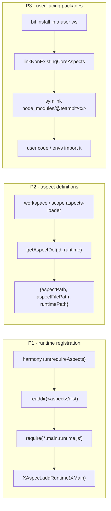
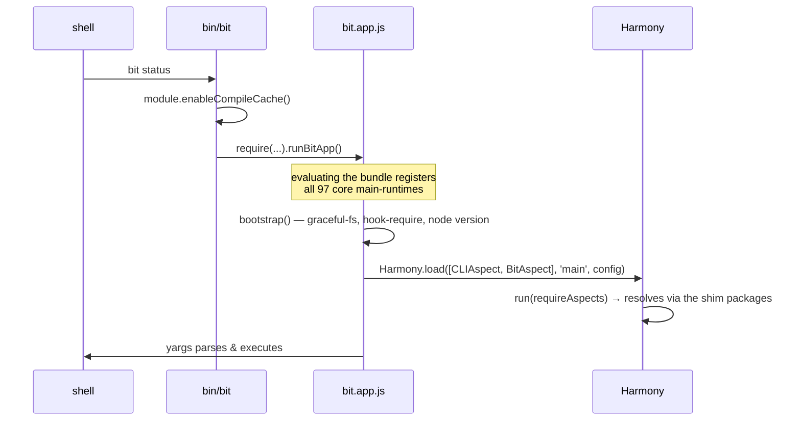

# Bundling the Bit CLI with esbuild — Plan, Architecture & Status Report

> Branch: `bit-bundle3` (based on `remove-core-envs-from-manifest`)
> Status: **working end-to-end** — and now also **as a real `bit build` task**, with types.
> §7 verification · §8 what's installed and why · §9 bundle vs SEA · §9b the published package shape
> · §9c running e2e against the bundle · §9d first CI run results · §9e the build task · §10 gaps.
> Last updated: 2026-08-10

---

## 1. Goal & result so far

Ship the Bit CLI as a **single bundled JavaScript file** plus a thin ring of packages that genuinely
cannot be inlined, instead of a 1.2 GB `node_modules` tree.

|                     | released bit (bvm 2.0.72) | bundled bit (this branch)                                   |
| ------------------- | ------------------------- | ----------------------------------------------------------- |
| install size        | **1.2 GB**                | **231 MB** (67 MB bundle + 161 MB externals + 2.5 MB shims) |
| files on disk       | **141,008**               | **~7,300**                                                  |
| `bit --help` (warm) | 0.662 s                   | **0.642 s** (SEA: 1.324 s — §9)                             |
| `bit list` (warm)   | 0.914 s                   | **0.848 s** (SEA: 1.574 s)                                  |
| single executable   | —                         | **179 MB `bit-app`** (+ the `bundle/` support dir)          |
| build time          | n/a                       | ~11 s esbuild + ~5 s codegen (+ ~40 s for the SEA variant)  |

Every command on the target list — and a good deal more — runs from `/tmp/bit-bundle` against
workspaces in `/tmp/bundle-tests/*`, with **zero** reads from this repo or from `~/.bvm` (§7.3).

---

## 2. How to build and run it

```bash
bit compile                     # the bundle is built FROM dist/, so this must be current
npm run bundle                  # → /tmp/bit-bundle
cd /tmp/bit-bundle/bundle && npm install     # the externals, ~230 packages

node /tmp/bit-bundle/node_modules/@teambit/bit/bin/bit --help
```

| flag                                      | meaning                                                                                 |
| ----------------------------------------- | --------------------------------------------------------------------------------------- |
| `--out-dir <path>`                        | where to write the distribution (or `BIT_BUNDLE_OUT_DIR`)                               |
| `--sea`                                   | also build the single executable → `<out>/bit-app`                                      |
| `--ui-bundling`                           | add the UI/preview bundling externals — makes `bit start` work, **costs 1.1 GB** (§8.3) |
| `--minify` / `--sourcemap` / `--no-clean` | as expected                                                                             |

A clean run keeps `bundle/node_modules`, so the `npm install` is only needed when `externals.ts`
changes. `npm run bundle:ensure` does build-only-if-stale (§9c) and also runs the `npm install` for
you, which is usually what you want:

```bash
npm run bundle:ensure            # build iff stale, then install externals
npm run bundle:ensure -- --sea   # same, plus the executable
```

---

## 3. Output layout

```
/tmp/bit-bundle/                       ← the distribution
├── bit-app                            ← the SEA executable (only with --sea)
├── node_modules/@teambit/             ← 108 generated SHIM packages (2.5 MB)
│   ├── bit/
│   │   ├── package.json               ← real version → `bit --version`; `bin` field
│   │   ├── bin/bit                    ← launcher: enableCompileCache() + runBitApp()
│   │   └── dist/{index.js, esm.mjs, bit.aspect.js, bit.main.runtime.js}
│   ├── workspace/  … one per core aspect …
│   └── harmony/ , legacy/             ← non-aspect packages users import
└── bundle/
    ├── bit.app.js                     ← THE bundle, 67 MB, one CJS file
    ├── bit.app.sea.js + .blob         ← SEA variant + its blob (only with --sea)
    ├── package.json + .npmrc          ← the externals; `npm install` runs HERE
    ├── node_modules/                  ← installed externals (161 MB)
    ├── workers/jest.worker.js         ← self-contained child-process entry
    ├── metafile.json, sea-config.json
    ├── workspace-template.jsonc, agents-template*.md, bit-*-template.md
    └── lib.*.d.ts                     ← typescript lib files (102 of them)
```

### Why there are two `node_modules`

They hold two different kinds of thing, and mixing them is unsafe:

- **`<out>/node_modules/@teambit/*` — generated, 2.5 MB.** Not dependencies at all: 108 two-line
  shim packages that re-export slices of `bit.app.js`. They are the _public API surface_ — what a
  user's `bit install` symlinks into their workspace, and what `getAspectDir` / `getAspectDef`
  discover.
- **`<out>/bundle/node_modules` — installed, 161 MB.** Real npm packages, the output of
  `npm install` against `bundle/package.json`.

They are kept apart because a package manager run in a directory prunes whatever its `package.json`
doesn't reference — a single root tree would mean `npm install` deleting the generated shims. Node
resolves both from `bit.app.js` anyway: `bundle/node_modules` first, then one level up.

**This split is a property of the prototype, not of the design.** A published package's own files are
never pruned, so the shipping layout has one `node_modules` — the consumer's — with the externals as
ordinary `dependencies` of `@teambit/bit`. See §9b.

---

## 4. Architecture

### 4.1 The three structural problems, and how each is solved



|        | problem                                                                        | solution                                                                                                                                                                                                                                                       |
| ------ | ------------------------------------------------------------------------------ | -------------------------------------------------------------------------------------------------------------------------------------------------------------------------------------------------------------------------------------------------------------- |
| **P1** | a bundle has no `dist/*.main.runtime.js` to `readdir` and `require`            | the generated entry does `import '@teambit/x/x.main.runtime'` for **every** core aspect, so the side effect happens at bundle-evaluation time. `requireAspects` still runs and still finds files — because of P2 — so **no runtime source change was needed**. |
| **P2** | `getAspectDef` globs `<pkg>/dist` for `*.aspect.js` / `*.<runtime>.runtime.js` | each shim emits those exact file names, re-exporting the bundle. `getAspectDef('teambit.workspace/workspace','main')` returns real paths (§7.3). **Zero changes to `core-aspects.ts`.**                                                                        |
| **P3** | users must `import '@teambit/<aspect>'`, and the linker symlinks _directories_ | the shims **are** real directories with real `package.json`s, so `DependencyLinker.linkCoreAspect` works untouched.                                                                                                                                            |

### 4.2 The shim trick

The bundle entry is generated into `node_modules/.bit-bundle/entry.ts`:

```ts
import './core-aspects-runtimes'; // 97 side-effect imports of *.main.runtime
export * from './core-aspects-exports'; // export * as workspace from '@teambit/workspace'; …
export { runBit as runBitApp } from '@teambit/bit/run-bit';
```

so `bit.app.js` exposes every core aspect's API as a named export, and each shim is two lines:

```js
// /tmp/bit-bundle/node_modules/@teambit/workspace/dist/index.js
module.exports = require('../../../../bundle/bit.app.js').workspace;
```

Node's module cache guarantees the 67 MB bundle is evaluated **once**, however many shims point at
it.

The entry deliberately **exports** `runBitApp` rather than calling it: the bundle is `require`d by
every shim, and a bundle that started the CLI on import would boot bit whenever a user's component
imported a core aspect.

### 4.3 Load flow



---

## 5. The bundler

`scopes/harmony/bit/bundle/` — run with `npm run bundle`.

| file                                                                      | role                                                                                                                                                                                 |
| ------------------------------------------------------------------------- | ------------------------------------------------------------------------------------------------------------------------------------------------------------------------------------ |
| `bundle.ts`                                                               | orchestrator, flags, summary; selective clean that preserves installed externals                                                                                                     |
| `config.ts`                                                               | every path in one place                                                                                                                                                              |
| `core-aspects-info.ts`                                                    | per aspect: package name, dir, and the **actual** `*.aspect` / `*.main.runtime` file names (not derivable from the id — `teambit.envs/envs` lives in `environments.main.runtime.ts`) |
| `generate-entry.ts`                                                       | writes the entry, the SEA entry and the two barrels into `node_modules/.bit-bundle`                                                                                                  |
| `run-esbuild.ts`                                                          | the single `build()` call, with an optional SEA wrapper                                                                                                                              |
| `externals.ts`                                                            | the lean list + the opt-in UI group, each entry with a stated reason                                                                                                                 |
| `plugins/teambit-dist-resolver-plugin.ts`                                 | the most important plugin — §6.1                                                                                                                                                     |
| `plugins/worker-entry-plugin.ts`, `worker-entries.ts`, `build-workers.ts` | child-process entry points, built as their own bundles                                                                                                                               |
| `plugins/ignore-assets-plugin.ts`                                         | `.css/.scss/.mdx/.md` → empty module                                                                                                                                                 |
| `generate-shim-packages.ts`                                               | the 108 `@teambit/*` shim packages                                                                                                                                                   |
| `generate-esm-bridges.ts`                                                 | derives each shim's `esm.mjs` **from the built bundle** — §6.3                                                                                                                       |
| `copy-assets.ts`                                                          | files read via `path.join(__dirname, …)`, with collision detection                                                                                                                   |
| `build-sea.ts`                                                            | Node single-executable build (§9)                                                                                                                                                    |
| `ensure-bundle.ts`                                                        | build-iff-stale + stamp, used by the e2e runners (§9c)                                                                                                                               |
| `create-package-json.ts`, `generate-npmrc.ts`, `generate-bin.ts`          | the distribution's metadata & launcher                                                                                                                                               |

Nothing generated is written into the source tree: the entry and barrels go to
`node_modules/.bit-bundle`, so git, `tsc` and oxlint never see them.

---

## 6. The four problems that actually mattered

### 6.1 Mixed resolution of `@teambit/*` → duplicate aspect instances

A workspace component's `package.json` says:

```jsonc
"." :   { "node": { "require": "./dist/index.js", "import": "./dist/esm.mjs" } }
"./*":  "./*.ts"
```

so the **same module** resolves three different ways depending on how it was imported:
`@teambit/cli` from a TS file (an `import`) → `dist/esm.mjs`; from a `require` → `dist/index.js`;
and `@teambit/cli/cli.main.runtime` → the raw **TypeScript source**. A bundler follows all three and
ends up with _two copies of every aspect_ — Harmony would register a runtime on one `CLIAspect`
object and look it up on another.

It also fails outright: `esm.mjs` is a hand-written bridge, and components that never needed one
(`@teambit/validator`, `@teambit/objects`, `@teambit/config-store`, `@teambit/cli-mcp-server`,
`@teambit/empty-env`) simply don't have it. `bit-bundle2`'s answer was to hand-write ~50 `esm.mjs`
files (there is a commit literally titled _"update all esm.mjs files"_).

**Solution** — `teambit-dist-resolver-plugin`: every `@teambit/*` package with `_bit_local: true`
(326 in this repo) resolves to its compiled `dist`, uniformly, bypassing the exports map. Bare
specifier → the package's `main` (**not** hard-coded `dist/index.js` — `@teambit/legacy.constants`
has `main: dist/constants.js`). Deep specifier `@teambit/x/foo` → `dist/foo.js`. Non-workspace
`@teambit/*` packages fall through to esbuild, retried with `require` semantics if the ESM branch
points at a missing file.

### 6.2 `hook-require` was polluting `Object.prototype` — a real bug, not a bundling artefact

`scopes/harmony/bit/hook-require.ts` did:

```ts
module.constructor.prototype.require = function (id) { … }
```

Under a bundler the free `module` variable is the _bundler's_ synthetic module record — a plain
object — so `module.constructor` is **`Object`**, and this installed an enumerable `require` on
`Object.prototype`. Every object in the process then inherited it, and anything doing `for…in`
picked it up. It surfaced as an opaque `hookRequire - id must be a string` from deep inside pino:
lodash's `omit` copies inherited enumerable keys, so a 4-key options object reached the logger with
a fifth key `require` whose value was the hook itself, which pino then called as a serializer.

**Fix**: import the `module` builtin explicitly and patch `Module.prototype.require` / call
`Module._load`. Correct in both bundled and non-bundled builds; `bd --version`, `bd list`,
`bd status` and `npm run lint` all re-verified. **This is worth landing on `master` independently of
bundling.**

### 6.3 ESM consumers need named exports

Envs are ESM: `import { ComponentMap } from '@teambit/component'`. Node can synthesise named exports
from CJS, but only for shapes `cjs-module-lexer` reads statically — and
`module.exports = require(bundle).component` is not one. `bit create` failed with _"Named export
'ComponentMap' not found"_.

**Fix** — `generate-esm-bridges.ts` loads the freshly built bundle **in a child process**, asks it
for the real export names of each aspect namespace, and writes `dist/esm.mjs` accordingly (108
bridges, 0 skipped). Because they are _derived from the artefact_, they cannot drift the way the
hand-written ones in the repo do.

### 6.4 Native code and child processes

- **`@pnpm/napi`** (the pnpm v12 Rust engine) picks a per-platform `.node` package at require time.
- **`jest.worker`** is handed to `jest-worker` as an absolute path and `require`d in a _child_
  process. It is built as its own self-contained bundle at `bundle/workers/jest.worker.js`, and
  `worker-entry-plugin` rewrites the `require.resolve` to point at it. (`require.resolve` in the
  emitted CJS resolves relative to the bundle file, so it travels with the distribution.)
- **`batch`** (via express/serve-index) requires a package called `emitter` that hasn't existed in a
  decade → aliased to node's `events`.
- **`__dirname`-relative data files** (`workspace-template.jsonc`, the AGENTS.md / MCP rules
  templates, typescript's `lib.*.d.ts`) are copied flat into the bundle dir, because inside the
  bundle `__dirname` _is_ the bundle dir. `copy-assets` warns on a name collision rather than
  silently overwriting.

---

## 7. Verification

### 7.1 Command matrix — 40 commands run from the bundle

All against `/tmp/bundle-tests/ws2` (a real workspace with a created, snapped, tagged component).

| ✅ working    |                                                                                                                                 |
| ------------- | ------------------------------------------------------------------------------------------------------------------------------- |
| lifecycle     | `init`, `create aspect`, `compile`, `status`, `status --json`, `list`, `show`, `log`, `diff`, `snap`, `tag`, `export`, `import` |
| build         | `build --unmodified` — **all 9 tasks**, incl. Vitest, schema extraction, Rspack preview bundling, PreBundlePreview              |
| analysis      | `schema`, `deps get`, `graph --json`, `insights`, `why`\*, `dependents`\*                                                       |
| lanes         | `lane list`, `lane create`, `lane show`, `lane switch`, `lane remove`                                                           |
| quality       | `test`, `lint`, `format`                                                                                                        |
| workspace     | `install`, `link`, `envs`, `aspect list`, `templates`, `clear-cache`, `doctor`                                                  |
| config/system | `config list`, `globals`, `system log`, `cat-component`, `cat-scope`                                                            |
| long-running  | `watch` (compiles + watches), `server` (HTTP API responds)                                                                      |

\* `why`, `dependents`, `format --check` and `eject --help` exit non-zero — **identically to the
released `bit`** on the same workspace, so they are pre-existing behaviour, not bundle regressions
(verified side by side).

| ❌ not working |                                                                                                                                                                                |
| -------------- | ------------------------------------------------------------------------------------------------------------------------------------------------------------------------------ |
| `bit start`    | `Cannot find module '@teambit/mdx.modules.mdx-v3-options'` — the UI dev server needs the UI-bundling packages on disk. Works with `--ui-bundling`, at a cost of 1.1 GB (§8.3). |

### 7.2 Single executable

`npm run bundle -- --sea` produces `/tmp/bit-bundle/bit-app` (179 MB). Verified: `--version`,
`--help`, `init`, `create aspect` (incl. pnpm install), `status`, `list`, `show`,
`build --unmodified` (all 9 tasks). Details and caveats in §9.

### 7.3 Isolation

- `BIT_LOG=* bit status` from the bundle → **0** log lines mentioning `dev/bit/bit`, **0** mentioning
  `.bvm`.
- A probe script resolved core aspects through the bundle's own resolution path:
  `teambit.workspace/workspace → /private/tmp/bit-bundle/node_modules/@teambit/workspace`, and
  `getAspectDef(…, 'main')` returned existing `dist/workspace.aspect.js` /
  `dist/workspace.main.runtime.js`.

### 7.4 No regression to the normal build

`npm run lint` (tsc --noEmit + oxlint) → 0 errors. `bd --version`, `bd list`, `bd status`,
`bd compile` all fine after the `hook-require` change.

---

## 8. What is installed next to the bundle, and why

This is the section to optimise against. The bundle itself is 67 MB; **161 MB is installed
dependencies**, so this is where the remaining weight lives.

### 8.1 The 11 declared externals

Every entry was verified against the emitted bundle — the "sites" column is the number of distinct
files in `bit.app.js` that actually `require()` it.

| package                         | installed | sites  | why it cannot be inlined                                                                                  | who needs it                                                                                             | droppable?                                                                             |
| ------------------------------- | --------- | ------ | --------------------------------------------------------------------------------------------------------- | -------------------------------------------------------------------------------------------------------- | -------------------------------------------------------------------------------------- |
| `@rspack/core`                  | **42 MB** | 7      | native Rust binary                                                                                        | `@teambit/preview` (rspack.config, pre-bundle), `@teambit/ui` (dev/browser/ssr configs, ui-server)       | **only for `bit start` / preview + UI bundling.** Biggest single win if made optional. |
| `@pnpm/napi`                    | **40 MB** | 3      | Rust engine, per-platform optional dep                                                                    | `@teambit/pnpm` (read-config, lynx), `@teambit/pkg` (packer)                                             | no — `bit install` / `bit create` need it                                              |
| `typescript`                    | **23 MB** | 92     | `ts-server-client` spawns `typescript/lib/tsserver.js` by path; the compiler is handed `lib.*.d.ts` paths | `@teambit/typescript`, `@teambit/envs` fallback compiler, `tsutils`                                      | partly — see §8.2                                                                      |
| `@babel/core`                   | **17 MB** | 77     | plugin graph resolved by name at runtime                                                                  | `@teambit/compilation.modules.babel-compiler`, `react-docgen`, dozens of bundled babel plugins           | partly — see §8.2                                                                      |
| `webpack`                       | **14 MB** | 8      | plugin/loader graph resolved by name                                                                      | `@teambit/webpack` dev config, `@rspack/dev-server`, `workbox-webpack-plugin`, `webpack-assets-manifest` | **only for user envs that use webpack**                                                |
| `mocha`                         | 2.2 MB    | 2      | loaded as a test runner in-process by path                                                                | `@teambit/mocha`, `@teambit/defender.mocha-tester`                                                       | no                                                                                     |
| `@parcel/watcher`               | 588 KB    | 1      | native `.node`                                                                                            | `@teambit/watcher`                                                                                       | no                                                                                     |
| `@lydell/node-pty`              | ~1 MB     | 1      | native `.node`                                                                                            | `@teambit/bit` server-forever (the PTY daemon)                                                           | only if `bit server-forever` is dropped                                                |
| `bufferutil` / `utf-8-validate` | small     | 2 each | native `.node`                                                                                            | optional accelerators for `ws`                                                                           | **yes** — `ws` works without them                                                      |
| `source-map-support`            | small     | 1      | installs a process-wide `Error.prepareStackTrace` hook                                                    | `@babel/register`                                                                                        | no                                                                                     |
| `pnpapi` / `fsevents`           | —         | 0      | declared external, never installed                                                                        | guarded/optional requires                                                                                | n/a                                                                                    |

Plus ~4 MB of `caniuse-lite`, 3.3 MB `terser-webpack-plugin`, 2.3 MB `terser`, and the transitive
tail — all pulled in by webpack/rspack, not requested directly.

### 8.2 Optimisation levers, roughly in order of value

1. **Make `@rspack/core` + `webpack` optional (≈ 60 MB).** Nothing in the CLI's core path touches
   them; they exist for `bit start`, the preview build and webpack-based user envs. A lazy install
   ("run `bit ui install` to enable the UI") or resolving them from the user's workspace would cut a
   quarter of the distribution.
2. **Decide who owns `typescript` (23 MB).** A user's env already brings its own TypeScript; bit ships
   a second copy mostly so `ts-server` and the fallback compiler have one. Resolving from the
   workspace with a lazy fallback is the same trade-off as (1).
3. **`@babel/core` (17 MB).** Same question. Note the 77 require sites are overwhelmingly _bundled
   babel plugins_ asking for their peer, not bit code — so inlining babel is also plausible.
4. **Drop `bufferutil` / `utf-8-validate`.** Pure optional accelerators for `ws`.
5. **Audit the bundle's own 67 MB** via `bundle/metafile.json`. The `aspectsWithoutMainRuntime` list
   (9 UI-only aspects) is a hint that a lot of React UI code is being pulled into a CLI bundle
   through index barrels and never executed. Marking the UI-bundling packages external already cut
   the bundle from 66.5 MB → 61.4 MB, which suggests more is reachable the same way.
6. **`--minify`** — not yet measured against the compile-cache startup win.

### 8.3 The `--ui-bundling` group — measured, and deliberately off

`bit start` builds an rspack config full of `require.resolve('<pkg>')` — loader paths and
`resolve.alias` entries — and rspack then loads those files itself, so a copy inlined in
`bit.app.js` is invisible to it. Supplying them means installing:

`react`, `react-dom`, `@mdx-js/loader`, `@teambit/mdx.modules.mdx-v3-options`, `@teambit/react`,
`@teambit/base-react.navigation.link`, `@teambit/base-ui.graph.tree.recursive-tree`,
`@teambit/component.ui.component-compare.context`, `@teambit/semantics.entities.semantic-schema`,
`@teambit/code.ui.code-editor`, `@teambit/api-reference.hooks.*`, `@teambit/lanes.*`,
`postcss-loader`, `postcss-flexbugs-fixes`, `postcss-normalize`, `resolve-url-loader`, `sass-loader`,
`sass`, `@rspack/dev-server`.

**Measured: 231 MB → 1.3 GB.** `@teambit/*` UI packages alone are 365 MB, `monaco-editor` 77 MB (via
`@teambit/code.ui.code-editor`), `date-fns` 36 MB, `@bitdev/*` 29 MB, `relative-time-format` 20 MB.
That is the entire saving, gone — so the group is behind a flag, not in the default build. Making
`bit start` viable needs a different approach (lazy install, or resolving the UI graph from the
pre-bundled UI artefact rather than re-resolving each package), not a bigger externals list.

Note it also required `legacy-peer-deps=true` in the generated `.npmrc`: the externals are a curated
slice of a tree pnpm already resolved, and npm's strict peer algorithm re-litigates it (e.g.
`@teambit/api-reference.hooks.use-api` still declares react `^16 || ^17` against a react-19
workspace).

---

## 9. Script bundle vs. single executable (SEA)

`npm run bundle -- --sea` runs the full Node SEA pipeline: esbuild a self-starting variant →
`node --experimental-sea-config` → copy the node binary → `codesign --remove-signature` →
`npx postject` → `codesign --sign -`. Result: `/tmp/bit-bundle/bit-app`, **179 MB**, verified working
for the whole `init → create → status → build` flow and for e2e specs.

### 9.1 Timings

Averaged over 5 runs each, same machine (macOS arm64, node 22.22.0), warm caches, in a real
workspace. "script" = `bundle/bit.app.js` loaded by the `bin/bit` launcher; "SEA" = the executable
with the bundle embedded.

|                            | `bit --version` | `bit --help` | `bit list`  |
| -------------------------- | --------------- | ------------ | ----------- |
| bvm bit 2.0.72 (unbundled) | **0.254 s**     | 0.662 s      | 0.914 s     |
| bundle, script launcher    | 0.400 s         | **0.642 s**  | **0.848 s** |
| bundle, SEA (embedded)     | 0.414 s         | 1.324 s      | 1.574 s     |

Per-command cost in the e2e suite (same 8-test spec): **script 0.78 s/command, SEA 2.0 s/command**
(27 s vs 47 s wall clock).

`--version` short-circuits before the aspect graph is evaluated, which is why all three are close
there and why bvm wins — it never parses 67 MB. Once real work starts, the bundle is slightly ahead
of bvm and the SEA is ~2× behind both.

### 9.2 Why the SEA is slower — measured, not guessed

Not the bundle size, and not (as first suspected) the wrapper I had to add. The cause is that
**Node's compile cache does not apply to the main entry script.**

| experiment                                                                  | `bit --help` |
| --------------------------------------------------------------------------- | ------------ |
| evaluate `bit.app.js` **as the main script**, cache on                      | 0.813 s      |
| evaluate the _same file_ **via `require()`** from a 1-line main, cache on   | **0.390 s**  |
| SEA with the 67 MB bundle embedded                                          | 1.312 s      |
| SEA whose embedded script is a **stub that `require`s `bundle/bit.app.js`** | **0.642 s**  |
| script launcher (`bin/bit` → `require`)                                     | 0.618 s      |

A SEA's embedded script is _always_ the main script, so it can never benefit from the module compile
cache; `useCodeCache: true` helps (2.10 s → 1.31 s) but cannot close the gap. The moment the same
binary loads the bundle through `require()` from disk, it matches the script launcher exactly.

(An earlier hypothesis — that wrapping the bundle in an IIFE to rebind `require`/`__dirname` was the
cost — was tested and rejected: removing the IIFE in favour of `var` re-binding changed nothing. The
`var` form is kept anyway, it is simpler.)

### 9.3 Pros and cons

**SEA — pros**

- One file to distribute and to put on `PATH`; no `node` on the user's machine, no version skew
  between bit and the runtime.
- The node version is pinned into the artefact, so "works on my node" problems disappear.
- The JavaScript is embedded, so it cannot be casually edited or partially deleted.
- Natural fit for a future `bvm`-less install (curl one binary).

**SEA — cons**

- **~2× slower on every command** (§9.1–9.2), and there is no configuration that fixes it — the
  limitation is structural.
- **It is not actually self-contained.** It still needs `bundle/` next to it: the externals are
  native/per-platform packages that no bundler can inline, and bit reads data files
  (`workspace-template.jsonc`, `lib.*.d.ts`, the jest worker) off disk via `__dirname`.
  So you ship a 179 MB binary _and_ a 230 MB directory.
- Build is per-platform and needs `postject` + `codesign`; every OS/arch is a separate artefact.
- 179 MB vs the 67 MB script — the binary carries a full node copy.
- Debugging is worse: no source paths, no `NODE_OPTIONS` niceties, harder stack traces.

**Script bundle — pros**

- Fastest of the three on real commands, and faster than today's bit.
- Platform-independent artefact; the same `bundle/` works anywhere the externals install.
- Ordinary node debugging, `--inspect`, source maps if enabled.

**Script bundle — cons**

- Requires a node runtime of a compatible version on the user's machine (as bit does today).
- The launcher must call `module.enableCompileCache()` (node ≥ 22.1) to get the good number.

**Recommendation.** The script bundle is the one to ship. A SEA only becomes attractive if the goal
is specifically "no node on the machine", and even then the _stub_ form (binary = node + a 1 KB
launcher that requires `bundle/bit.app.js`) gives the same startup as the script while still being a
single executable on `PATH` — it just doesn't embed the JS. That is the shape to pick if a binary is
wanted; embedding the 67 MB buys tamper-resistance and costs 2× startup.

## 9b. What the published `@teambit/bit` package should look like

The `/tmp/bit-bundle` layout is a **prototype layout**, not the shipping one, and the difference
matters because of exactly the thing you spotted: `npm install` of a published package puts that
package's dependencies in the _consumer's_ `node_modules`, never inside `<pkg>/bundle/node_modules`.

The prototype puts the externals' `package.json` inside `bundle/` for one reason only: in a hand-made
directory, an `npm install` at the root would prune the generated `@teambit/*` shims as extraneous.
**That problem does not exist for a published package** — a package's own files are never pruned.

So the shipping shape should mirror today's, with two changes:

```
@teambit/bit@<version>            ← published, ~70 MB
├── package.json
│     "bin":          { "bit": "./bin/bit" }
│     "dependencies": { "@pnpm/napi": "…", "typescript": "…", "@rspack/core": "…", … }   ← the 11 externals
├── bin/bit                       ← enableCompileCache() + require('../bundle/bit.app.js').runBitApp()
└── bundle/
      bit.app.js                  ← the 67 MB bundle
      workers/jest.worker.js
      workspace-template.jsonc, agents-template*.md, lib.*.d.ts, …

@teambit/<aspect>@<version>       ← 108 published SHIM packages, ~20 KB each
├── package.json  { "main": "dist/index.js", "dependencies": { "@teambit/bit": "<version>" } }
└── dist/{index.js, esm.mjs, <name>.aspect.js, <name>.main.runtime.js}
        → module.exports = require('@teambit/bit/bundle/bit.app.js').<aspect>
```

Why this shape:

- **The externals become ordinary `dependencies` of `@teambit/bit`.** A package manager installs them
  into the install root's `node_modules`, and node resolution from `@teambit/bit/bundle/bit.app.js`
  walks up and finds them. No `npm install` inside the package, ever. The two-`node_modules` split in
  the prototype disappears.
- **The 108 aspect packages keep their existing names and versions** — bit already publishes them, so
  the release pipeline's shape is unchanged. They just stop containing code and become ~20 KB
  re-exports of the bundle. This is what keeps `require.resolve('@teambit/workspace')`,
  `getAspectDir`, `getAspectDef` and `DependencyLinker.linkCoreAspect` working with no runtime change,
  in a user's workspace as well as in bvm's install dir.
- **bvm needs no change at all**: it still creates a dir with `{"dependencies":{"@teambit/bit":"…"}}`
  and installs. The result is ~230 MB instead of 1.2 GB because the 108 packages are now tiny and the
  dependency tree is 11 packages instead of ~5000.

> **Implemented (option 1b).** Shims now live at `dist/core-aspects/node_modules/@teambit/<name>/`
> and the bundle at `dist/core-aspects/bundle/bit.app.js`. Node's upward `node_modules` walk from the
> bundle file reaches them, so `require.resolve('@teambit/<name>')` works with **no runtime change**;
> `npm pack --dry-run` confirms npm strips only the _root_ `node_modules`, so a nested one publishes.
> The per-aspect locators (`dist/<name>/index.js`) are emitted by the bundler, replacing
> `CoreExporterTask` for a bundled build. Verified end to end: `bit install` in a workspace symlinked
> `node_modules/@teambit/workspace -> .../dist/core-aspects/node_modules/@teambit/workspace`, and
> `--version`, `status`, `list`, `show`, `compile` all pass. Full rationale in the bundler's
> `config.ts`.

### Why `dist/<aspect>/` cannot simply replace the node_modules shims

A released `@teambit/bit` already contains `dist/<aspect-name>/index.js`, generated by
`CoreExporterTask` (`@teambit/aspect`). It looked like the natural home for the bundle's shims - it
publishes cleanly, and `DependencyLinker.linkCoreAspect` checks `<mainAspect>/dist/<name>` _before_
falling back to `getAspectDir`. But its whole content is:

```js
module.exports.path = require.resolve('@teambit/workspace');
```

It is a **locator, not a package**. `linkCoreAspect` requires it, reads `module.path`, and symlinks
`resolve(module.path, '..', '..')` - it uses the file to _find_ the real `@teambit/<aspect>` package
and links that. So the directory it points at still has to exist and still has to look like a package.

The two roles cannot be merged. Node resolves a directory `require` through `package.json.main` when
a package.json is present, and only falls back to `index.js` when it is absent (verified):

| `dist/<name>/` contains                           | `require('<dist>/<name>')` returns                                      |
| ------------------------------------------------- | ----------------------------------------------------------------------- |
| `index.js` + `package.json {main: dist/index.js}` | the **package main** - `module.path` undefined, `linkCoreAspect` throws |
| `index.js` only                                   | the **locator** - what `linkCoreAspect` needs                           |

So `dist/<name>/` stays a locator, and the bundle still needs a real, resolvable package directory per
core aspect inside the published `@teambit/bit`. Three ways out:

1. **`dist/core-aspects/@teambit/<name>/` as the package dir**, with `dist/<name>/index.js` pointing at
   it (`require.resolve('../core-aspects/@teambit/<name>/dist/index.js')`, so `'..','..'` lands on the
   package root). Publishes cleanly, no `node_modules` in the tarball, no extra published packages.
   **But** `getAspectDir` - used on many other paths - resolves via `require.resolve('@teambit/<name>')`
   with a `resolve(__dirname, '../..', name, 'dist')` fallback; neither finds that directory, so it
   needs a bundle-aware branch.
2. **`node_modules/@teambit/<name>` inside the package** + `bundleDependencies` listing all 107 - the
   only way npm keeps `node_modules` in a tarball. No runtime change, more fragile packaging.
3. **Publish 107 thin packages** - rejected, too much registry churn.

(1) is the cleanest artefact and costs one small change to `getAspectDir`; (2) needs no source change.
This is the open decision.

The one open question is whether the shim packages should instead be _bundled_ inside `@teambit/bit`
(`bundleDependencies` + a pre-baked `node_modules`). That would mean publishing one package instead of
109, but npm strips `node_modules` from tarballs unless every entry is listed in `bundleDependencies`,
and it would break anyone who depends on a specific `@teambit/<aspect>` version directly. Publishing
109 packages is the boring, compatible answer.

**Not yet implemented** — `generate-shim-packages.ts` currently emits the prototype layout. Converting
it is mechanical (emit a `dependencies` entry instead of `{}`, drop `bundle/package.json`, move the
externals into the bit package's `package.json`), and is the first item of §11C.

## 9c. Running the e2e suite against the bundle

```bash
npm run e2e-test:bundle                          # whole suite against bundle/bit.app.js
npm run e2e-test:sea                             # whole suite against the SEA binary
npm run e2e-test:bundle -- ./e2e/commands/cat.e2e.ts     # a single spec
npm run e2e-test:bundle -- --force                       # rebuild even if it looks current
npm run e2e-test:bundle -- --no-build                    # fail instead of building (assert CI prepared it)
npm run e2e-test:bundle-circle                           # CircleCI reporter flags
npm run e2e-test:sea-circle
npm run bundle:ensure                            # just the build-if-stale step, no tests
```

`scripts/e2e-with-bundle.js` prepares the artefact, then runs the normal mocha command with
`npm_config_bit_bin` pointed at it — which `CommandHelper.getBitBin()` already honours, and which
accepts a full command (`node /tmp/bit-bundle/node_modules/@teambit/bit/bin/bit`), not just a bin
name. Unrecognised arguments are forwarded to mocha, so `.only` workflows and explicit spec paths
work unchanged.

### Build-once-per-machine, without ever testing a stale bundle

CI splits the suite across many fresh machines and invokes mocha repeatedly on each; a rebuild per
invocation would dominate the run. Locally the opposite risk applies: a `/tmp/bit-bundle` from
yesterday silently tests the wrong code.

Both are served by one rule — **build if and only if the stamp doesn't match**
(`scopes/harmony/bit/bundle/ensure-bundle.ts`). The stamp, written to `<out-dir>/bundle-stamp.json`,
records:

| input                                                                              | catches                                                        |
| ---------------------------------------------------------------------------------- | -------------------------------------------------------------- |
| `distFingerprint` — count + newest mtime across every workspace component's `dist` | any `bit compile`, i.e. any source change                      |
| `bundlerFingerprint` — mtimes of the compiled bundler                              | changes to the bundler itself                                  |
| `externalsHash`                                                                    | a changed externals list (→ the externals must be reinstalled) |
| `bitVersion`, `node`, `platform`, `arch`                                           | wrong machine / wrong runtime                                  |
| `sea`, `uiBundling`                                                                | a different artefact was requested                             |

Consequences, all verified:

- **CI:** first invocation on a machine builds (`no previous build`); every later invocation on the
  same machine reuses it, because nothing in the stamp moved. No cross-machine cache needed.
- **Local:** recompiling anything moves `distFingerprint` and triggers exactly one rebuild.
- A `--sea` request against a script-only build rebuilds (`artifact missing`); a plain request against
  a `--sea` build **reuses** it, since the SEA build produces the script bundle too.
- `--force` always rebuilds; `--no-build` turns staleness into a hard error, which is what a CI job
  should use if a separate step is supposed to have prepared the bundle.

The externals `npm install` runs as part of the ensure step and is a no-op on a warm machine, because
a clean rebuild deliberately preserves `bundle/node_modules`.

## 9d. First full CI run — results

Pipeline `735761af` on `bb86f8828`. `setup_esbuild_bundle` **passed** (210 s: build + externals
install + smoke tests) with the same numbers as local: 66.58 MB bundle, 106 core aspects, 11
externals, 0 unresolved, 107 ESM bridges, 0 errors.

`e2e_test_esbuild_bundle` ran the full suite across 40 nodes. Compared against the **baseline
`e2e_test` job from the same pipeline**, which is the only fair reading — the baseline is not green
on this branch either:

|                                   | tests | failures |
| --------------------------------- | ----- | -------- |
| baseline `e2e_test`               | 2876  | 23       |
| bundled `e2e_test_esbuild_bundle` | 2837  | 41       |

**All 23 baseline failures also fail in the bundle, and 0 failures are unique to the baseline** — the
bundle's failures are a strict superset, so the delta is exactly **18 bundle regressions**:

| #   | cause                                                                                                | tests                                                                                                 | already known?                                                                                                                                        |
| --- | ---------------------------------------------------------------------------------------------------- | ----------------------------------------------------------------------------------------------------- | ----------------------------------------------------------------------------------------------------------------------------------------------------- |
| 9   | `failed to start the UI server` — the http/lane/ci e2e specs serve a remote scope via `bit start`    | `http.e2e.ts` ×4, `ci-commands.e2e.ts` ×3, `lane-export-skip-main-history-http.e2e.ts` ×1, +1 cascade | **yes** — §10.1. This measures its real blast radius: the UI server is not just `bit start`, it backs the HTTP remote protocol.                       |
| 2   | `Cannot find module '@teambit/mdx.modules.mdx-v3-options'` in `bit build` with a preview/bundler env | `custom-env-operations-2.e2e.ts` ×2                                                                   | **yes** — §8.3                                                                                                                                        |
| 1   | `Cannot find module 'process/browser'` on `bit tag --build`                                          | `custom-env-operations.e2e.ts`                                                                        | **yes** — §10.2                                                                                                                                       |
| 2   | `Cannot find module './get-uid-gid.js'` on `bit export` to a shared-flag remote                      | `export.e2e.ts` ×2                                                                                    | **yes** — §10.2                                                                                                                                       |
| 2   | `Cannot find module '@yarnpkg/plugin-npm'` on `bit install` with the yarn package manager            | `root-components-yarn.e2e.ts` ×2                                                                      | **no** — the yarn aspect was not on the externals radar                                                                                               |
| 1   | `node-gyp rebuild exited with status 127`                                                            | `node-gyp.e2e.ts`                                                                                     | **no** — `node-gyp/bin/node-gyp.js` was in the warning list but its absence from PATH is a separate problem                                           |
| 1   | **`zlib.inflate … incorrect header check`** on a scope object written by the bundled binary          | `repository-hooks-aspects.e2e.ts`                                                                     | **no — investigate first**                                                                                                                            |
| 1   | `bit --help` took 1849 ms against a 1500 ms budget                                                   | `filesystem-read.e2e.ts`                                                                              | **no** — locally the bundle beats bvm (0.64 s vs 0.66 s); the CI number suggests the compile cache is not being reused between spawned commands there |

### Reading

Two thirds of the delta (12 of 18) is the **already-documented** UI-bundling / `require.resolve`
surface. The CI run's value is that it turned "silent landmines" (§10.2) into a ranked list with
exact call sites, and showed that the UI server matters more than assumed — it backs the HTTP remote
protocol, not only `bit start`.

Priority order for the next pass:

1. **`repository-hooks-aspects` zlib corruption.** A data-integrity failure outranks every missing
   module here. Objects written by the bundled binary failed to inflate; nothing else in the run
   points at a cause yet, and it must be understood before the bundle is trusted with real scopes.
2. **The UI server** (9 tests). Same root cause as `bit start`; §11A.1 still applies — fix by
   resolving the UI graph from the pre-bundled artefact, not by growing the externals list.
3. **Cheap externals**: `@yarnpkg/plugin-npm` (and the yarn plugin family), `process/browser`,
   `uid-number`/`get-uid-gid`, `node-gyp`. Small packages, mechanical, ~5 tests.
4. **The startup budget** — check whether `module.enableCompileCache()` actually has a writable
   cache dir under the CI user, since the local measurement says the bundle should pass this test.

## 9e. The build task — status as of 2026-08-10

`BundleCliAppTask` is wired to `@teambit/bit` via `teambit.harmony/envs/bit-cli-app-env` and **runs
green**: `bd build teambit.harmony/bit --reuse-capsules --tasks BundleCliApp` exits 0 in ~5 s and
produces a 69 MB bundle, 107 shims, 107 locators, 105 runtime assets and 1722 `.d.ts` files.

### What the first runs exposed

The bundler located every package by path-joining onto `packagesRoot`. That holds for this repo and
is wrong everywhere else: **capsules hoist most dependencies to a shared capsule root**, and pnpm
puts a package's own dependencies inside its store slot. The first real run therefore found 71 of 106
core aspects, 70 of them "without a main runtime", copied 0 of 4 asset patterns and resolved 3 of 11
external versions — **all silently**, because a missing main runtime is legitimate for a UI-only
aspect and a missing asset only surfaces at runtime.

Fixed by `resolve-package-dir.ts`, which walks the `node_modules` chain the way node does and returns
the **realpath** (returning the symlink instead broke pnpm resolution for transitive deps). Alongside
it: `findRuntimeAndAspectFiles` now looks in `dist/` and prefers it (a bare `@teambit/x` resolves to
`dist/index.js`, so a deep import to the top-level `.ts` would put the same aspect in the bundle
twice — §6.2 again); specifiers keep the extension under `dist/` and drop it at the top level, since
the two take different branches of the `exports` map and neither extension-probes; and the dist
resolver keys off `componentId` rather than `_bit_local`, which a capsule's copies do not carry.

### Freshness — checked, and correct

Most aspects resolve to _published_ packages in the capsule-root store rather than to the workspace's
just-compiled components, which looked alarming. The rule is right: **new or modified components are
built into sibling capsules and linked fresh; unmodified ones install from the registry**, where the
published package _is_ the current code. Confirmed by counting — the capsule root held 53 capsules
against a `bit status` of 2 new + 51 modified — and it only gets more correct at tag time.

### Types

Shims now carry the aspect's `.d.ts` tree, copied verbatim rather than regenerated so that type
identity is preserved across packages: declarations re-export their siblings and other `@teambit/*`
packages, and those resolve through the sibling shims. Verified in an external workspace under
`noImplicitAny`, with a negative control proving the types are enforced rather than silently `any` —
`ws.path` resolves as `string`, `cm.toArray()` as `[Component, string][]` with `Component` coming
from a sibling shim. Capsules always carry declarations; this repo needs
`bit compile --generate-types` (~11 min).

### Still open on the task

- **4 externals are undeclared dependencies of `@teambit/bit`** — `webpack`, `@babel/core`,
  `bufferutil`, `utf-8-validate` — so their versions cannot be resolved and they are dropped from the
  generated package.json. They are marked external, i.e. _not in the bundle_, so this is a runtime
  `Cannot find module` waiting to happen. The bundler now warns loudly. Fix is `bit deps set`, and it
  belongs with §9b. `@teambit/mcp.mcp-config-writer` is likewise undeclared, so its runtime template
  asset is not copied.
- **`outDir` is `<capsule>/app-bundle`, not the capsule root**, so the build does not yet emit the
  publishable shape of §9b. Moving it must pass `clean: false` — `cleanOutDir` deletes everything in
  the out dir except `node_modules`, which at the capsule root would delete the capsule's own sources
  and dist — and must merge into the capsule's real `package.json` rather than overwrite it with the
  `@teambit/bit-bundle-externals` stand-in.
- **`CoreExporterTask` still writes the same locators** for a non-bundled build; superseding it for
  `@teambit/bit` is not done.
- **The task's output is not yet consumed by the e2e runners**, which still test the hand-built
  `/tmp/bit-bundle`. Pointing them at the task's artefact is what proves the two paths cannot drift.

## 10. Known gaps & limitations

1. **`bit start` / the UI dev server does not work** in the default build (§7.1, §8.3). `bit build`'s
   `BundleUI` and `PreBundlePreview` tasks _do_ pass, so this is specifically the interactive server.
2. **41 `require.resolve` calls remain unresolved in the output.** esbuild warns
   _"X should be marked as external for use with require.resolve"_ for `@svgr/webpack`,
   `babel-loader`, `expose-loader`, the `*-browserify` polyfills, `@rspack/dev-server/client/*`, etc.
   All sit inside webpack/rspack config builders — code that produces a config for bundling _someone
   else's_ browser code. They throw only if that path executes. Silent landmines; see §11.
3. **`bit install` inside a bundled workspace requires the externals installed** — `@pnpm/napi` in
   particular. Without `bundle/npm install` you get `--help`, `init`, `status`, `list` but not
   `create`/`install`.
4. **SEA startup is 2× slower than the script launcher**, structurally — Node's compile cache never
   applies to an embedded main script (§9.2). Not fixable by configuration.
5. **The distribution layout is a prototype**, not the shape to publish (§9b). Converting
   `generate-shim-packages.ts` to emit the publishable shape is not done.
6. **9 core aspects have no main runtime** (`react-router`, `notifications`, `changelog`, `code`,
   `command-bar`, `sidebar`, `component-tree`, `user-agent`, `api-reference`) — all UI-only. Expected,
   not a defect.
7. **Not tested on Linux/Windows.** `@pnpm/napi`, `@parcel/watcher` and `@lydell/node-pty` are the
   platform-sensitive pieces; they are externals precisely so `npm install` picks the right binary.
8. **The bundle is built from `dist/`**, so `bit compile` must be current. A stale dist silently
   produces a stale bundle.

---

## 11. Next steps

**A. Correctness / coverage**

1. Fix `bit start` — but not by growing the externals list (§8.3). The promising direction is to have
   the UI/preview rspack config resolve its aliases from the _pre-bundled UI artefact_ or from the
   user's workspace, rather than `require.resolve`-ing each package out of bit's own installation.
2. Turn the 41 remaining `require-resolve-not-external` warnings into an explicit decision list:
   external, copied asset, worker entry, or confirmed-dead now that core envs are gone.
3. Run the e2e suite against the bundled binary (`npm run e2e-test --bit_bin=…`) — the fastest way to
   find whatever is left.

**B. Size** — see §8.2 for the ordered levers.

**C. Packaging** — the critical path now that the task runs (§9e):

- Declare the 4 missing externals on `@teambit/bit` (`bit deps set`), plus
  `@teambit/mcp.mcp-config-writer`. Without this the published bundle is missing modules it needs at
  runtime.
- Emit the publishable layout of §9b from the task itself: `outDir` at the capsule root with
  `clean: false`, externals merged into the capsule's real `package.json`. Removes the
  two-`node_modules` split and needs no bvm change.
- Supersede `CoreExporterTask` for `@teambit/bit` — both write the same locators today.
- Point the e2e runners at the task's artefact instead of the hand-built `/tmp/bit-bundle`, which is
  what actually proves the two build paths cannot drift.
- Decide SEA's fate with §9.2 in hand: embed (tamper-proof, 2× slower) vs stub (same startup as the
  script, still one binary on PATH, JS stays on disk) vs drop it.

**D. Hardening**

- Wire `e2e-test:bundle-circle` / `e2e-test:sea-circle` into CircleCI so the bundle is exercised by
  the full suite on every run, plus a smoke suite (`--help`, `init`, `create`, `status`, `build`) so
  it cannot silently rot.
- Land the `hook-require` fix (§6.2) on `master` independently.
- Land the two install guards on `remove-core-envs-from-manifest` — **done**, cherry-picked as
  `5f50bc2d5`. A third instance of the same defect remains: `bd install` reaches its own compile step
  and dies on `@teambit/compiler/dist/index.js` lazily requiring `./types`. Fixing it would remove
  the snapshot/restore dance local dev currently needs.
- Consider generating the repo's own `esm.mjs` files the way the bundle's are — same staleness
  hazard, just less visible.

---

## 12. Open questions for you

- **OQ1 — who owns `typescript` / `@babel/core` / `webpack` / `@rspack/core`?** Should bit ship its
  own copies (today: ~96 MB of the 161 MB), or resolve them from the user's workspace with a lazy
  fallback? Biggest lever on install size, and a product decision rather than a technical one.
- **OQ2 — is `bit start` in scope for the bundle at all?** The instructions put `bit start --dev`
  out of scope; plain `bit start` is a different question, and answering it decides how much of the
  rspack/webpack surface has to survive.
- **OQ3 — should the repo's hand-written `esm.mjs` files be replaced by generated ones?** The bundle
  no longer needs them, but they remain a live source of "named export not found" bugs for ESM
  consumers of a normally-installed bit.
- **OQ4 — SEA: embed, stub, or drop?** The embedded binary is 2× slower on every command and still
  needs the 230 MB support dir; the stub form matches the script's speed but doesn't embed the JS.
  §9.3 recommends the script bundle; confirm before more work goes into the SEA path.
- **OQ5 — publish 109 packages (one bit + 108 thin shims) or one package with `bundleDependencies`?**
  §9b argues for 109 as the compatible answer, since those package names/versions already exist.

---

## 13. Decisions taken (and why)

| #   | decision                                                                                   | rationale                                                                                                                                                                                                                                                                                                                |
| --- | ------------------------------------------------------------------------------------------ | ------------------------------------------------------------------------------------------------------------------------------------------------------------------------------------------------------------------------------------------------------------------------------------------------------------------------ |
| D1  | esbuild `0.28.2` (repo previously had only a transitive `0.14.29`)                         | continuation of bit-bundle2; fast, good CJS/node output                                                                                                                                                                                                                                                                  |
| D2  | bundler lives in-repo at `scopes/harmony/bit/bundle`, run via `npm run bundle`             | dogfooding; same place bit-bundle2 used                                                                                                                                                                                                                                                                                  |
| D3  | output defaults to `/tmp/bit-bundle`, overridable                                          | keeps the repo clean and forces isolation testing                                                                                                                                                                                                                                                                        |
| D4  | **did not merge `bit-bundle2`**; ported ideas, not code                                    | stale, carries ~50 unrelated `esm.mjs` edits and a rewritten `manifests.ts`                                                                                                                                                                                                                                              |
| D5  | **`manifests.ts` untouched**; main runtimes registered by a _generated_ side-effect module | bundle2 rewrote it to deep-import both `.aspect` and `.main.runtime`, making every future core-aspect addition a two-place edit. It is also mirrored into `teambit.harmony/testing/load-aspect` by CI.                                                                                                                   |
| D6  | **`core-aspects.ts`, `load-bit.ts`, `config.main.runtime.ts`, `cli-parser.ts` untouched**  | bundle2 patched all four. Emitting shim packages that _look like_ real aspect packages made every patch unnecessary. Net runtime-source change: **one file** (`hook-require.ts`), fixing a genuine bug.                                                                                                                  |
| D7  | bundle from `dist/`, not from TypeScript source                                            | `dist` is what ships today, produced by bit's own compiler. Compiling ~2000 TS files with esbuild would introduce a second set of TS semantics (decorators, class fields, enums) for no benefit.                                                                                                                         |
| D8  | externals list starts at **11**, not bundle2's ~120                                        | most of bundle2's entries were react/node/mdx env deps deleted by `remove-core-envs-from-manifest`. Verified against the emitted bundle: `@swc/core`, `yoga-layout`, `canvas`, `jest-*`, `css-loader`, `style-loader`, `less-loader`, `source-map-loader`, `ink`, `esbuild`, `lightningcss` have **zero** require sites. |
| D9  | `bin/bit` calls `module.enableCompileCache()`                                              | V8 parsing a 67 MB file every run cost more than the requires it replaced (1.07 s). With the cache: 0.61 s, faster than the released bit's 0.70 s.                                                                                                                                                                       |
| D10 | UI-bundling externals behind `--ui-bundling`, off by default                               | measured at +1.1 GB (§8.3) — shipping it by default would erase the entire point                                                                                                                                                                                                                                         |

---

## 14. Findings log

_(append-only)_

- **2026-08-09** — released bit at `~/.bvm/versions/2.0.72` measures **1.2 GB / 141,008 files**; 678
  packages under `node_modules/@teambit` alone. That is the number to beat.
- **2026-08-09** — core aspects in a released bit live at `@teambit/bit/dist/<name>/` and are
  symlinked into user workspaces by `DependencyLinker.linkCoreAspect`
  (`scopes/dependencies/dependency-resolver/dependency-linker.ts:789`). The bundle must therefore
  produce **directories that look like packages**, not just exports.
- **2026-08-09** — `requireAspects` (`scopes/harmony/bit/load-bit.ts:197`) looked like the blocker,
  but generating `dist/*.aspect.js` + `dist/*.main.runtime.js` stubs in each shim satisfies it
  unchanged. This is what let the whole runtime stay untouched.
- **2026-08-09** — first clean esbuild build: **39 s**, then **11 s** once the resolver plugin cut the
  duplicate module graph.
- **2026-08-09** — `hook-require` was installing `require` on `Object.prototype` under any bundler
  (§6.2). Fixed at the source.
- **2026-08-09** — `bit build --unmodified` completes all 9 tasks from the bundle, Rspack included.
- **2026-08-09** — startup: bundled 1.07 s → **0.61 s** with `module.enableCompileCache()`, vs
  released bit's 0.70 s. Cache dir ~6.6 MB.
- **2026-08-09** — `bit tag`, `bit export` to a local file remote, and `bit import` into a fresh
  workspace all work from the bundle. `bit watch` and `bit server` run.
- **2026-08-09** — SEA binary built and verified (179 MB), but **2× slower to start** than the script
  launcher despite `useCodeCache`.
- **2026-08-09** — adding the UI-bundling externals makes `bit start` reachable but takes the
  distribution from 231 MB to **1.3 GB**. Rejected as a default (§8.3).
- **2026-08-09** — the SEA slowdown is **not** bundle size and **not** the IIFE wrapper (both tested
  and rejected): Node's compile cache does not apply to a main entry script. Same file evaluated as
  main = 0.813 s, via `require()` = 0.390 s. A stub SEA that requires the bundle from disk runs at
  0.642 s, identical to the script launcher (§9.2).
- **2026-08-09** — first CI run failed with `Could not resolve "@teambit/legacy"`. The package is
  declared nowhere in the repo and imported by nothing; the only reference was the bundler's own
  `EXTRA_PACKAGES` list, copied from `bit-bundle2` (which predates the split of legacy into
  `@teambit/legacy.constants`, `@teambit/legacy.logger`, … — all ordinary components that bundle
  normally). It resolved locally purely because a stale v2.1.0 copy sat in a developer's
  `node_modules`. Dropped, and the extras list is now filtered to what is actually installed so a
  missing optional extra warns instead of failing the build. Shims: 108 → 107.
- **2026-08-09** — e2e runners added (`e2e-test:bundle`, `e2e-test:sea`). `./e2e/commands/cat.e2e.ts`
  passes 8/8 against both; per-command cost 0.78 s (script) vs 2.0 s (SEA).
- **2026-08-09** — `ensure-bundle` stamp verified across six scenarios: cold build, warm reuse,
  `--sea` escalation, plain-after-sea reuse, staleness after touching a component's `dist`, and
  `--no-build` failing loudly.
