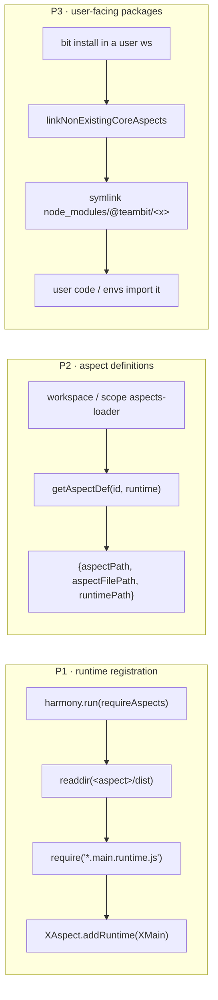
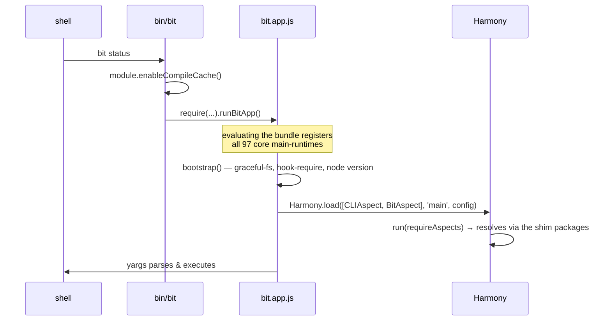

# 4. Architecture

[← back to bundle-plan index](../bundle-plan.md)

### 4.1 The three structural problems, and how each is solved



|        | problem                                                                        | solution                                                                                                                                                                                                                                                       |
| ------ | ------------------------------------------------------------------------------ | -------------------------------------------------------------------------------------------------------------------------------------------------------------------------------------------------------------------------------------------------------------- |
| **P1** | a bundle has no `dist/*.main.runtime.js` to `readdir` and `require`            | the generated entry does `import '@teambit/x/x.main.runtime'` for **every** core aspect, so the side effect happens at bundle-evaluation time. `requireAspects` still runs and still finds files — because of P2 — so **no runtime source change was needed**. |
| **P2** | `getAspectDef` globs `<pkg>/dist` for `*.aspect.js` / `*.<runtime>.runtime.js` | each shim emits those exact file names, re-exporting the bundle. `getAspectDef('teambit.workspace/workspace','main')` returns real paths (§7.3). **Zero changes to `core-aspects.ts`.**                                                                        |
| **P3** | users must `import '@teambit/<aspect>'`, and the linker symlinks _directories_ | the shims **are** real directories with real `package.json`s, so `DependencyLinker.linkCoreAspect` works untouched.                                                                                                                                            |

### 4.2 The shim trick

The bundle entry is generated into `node_modules/.bit-bundle/entry.ts`:

```ts
import './core-aspects-runtimes'; // 97 side-effect imports of *.main.runtime
export * from './core-aspects-exports'; // export * as workspace from '@teambit/workspace'; …
export { runBit as runBitApp } from '@teambit/bit/run-bit';
```

so `bit.app.js` exposes every core aspect's API as a named export, and each shim is two lines:

```js
// /tmp/bit-bundle/node_modules/@teambit/workspace/dist/index.js
module.exports = require('../../../../bundle/bit.app.js').workspace;
```

Node's module cache guarantees the 67 MB bundle is evaluated **once**, however many shims point at
it.

The entry deliberately **exports** `runBitApp` rather than calling it: the bundle is `require`d by
every shim, and a bundle that started the CLI on import would boot bit whenever a user's component
imported a core aspect.

### 4.3 Load flow


